**Python 3 基础教程**

---

目录

[toc]

<div style="page-break-after: always;"></div>
&emsp;

# 1 Python 2 与 3 的区别

## 1.1 `print`函数

Python 3 中`print`语句没有了，取而代之的是`print()`函数。Python 2.7 中以下三种形式等价：

```python
print "fish"
print ("fish") # print后面有个空格
print("fish")  # print()不能带有任何其它参数
```

实际上 Python 2.6 已经支持新的`print()`函数语法：

```python
from __future__ import print_function
print("fish", "panda", sep=',')
```

## 1.2 `Unicode`编码

Python 2 有`ASCII str()`类型，`unicode()`是单独的，不是 `byte`类型。现在在Python 3 中，我们有了 `Unicode (utf-8)` 字符串，以及一个字节类：`byte`和`bytearrays`。由于 Python3.X 源码文件默认使用`utf-8`编码，这就使得以下代码是合法的:

```python
>>> 中国 = 'china'
>>> print(中国)
china
```

## 1.3 除法运算

在 Python 3 中对于整数之间的相除 (/)，结果也会是浮点数。<br>而对于 `//` 除法 (floor除法)，会自动对结果进行一个 `floor` 操作，这在 Python 2 和 3 中是一致的。

## 1.4 异常与抛出

 Python 3 中使用 `as` 作为关键词。捕获异常的语法由 `except exc, var` 改为 `except exc as var`。使用语法`except (exc1, exc2) as var`可以同时捕获多种类别的异常。Python 2.6 已经支持这两种语法。此外:<br>

1. Python 2 中所有类型的对象都可被直接抛出； 而 Python 3 中只有继承自`BaseException`的对象才可被抛出。
2. Python 2 中`raise`语句使用逗号将抛出对象类型和参数分开；而 Python 3 中取消了这种奇葩的写法，直接调用构造函数抛出对象即可。

## 1.5 `range()`取代`xrange()`

在 Python 3 中，`range()`是像`xrange()`那样实现的，因而`xrange()`函数不再存在。在 Python 3 中使用`xrange()`会抛出命名异常。(`xrange()`相当于利用迭代器生成器，可以节省内存的使用)

## 1.6 进制数表示

1. 八进制数必须写成：0o777，原来的形式：0777不能用了；二进制必须写成：0b111。

2. 新增了一个`bin()`函数用于将一个整数转换成二进制字串。

## 1.7 不等运算符

Python 3 中去掉了`<>`, 只有`!=`一种写法。

## 1.8 去掉了`repr`表达式\`\`

Python 2 中反引号\`\`相当于`repr`函数的作用；<br>Python 3 中去掉了这种写法，只允许使用`repr()`函数。

## 1.9 模块更名

| Old Name       | New Name       | Old Name       | New Name       |
| -------------- | -------------- | -------------- | -------------- |
| `_winreg`      | `winreg`       | `ConfigParser` | `configparser` |
| `copy_reg`     | `copyreg`      | `Queue`        | `queue`        |
| `SocketServer` | `socketserver` | `repr`         | `reprlib`      |

`StringIO`被合并到`io`模组内；`new`, `md5`, `gopherlib`等模块被删除；`httplib`, `BaseHTTPServer`, `CGIHTTPServer`, `SimpleHTTPServer`, `Cookie`, `cookielib`被合并到`http`包内；取消了`exec`语句，只剩下`exec()`函数。

## 1.10 数据类型

1. Python 3 去除了`long`类型，现在只有一种整型`int`，但它的行为就像 Python 2 版本的`long`。

2. 新增了`bytes`类型，对应于 Python 2 版本中的八位串，定义一个`bytes`变量的方法如下:

   ```python
   >>> b = b'china'
   >>> type(b)
   <type 'bytes'>
   ```

   `str` 对象和 `bytes` 对象可以使用`.encode()` (`str -> bytes`) 或`.decode()` (`bytes -> str`) 相互转化。

   ```python
   >>> s = b.decode()
   >>> s
   'china'
   >>> b1 = s.encode()
   >>> b1
   b'china'
   ```

3. `dict`类型的的`.keys()`、`.items()`和`.values()`方法返回迭代器，而之前的`.iterkeys()`等函数都被废弃。同时去掉的还有`dict.has_key()`，用`in`替代它吧 。

## 1.11 打开文件及输入

1. 原 Python 2 中：

   ```python
   file( ..... )
   或
   open(.....)
   ```

   现改为只能用：

   ```python
   open(.....)
   ```

2. Python 3 中`input()`函数替代了原`raw_input()`函数，可接收任意性输入，将所有输入默认为字符串处理并返回字符串类型。

## 1.12 `map`,`filter`和`reduce`

这三个函数号称是函数式编程的代表。在 Python 2 中它们都是内置函数 (built-in function)。而在 Python 3 中它们从内置函数变成了类 (class)；其次它们的**返回结果**也从当初的列表变成了一个**可迭代的对象**，可以使用`next()`函数来进行手工迭代，若想输出需使用`list()`转换为列表。

# 2 Python 解释器

## 2.1 环境变量

| Variable        | Description                                                  |
| --------------- | ------------------------------------------------------------ |
| `PYTHONPATH`    | Python搜索路径，默认`import`的模块都会从`PYTHONPATH`中寻找   |
| `PYTHONSTARTUP` | Python启动后，先执行`PYTHONSTARTUP`环境变量指定的文件中的代码 |
| `PYTHONCASEOK`  | 加入`PYTHONCASEOK`的环境变量，会使Python导入模块时不区分大小写 |
| `PYTHONHOME`    | 模块搜索路径，通常内嵌于`PYTHONSTARTUP`或`PYTHONPATH`目录中，使得模块库更容易切换 |

## 2.2 脚本式编程

在 Linux/Unix 中可以在脚本顶部添加以下命令让 Python 脚本可以像 Shell 脚本一样可直接执行：

```python
#!/usr/bin/env python3
```

然后修改脚本权限，使其有执行权限：

```bash
$ chmod +x hello.py
```

执行以下命令即可直接运行脚本：

```bash
./hello.py
```

# 3 Python 3 基础语法

## 3.1 编码

默认情况下， Python 3 源码文件以 UTF-8 编码， 所有字符串都是 Unicode 字符串， 即:

```
#_*_ coding:utf-8 _*_
```

当然你也可以为源码文件指定不同的编码：

```
# -*- coding: cp-1252 -*-
```

上述定义允许在源文件中使用 Windows-1252 字符集中的字符编码， 对应适合语言为保加利亚语、白罗斯语、马其顿语、俄语、塞尔维亚语。

## 3.2 标识符

```
第一个字符必须是字母表中字母(a-z,A-Z)或下划线(_)。
标识符的其他的部分由字母、数字和下划线组成。
标识符对大小写敏感。
```

## 3.3 保留字

保留字即关键字， 我们不能把它们用作任何标识符名称。<br>Python 的标准库提供了一个`keyword`模块， 可输出当前版本的所有关键字：

```python
>>> import keyword
>>> keyword.kwlist
['False', 'None', 'True', 'and', 'as', 'assert', 'async', 'await', 'break', 'class', 'continue', 'def', 'del', 'elif', 'else', 'except', 'finally', 'for', 'from', 'global', 'if', 'import', 'in', 'is', 'lambda', 'nonlocal', 'not', 'or', 'pass', 'raise', 'return', 'try', 'while', 'with', 'yield']
```

## 3.4 注释

**单行注释**：以 \# 开头；<br>**多行注释**：多个 \#，或者 ''' ，或者 """。

```python
#!/usr/bin/env python3
# 第一个注释
# 第二个注释
'''
第三注释
第四注释
'''
"""
第五注释
第六注释
"""
print ("Hello, Python!")
```

以下实例可以输出函数的注释：

```python
def a():
'''这是文档字符串'''
pass
print(a.__doc__)
```

输出结果为：

```
这是文档字符串
```

## 3.5 行与缩进

### 3.5.1 缩进

Python 最具特色的就是使用缩进来表示代码块，不需要使用大括号 \{\} 。<br>
缩进的空格数是可变的，但是**同一个代码块**的语句**必须包含相同的缩进**空格数。

### 3.5.2 空行

函数之间或类的方法之间用空行分隔，表示一段新的代码的开始。<br>类和函数入口之间也用一行空行分隔，以突出函数入口的开始。<br>空行的作用在于分隔两段不同功能或含义的代码，便于日后代码的维护或重构。

## 3.6 多行语句

Python 通常是一行写完一条语句。

### 3.6.1 一条语句跨多行

但如果语句很长，我们可以使用反斜杠(\\)来实现多行语句，例如：

```python
total = item_one + \
        item_two + \
        item_three
```

在 []、{}、或 () 中的多行语句，不需要使用反斜杠(\\)，例如：

```python
total = ['item_one', 'item_two', 'item_three',
         'item_four', 'item_five']
```

### 3.6.2 一行写多条语句

Python可以在同一行中使用多条语句，语句之间使用分号(;)分割，例如：

```python
#!/usr/bin/env python3
import sys; x = 'runoob'; sys.stdout.write(x + '\n')
```

使用脚本执行以上代码，输出结果为：

```
runoob
```

使用交互式命令行执行，输出结果为：

```
>>> import sys; x = 'runoob'; sys.stdout.write(x + '\n')
runoob
7
```

此处的 7 表示字符数。

### 3.6.3 多个语句构成代码组

缩进相同的一组语句构成一个代码块，称之代码组。像 `if`、`while`、`def`和`class`这样的复合语句，首行以关键字开始并以冒号(:)结束，该行之后的一行或多行代码构成代码组。首行及后面的代码组称为一个子句 (clause)。

如下实例：

```python
if expression1 :
	suite1
elif expression2 :
	suite2
else :
	suite3
```

## 3.7 输入与输出

### 3.7.1 `input` 输入

Python 3 仅保留了`input()`函数，它可接收任意任性输入，将所有输入默认为字符串处理，并返回字符串类型。执行下面的程序在按回车键后就会等待用户输入：

```python
#!/usr/bin/env python3
input("\n\n按下 enter 键后退出。")
```

以上代码中 ，`'\n\n'`在结果输出前会输出两个新的空行。一旦用户按下 <kbd>Enter</kbd> 键时，程序将退出。

### 3.7.2 `print` 输出

`print` 默认输出是换行的 (即`end='\n'`)，若要实现不换行需在变量末尾加上 `end=' '`，实例：

```python
#!/usr/bin/env python3
x="a"
y="b"
# 换行输出
print(x)
print(y)
print('---------')
# 不换行输出
print(x, end=' ')
print(y, end=' ')
print()
```

以上实例执行结果为：

```
a b
---------
a b
```

通过命令 `help(print)` 我们知道这个方法里第二个为缺省参数 `sep=' '`, 表示使用空格作为分隔符。

```python
>>> help(print)
Help on built-in function print in module builtins:

print(...)
    print(value, ..., sep=' ', end='\n', file=sys.stdout, flush=False)
    
    Prints the values to a stream, or to sys.stdout by default.
    Optional keyword arguments:
    file:  a file-like object (stream); defaults to the current sys.stdout.
    sep:   string inserted between values, default a space.
    end:   string appended after the last value, default a newline.
    flush: whether to forcibly flush the stream.
```

所以在打印 `dict` 类的使用, 可以这样写 (使用冒号作为分隔符):

```python
>>> def getPairs(dict):
...	for k,v in dict.items() :
...		print(k,v,sep=':')
...
>>> getPairs({x:x**3 for x in (1,2,3,4)})
```

输出结果：

```python
1:1
2:8
3:27
4:64
```

## 3.8 `import` 与 `from ... import`

在 Python 用 `import` 或者 `from ... import` 来导入相应的模块。

| Description                                                  |
| ------------------------------------------------------------ |
| 将整个模块(somemodule)导入： `import somemodule`             |
| 从某个模块中导入某个函数： `from somemodule import somefunction` |
| 从某个模块中导入多个函数：` from somemodule import firstfunc, secondfunc, thirdfunc` |
| 将某个模块中的全部函数导入： `from somemodule import *` (应避免使用) |

## 3.9 `help()` 函数

调用 Python 的 help() 函数可以打印输出一个函数的文档字符串，按下`:q`即退出说明文档。

```python
>>> help(max) # 查看 max 内置函数的参数列表和规范的文档
Help on built-in function max in module builtins:

max(...)
    max(iterable, *[, default=obj, key=func]) -> value
    max(arg1, arg2, *args, *[, key=func]) -> value
    
    With a single iterable argument, return its biggest item. The
    default keyword-only argument specifies an object to return if
    the provided iterable is empty.
    With two or more arguments, return the largest argument.
(END)
```

若仅想得到文档字符串：

```python
>>> print(max.__doc__) # 注意，doc的前后分别是两个下划线
max(iterable, *[, default=obj, key=func]) -> value
max(arg1, arg2, *args, *[, key=func]) -> value

With a single iterable argument, return its biggest item. The
default keyword-only argument specifies an object to return if
the provided iterable is empty.
With two or more arguments, return the largest argument.
```

在 `print()` 打印的时候双引号与单引号都可作为定界符使用，且可以嵌套，被嵌套的会被解释为标点符号。

## 3.10 命令行参数

很多程序可以执行一些操作来查看一些基本信息，Python可以使用`-h`参数查看各参数帮助信息：

```bash
$ python -h
usage: python [option] ... [-c cmd | -m mod | file | -] [arg] ...
Options and arguments (and corresponding environment variables):
-b     : issue warnings about str(bytes_instance), str(bytearray_instance)
         and comparing bytes/bytearray with str. (-bb: issue errors)
-B     : don't write .pyc files on import; also PYTHONDONTWRITEBYTECODE=x
-c cmd : program passed in as string (terminates option list)
-d     : debug output from parser; also PYTHONDEBUG=x
-E     : ignore PYTHON* environment variables (such as PYTHONPATH)
-h     : print this help message and exit (also --help)
-i     : inspect interactively after running script; forces a prompt even
         if stdin does not appear to be a terminal; also PYTHONINSPECT=x
-I     : isolate Python from the user's environment (implies -E and -s)
-m mod : run library module as a script (terminates option list)
-O     : remove assert and __debug__-dependent statements; add .opt-1 before
         .pyc extension; also PYTHONOPTIMIZE=x
-OO    : do -O changes and also discard docstrings; add .opt-2 before
         .pyc extension
-q     : don't print version and copyright messages on interactive startup
-s     : don't add user site directory to sys.path; also PYTHONNOUSERSITE
-S     : don't imply 'import site' on initialization
-u     : force the stdout and stderr streams to be unbuffered;
         this option has no effect on stdin; also PYTHONUNBUFFERED=x
-v     : verbose (trace import statements); also PYTHONVERBOSE=x
         can be supplied multiple times to increase verbosity
-V     : print the Python version number and exit (also --version)
         when given twice, print more information about the build
-W arg : warning control; arg is action:message:category:module:lineno
         also PYTHONWARNINGS=arg
-x     : skip first line of source, allowing use of non-Unix forms of #!cmd
-X opt : set implementation-specific option
--check-hash-based-pycs always|default|never:
    control how Python invalidates hash-based .pyc files
file   : program read from script file
-      : program read from stdin (default; interactive mode if a tty)
arg ...: arguments passed to program in sys.argv[1:]

Other environment variables:
PYTHONSTARTUP: file executed on interactive startup (no default)
PYTHONPATH   : ':'-separated list of directories prefixed to the
               default module search path.  The result is sys.path.
PYTHONHOME   : alternate <prefix> directory (or <prefix>:<exec_prefix>).
               The default module search path uses <prefix>/lib/pythonX.X.
PYTHONCASEOK : ignore case in 'import' statements (Windows).
PYTHONIOENCODING: Encoding[:errors] used for stdin/stdout/stderr.
PYTHONFAULTHANDLER: dump the Python traceback on fatal errors.
PYTHONHASHSEED: if this variable is set to 'random', a random value is used
   to seed the hashes of str and bytes objects.  It can also be set to an
   integer in the range [0,4294967295] to get hash values with a
   predictable seed.
PYTHONMALLOC: set the Python memory allocators and/or install debug hooks
   on Python memory allocators. Use PYTHONMALLOC=debug to install debug
   hooks.
PYTHONCOERCECLOCALE: if this variable is set to 0, it disables the locale
   coercion behavior. Use PYTHONCOERCECLOCALE=warn to request display of
   locale coercion and locale compatibility warnings on stderr.
PYTHONBREAKPOINT: if this variable is set to 0, it disables the default
   debugger. It can be set to the callable of your debugger of choice.
PYTHONDEVMODE: enable the development mode.
PYTHONPYCACHEPREFIX: root directory for bytecode cache (pyc) files.
```

# 4 Python 3 基本数据类型

Python 中的变量不需要声明。每个变量在使用前都必须赋值，变量赋值以后该变量才会被创建。<br>Python 中的变量就是变量，它没有类型，我们所说的"*类型* "是变量所指的内存中对象的类型。

## 4.1 变量赋值

Python 中用等号 (\=) 来给变量赋值，等号运算符左边是一个变量名，右边是存储在变量中的值。

```python
a = b = c = 1
```

Python 允许同时为多个变量赋值，例如：

```python
a, b, c = 1, 2, "runoob"
```

## 4.2 标准数据类型

Python 3 中有六个标准的数据类型：

1. **Number** (数字)
2. **String** (字符串)
3. **List** (列表)
4. **Tuple** (元组)
5. **Set** (集合)
6. **Dictionary** (字典)

Python 3 的六个标准数据类型中：

* **不可变(immutable)数据类型** (3个)：**Number** (数字)、**String** (字符串)、**Tuple** (元组)
* **可变(mutable)数据类型** (3个)：**List** (列表)、**Dictionary** (字典)、**Set** (集合)

## 4.3 查询对象类型

内置的 **`type()`** 函数可以用来查询变量所指的对象类型：

```python
>>> a, b, c, d = 20, 5.5, True, 4+3j
>>> print(type(a), type(b), type(c), type(d))
<class 'int'> <class 'float'> <class 'bool'> <class 'complex'>
```

此外还可以用**` isinstance()` **来判断：

```python
>>>a = 111
>>> isinstance(a, int)
True
```

比较**`isinstance()` **和 **`type()` **的区别在于：

```
type()不会认为子类是一种父类类型;
isinstance()会认为子类是一种父类类型。

type()主要用于判断未知数据类型;
isinstance()主要用于判断A类是否继承于B类。
```

实例：

```python
# 判断子类对象是否继承于父类
class father(object):
	pass

class son(father):
    pass

if __name__ == '__main__':
	print (type(son())==father)
	print (isinstance(son(),father))
	print (type(son()))
	print (type(son))
```

运行结果：

```python
False
True
<class '__main__.son'>
<type 'type'>
```

## 4.4 数字 (Number)

### 4.4.1 数字类型

Python中数字有四种类型：**整数 (int)**、**布尔型 (bool)**、**浮点数 (float)** 和**复数 (complex)**。

| Number Type      | Description/Example                                          |
| ---------------- | ------------------------------------------------------------ |
| `int` (整数)     | 如: 1。只有一种整数类型`int`，表示为长整型，没有Python2中的`long`。 |
| `bool` (布尔型)  | 如：`True` 或 `False`。其实它们的值还是1和0，可以和数字相加。 |
| `float` (浮点数) | 如：1.23、3.1E-2。                                           |
| `complex` (复数) | 如：1 + 2j、1.1 - 2.2j，a + bj 或 complex(a, b)              |

当你指定一个值时，**Number**对象就会被创建。可以使用`del`语句删除一些对象引用:

```python
del var1[,var2[,var3[....,varN]]]
```

**注意**：

1. 其他类型值转换为`bool`值时，除了`' '`、`""`、`''''''`、`""""""`、`0`、`()`、`[]`、`{}`、`None`、`0.0`、`0L`、`0.0+0.0j`及`False`转换为`False`外，其他的转换都为 `True`。
2. 虚数不能单独存在，它们总是和一个值为0.0的实数部分一起构成一个复数。获取复数`x`的实部`x.real`与虚部`x.imag`；获取复数`x`的共轭: `x.conjugate()`。
3. Python 不支持复数转换为整数或浮点数。

### 4.4.2 数值运算

```python
>>>5 + 4    # 加法
9
>>> 4.3 - 2 # 减法
2.3
>>> 3 * 7   # 乘法
21
>>> 2 / 4   # 除法，得到一个浮点数
0.5
>>> 2 // 4  # 除法，得到一个整数
0
>>> 17 % 3  # 取余
2
>>> 2 ** 5  # 乘方
32
```

### 4.4.3 数学函数

| Function         | Description                                                  |
| ---------------- | ------------------------------------------------------------ |
| `abs(x)`         | 返回一个数字的绝对值，入参可为`int`,`float`或`complex`型，为一个内置函数 |
| `fabs(x)`        | 返回一个数字的绝对值，入参仅可为`int`或`float`型，位于`math`模组中 |
| `ceil(x)`        | 返回数字的上入整数，位于`math`模组中                         |
| `floor(x)`       | 返回数字的下舍整数，位于`math`模组中                         |
| `round(x [,n])`  | 返回浮点数`x`的四舍五入值；若给定`n`，则舍入到小数点后`n`位；内置函数 |
| `exp(x)`         | 返回`e`的`x`次幂 ($e^x$)，位于`math`模组中                   |
| `log(x)`         | 返回以`e`为底的指数, i.e. $ln(x)$，位于`math`模组中          |
| `log10(x)`       | 返回以`10`为底的指数, i.e. $log_{10}(x)$，位于`math`模组中   |
| `modf(x)`        | 返回一个由`x`的小数与整数组成的元组，整数以浮点型表示；位于`math`模组中 |
| `max(x1,x2,...)` | 返回给定参数的最大值，参数可以为序列；为一个内置函数         |
| `min(x1,x2,...)` | 返回给定参数的最小值，参数可以为序列；为一个内置函数         |
| `pow(x, y)`      | 返回`x**y`运算 (幂运算) 后的值，为一个内置函数               |
| `sqrt(x)`        | 返回数字`x`的平方根，返回值是`float`型，位于`math`模组中     |
| `cmp(x, y)`      | 已弃用, 可用 `(x>y)-(x<y)`替换。若`x<y`, 返回 -1; `x==y`, 返回 0; `x>y`, 返回 1. |

### 4.4.4 随机数函数

| Function                           | Description                                          |
| ---------------------------------- | ---------------------------------------------------- |
| `choice(seq)`                      | 从序列的元素中随机挑选一个元素                       |
| `randrange([start,] stop [,step])` | 从指定范围内递增的集合中获取一个随机数               |
| `random()`                         | 随机生成下一个在 [0,1) 范围内的实数                  |
| `seed([x])`                        | 改变随机数生成器的种子seed                           |
| `shuffle(list)`                    | 将列表的所有元素随机排序                             |
| `uniform(x, y)`                    | 随机生成下一个 [x, y] 范围内的实数                   |
| `randint(x, y)`                    | 随机生成下一个 [x, y] 范围内的整数                   |
| `sample(seq, length)`              | 从指定的序列中随即的截取指定长度的片段，不修改原序列 |

**注意**：以上函数的使用都需先**导入`random`模块**！

### 4.4.5 三角函数

| Function      | Description                            |
| ------------- | -------------------------------------- |
| `acos(x)`     | 返回`x`的反余弦弧度值                  |
| `asin(x)`     | 返回`x`的反正弦弧度值                  |
| `atan(x)`     | 返回`x`的反正切弧度值                  |
| `atan2(y, x)` | 返回给定的`x`及`y`坐标值的反正切弧度值 |
| `cos(x)`      | 返回`x`弧度的余弦值                    |
| `sin(x)`      | 返回`x`弧度的正弦值                    |
| `tan(x)`      | 返回`x`弧度的正切值                    |
| `hypot(x, y)` | 返回欧几里德范数：`sqrt(x*x+y*y)`      |
| `degrees(x)`  | 将弧度转换为角度                       |
| `radians(x)`  | 将角度转换为弧度                       |

**注意**：以上函数的使用都需先**导入`math`模块**！若要使用**复数运算**，则需**先导入`cmath`模块**！

### 4.4.6 数学常量

| Constant | Description                             |
| -------- | --------------------------------------- |
| `pi`     | 数学常量$\pi$，圆周率，需导入`math`模块 |
| `e`      | 数学常量$e$，自然常数，需导入`math`模块 |

### 4.4.7 其他说明

1. 使用`round()`函数时遵循 **“四舍六入五看齐，奇进偶不进”** 的规则 。

2. Python 3 中舍弃了`cmp()`函数，可用`operator`模块中的函数替代：

   ```python
   import operator       #首先要导入运算符模块
   operator.gt(1,2)      #意思是greater than（大于）
   operator.ge(1,2)      #意思是greater and equal（大于等于）
   operator.eq(1,2)      #意思是equal（等于）
   operator.le(1,2)      #意思是less and equal（小于等于）
   operator.lt(1,2)      #意思是less than（小于）
   ```

3. Python 中的`Fraction` 模块提供了**分数类型**的支持。

   可以同时提供分子(numerator)和分母(denominator)给构造函数用于实例化`Fraction`类，但两者必须同时是`int`或`numbers.Rational`类型，否则抛出类型错误。当分母为 0 初始化时会抛出异常`ZeroDivisionError`。

   ```python
   >>> from fractions import Fraction
   >>> x = Fraction(1,3)
   >>> y = Fraction(4,6)
   >>> x + y
   Fraction(1, 1)
   >>> Fraction('.25') 
   Fraction(1, 4)
   ```

   浮点数与分数的转换：

   ```python
   >>> f = 2.5
   >>> z = Fraction(*f.as_integer_ratio())
   >>> z
   Fraction(5, 2)
   >>> x = Fraction(1,3)
   >>> float(x)
   0.3333333333333333
   ```

4. Python 中的`decimal` 模块提供了一个`Decimal`数据类型用于浮点数计算，拥有更高的精度：

   ```python
   >>> import decimal
   >>> decimal.getcontext().prec = 4            # 指定精度（4位小数）
   >>> decimal.Decimal(1) / decimal.Decimal(7)
   Decimal('0.1429')
   >>> with decimal.localcontext() as ctx :     # 小数上下文管理器
   ...     ctx.prec = 2
   ...     decimal.Decimal('1.00') / decimal.Decimal('3.00')
   ... 
   Decimal('0.33')
   >>> from decimal import Decimal
   >>> Decimal.from_float(1.05)
   Decimal('1.0500000000000000444089209850062616169452667236328125')
   ```

## 4.5 字符串 (String)

Python中字符串**不可以发生改变**。<br>Python中没有单独的字符类型，一个字符就是长度为1的字符串。<br>Python中单引号和双引号使用完全相同。<br>Python 中可使用三引号 ( ''' 或 """ )可以指定一个多行字符串。

### 4.5.1 字符串的截取

字符串的截取语法格式如下：

```python
字符串变量[头下标:尾下标:步长]
```

索引值以 0 为开始值，-1 为从末尾的开始位置。

<left>
    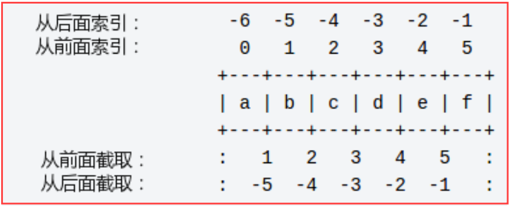
</left>

### 4.5.2 字符串的操作

Python 中字符串运算符表：

| Operator | Description                                            | Example        |
| -------- | ------------------------------------------------------ | -------------- |
| `+`      | 字符串连接                                             | `a + b`        |
| `*`      | 重复输出字符串                                         | `a*2`          |
| `[]`     | 通过`index`索引获取字符串中的字符                      | `a[1]`         |
| `[:]`    | 截取字符串中的一部分，遵循**左闭右开**原则             | `a[1:4]`       |
| `in`     | 成员运算符，若字符串中包含给定的字符，则返回`True`     | `'H' in a`     |
| `not in` | 成员运算符，若字符串中不包含给定的字符，则返回`True`   | `'H' not in a` |
| `r/R`    | 原始字符串：字符串直接使用，不转义特殊或不能打印的字符 | `a = r'\n'`    |
| `%`      | 格式字符串                                             |                |

实例：

```python
#!/usr/bin/env python3
str = 'Runoob'
print (str)           # 输出字符串
print (str[0:-1])     # 输出第一个到倒数第二个的所有字符
print (str[0])        # 输出字符串第一个字符
print (str[2:5])      # 输出从第三个开始到第五个的字符
print (str[2:])       # 输出从第三个开始的后的所有字符
print (str * 2)       # 输出字符串两次
print (str + "TEST")  # 连接字符串
```

执行以上程序会输出如下结果：

```python
Runoob
Runoo
R
noo
noob
RunoobRunoob
RunoobTEST
```

### 4.5.3 字符串的格式化

#### 4.5.3.1 使用"%"操作符

操作符" % "的使用格式为：

```python
%[(name)][flags][width][.precision]typecode
```

- **(name)** 为命名，可不指定；
- **flags** 可以有`+`, `-`, `空格`或`0`，分别表示右对齐, 左对齐, 在正数左侧填充一个空格, 及使用`0`填充；
- **width** 表示显示的最小总宽度；
- **precision** 表示小数点后的精度；
- **typecode** 必须指定，不可缺失。

Python 中字符串格式化 **typecode** 表：

| Symbol     | Description                          | Symbol | Description                          |
| ---------- | ------------------------------------ | ------ | ------------------------------------ |
| `%c`       | 格式化单个字符及其ASCII码            | `%s`   | 格式化字符串 (采用`str()`的显示)     |
| `%d`或`%i` | 格式化十进制整数                     | `%r`   | 格式化字符串 (采用`repr()`的显示)    |
| `%u`       | 格式化无符号整型                     | `%x`   | 格式化无符号十六进制数               |
| `%o`       | 格式化无符号八进制数                 | `%X`   | 格式化无符号十六进制数（大写）       |
| `%e`       | 用科学计数法格式化浮点数             | `%f`   | 格式化浮点数字，可指定小数点后的精度 |
| `%E`       | 作用同`%e`，用科学计数法格式化浮点数 | `%g`   | `%f`和`%e`的简写                     |
| `%%`       | 格式化百分号 % 输出                  | `%G`   | `%f` 和`%E`的简写                    |

Python 中格式化操作符**辅助指令**：

| Symbol    | Function                                                     |
| --------- | ------------------------------------------------------------ |
| `-`       | 用做左对齐                                                   |
| `+`       | 在正数前面显示加号(\+)                                       |
| `<space>` | 在正数前面显示空格                                           |
| `0`       | 显示的数字前面填充'0'而不是默认的空格                        |
| `m.n`     | `m`是显示的最小总宽度，`n`是小数点后的位数                   |
| `*`       | 定义宽度或者小数点精度 (可实现动态带入)                      |
| `#`       | 在八进制数前面显示零('0')，在十六进制前面显示'0x'或者'0X' (取决于用的是'x'还是'X') |
| `(var)`   | 映射变量(字典参数)                                           |

实例：

```python
>>> print("%6.3f" % 2.3)
 2.300
```

-  第一个 % 后面的内容为显示的格式说明，6 为显示宽度，3 为小数点位数，f 为浮点数类型
-  第二个 % 后面为显示的内容来源，输出结果右对齐，2.300 长度为 5，故前面有一空格

上面的**width**, **precision**为两个整数。我们可以**利用" * "来动态代入这两个量**。如：

```python
>>> print("%10.*f" % (4, 1.2))
  1.2000
```

#### 4.5.3.2 使用`str.format()`

Python 2.6 开始，新增了一种格式化字符串的函数`str.format()`，它增强了字符串格式化的功能。<br>基本语法是通过 **{}** 和 **:** 来代替以前的 **%** 。`str.format()` 函数可以接受不限个数的参数，位置可以不按顺序。

```python
>>>"{} {}".format("hello", "world")        # 不设置指定位置，按默认顺序
'hello world'
>>> "{0} {1}".format("hello", "world")     # 设置指定位置
'hello world'
>>> "{1} {0} {1}".format("hello", "world") # 设置指定位置
'world hello world'
```

也可设置索引或关键字参数：

```python
#!/usr/bin/env python3

# 通过关键字设置参数
print("网站名：{name}, 地址：{url}".format(name="菜鸟教程", url="www.runoob.com"))

# 通过字典关键字设置参数
site = {"name": "菜鸟教程", "url": "www.runoob.com"}
print("网站名：{name}, 地址：{url}".format(**site))

# 通过指定位置+字典关键字设置参数
my_dict = {'name': "菜鸟教程", 'url': "www.runoob.com"}
print("网站名：{0[name]}; 地址：{0[url]}".format(my_dict))  # "0" 是必须的

# 通过指定位置+列表索引设置参数
my_list = ['菜鸟教程', 'www.runoob.com']
print("网站名：{0[0]}, 地址：{0[1]}".format(my_list))       # "0" 是必须的
```

也可以向`str.format()`传入对象：

```python
#!/usr/bin/env python3
class AssignValue(object) :
    def __init__(self, value) :
        self.value = value

my_value = AssignValue(6)
print('value 为: {0.value}'.format(my_value)) # "0" 是可选的
print('value 为: {.value}'.format(my_value))  # "0" 是可选的 (两结果相同)
```

**注意**: 在 **\{\}** 中可指定输出字符串格式：**`!a`**使用 **`ascii()`**,  **`!s`**使用 **`str()`** , **`!r`**使用 **`repr()`**。

**数字的格式化** (在 **\{\}** 中可使用 " : "来表示数字的格式化，且仍可添加限定参数，如 "name:+5.2f"等)：

| Number     | Format               | Output    | Description                  |
| :--------- | :------------------- | :-------- | :--------------------------- |
| 3.1415926  | {:.2f}               | 3.14      | 保留小数点后两位             |
| 3.1415926  | {:+.2f}              | +3.14     | 带符号保留小数点后两位       |
| -1         | {:+.2f}              | -1.00     | 带符号保留小数点后两位       |
| 2.71828    | {:.0f}               | 3         | 不带小数                     |
| 5          | {:0>2d}              | 05        | 数字补零 (填充左边, 宽度为2) |
| 5          | {:x<4d}              | 5xxx      | 数字补x (填充右边, 宽度为4)  |
| 1000000    | {:,}                 | 1,000,000 | 以逗号分隔的数字格式         |
| 0.25       | {:.2%}               | 25.00%    | 百分比格式                   |
| 1000000000 | {:.2e}               | 1.00e+09  | 指数记法                     |
| 13         | {:>10d}              | 13        | 右对齐 (默认, 宽度为10)      |
| 13         | {:<10d}              | 13        | 左对齐 (宽度为10)            |
| 13         | {:^10d}              | 13        | 中间对齐 (宽度为10)          |
| 11         | `'{:b}'.format(11)`  | 1011      | 二进制                       |
| 11         | `'{:d}'.format(11)`  | 11        | 十进制                       |
| 11         | `'{:o}'.format(11)`  | 13        | 八进制                       |
| 11         | `'{:x}'.format(11)`  | b         | 十六进制                     |
| 11         | `'{:#x}'.format(11)` | 0xb       | 十六进制前面显示'0x'         |
| 11         | `'{:#X}'.format(11)` | 0XB       | 十六进制前面显示'0X'         |

**总结**：使用**`str.format()`**中的 **{}** 的格式样式为：

```
{[name][:][symbol][align][width][.precision][type]}

name      : 限定参数 (可为数字，键值，索引，.value 等)
symbol    : 填充符号 (只能是一个字符，如: 正号,逗号,0,x 等；不指定则默认使用空格填充)
align     : 居中(^)、左对齐(<)、右对齐(>)
width     : 表示总宽度
.precision: 表示小数点后的位数
typecode  : f, d, e, E, g, G, % (百分数), b, d, o, #o, x, #x, #X
```

1. "^, <, > " 分别是**居中**、**左对齐**、**右对齐**，左边跟的符号代表补齐方式，右边跟的数字代表宽度；

2. “ : ” 号后面带填充的字符，只能是一个字符，不指定则默认是用空格填充；

3. “ + ” 表示在正数前显示正号负数前显示负号； (空格) 表示在正数前加空格；" , " 表示用逗号分隔；

4. 此外可以使用大括号 **{}** 来转义大括号，如下实例：

   ```python
   >>> print ("{} 对应的位置是 {{0}}".format("runoob"))
   runoob 对应的位置是 {0}
   ```

实例：(**注意：`header_fmt`和`fmt`的定义方法，以及在定义后可复使用**)

```python
#!/usr/bin/env python3
width = int(input('Please enter width: '))

price_width = 10
item_width = width - price_width

# header_fmt = '{:item_width}{:>price_width}'
header_fmt = '{{:{}}}{{:>{}}}'.format(item_width, price_width)
# fmt = '{:item_width}{:>price_width.2f}'
fmt = '{{:{}}}{{:>{}.2f}}'.format(item_width, price_width)

print('=' * width)
print(header_fmt.format('Item', 'Price'))
print('-' * width)

print(fmt.format('Apples', 0.4))
print(fmt.format('Pears', 0.5))
print(fmt.format('Cantaloupes', 1.92))
print(fmt.format('Dried Apricots (16 oz.)', 8))
print(fmt.format('Prunes (4 lbs.)', 12))

print('=' * width)

# 输出结果为：
# Please enter width: 35
# ===================================
# Item                          Price
# -----------------------------------
# Apples                         0.40
# Pears                          0.50
# Cantaloupes                    1.92
# Dried Apricots (16 oz.)        8.00
# Prunes (4 lbs.)               12.00
# ===================================
```

有些情况下，通过在字典中存储一系列命名的值，可让格式设置更容易些。例如，可在字典中包含各种信息，这样只需在格式字符串中提取所需的信息即可，但必须使用`format_map`来指出将通过一个映射来提供所需的信息。

```python
#!/usr/bin/env python3
template = '''<html>
<head><title>{title}</title></head>
<body>
<h1>{title}</h1>
<p>{text}</p>
</body>'''
data = {'title': 'My Home Page', 'text': 'Welcome to my home page!'}
print(template.format_map(data))

# 输出结果为：
# <html>
# <head><title>My Home Page</title></head>
# <body>
# <h1>My Home Page</h1>
# <p>Welcome to my home page!</p>
# </body>
```

#### 4.5.3.3 使用`f-string`来格式化

Python 3.6 之后添加了 **f-string** , 称之为**字面量格式化字符串**，是新的格式化字符串的语法。其字符串以 **f** 开头，后面跟着字符串，字符串中的表达式用大括号 **{}** 包起来，它会将**变量**或**表达式**计算后的值替换进去。实例：

```python
>>> name = 'Runoob'
>>> f'Hello {name}'  # 替换变量
'Hello Runoob'
>>> f'{1+2}'         # 使用表达式
'3'
>>> w = {'name': 'Runoob', 'url': 'www.runoob.com'}
>>> f'{w["name"]}: {w["url"]}'
'Runoob: www.runoob.com'
```

此外，在 Python 3.8 版本中可以使用 **=** 符号来拼接运算表达式与结果：

```python
>>> x = 1
>>> print(f'{x+1}')   # Python 3.6
2
>>> x = 1
>>> print(f'{x+1=}')   # Python 3.8
'x+1=2'
```

### 4.5.4 字符串的转义

Python 使用反斜杠 (**\\**) 来转义；使用 **r** 或 **R** 可以让反斜杠不发生转义，表示原始字符串：

```bash
>>> print('Ru\noob')
Ru
oob
>>> print(r'Ru\noob')
Ru\noob
```

Python 中转义字符表：

| Escape Character      | Description              | Escape Character | Description              |
| --------------------- | ------------------------ | ---------------- | ------------------------ |
| `\` (at the end line) | 续行符                   | `\\`             | 反斜杠符号               |
| `\'`                  | 单引号                   | `\''`            | 双引号                   |
| `\a`                  | 响铃                     | `\b`             | 退格                     |
| `\000`                | 空                       | `\n`             | 换行                     |
| `\v`                  | 纵向制表符               | `\t`             | 横向制表符               |
| `\r`                  | 回车                     | `\f`             | 换页                     |
| `\oyy`                | 八进制数, `yy`代表字符   | `\xyy`           | 十六进制数，`yy`代表字符 |
| `\other`              | 其他的字符以普通格式输出 |                  |                          |

### 4.5.5 字符串的内置函数

Python 的字符串常用内建函数如下：

|  No.   | Function & Description                                       |
| :----: | :----------------------------------------------------------- |
|   1    | [str.capitalize()](https://www.runoob.com/python3/python3-string-capitalize.html) 将`str`的首字符转换为大写, 其余字符转换为小写；若首字符非字母, 则首字符不转换 |
|   2    | [str.center(width, fillchar)](https://www.runoob.com/python3/python3-string-center.html) 返回一个指定宽度`width`居中的`str`, `fillchar`为填充的字符(默认为空格) |
| **3**  | [str1.count(str2, beg=0,end=len(str1))](https://www.runoob.com/python3/python3-string-count.html) 返回`str2`在`str1`里面出现的次数, 若`beg`或`end`指定则返回指定范围内`str2`出现的次数 |
| **4**  | [bytes.decode(encoding="utf-8", errors="strict")](https://www.runoob.com/python3/python3-string-decode.html) Python 3 中没有`decode()`方法, 但可使用`bytes`对象的`decode()`方法来解码给定的`bytes`对象, 这个`bytes`对象可以由`str.encode()`来编码返回 |
| **5**  | [str.encode(encoding='UTF-8',errors='strict')](https://www.runoob.com/python3/python3-string-encode.html) 以`encoding`指定的编码格式编码字符串, 若出错默认报一个`ValueError`的异常, 除非`errors`指定的是`ignore`或`replace` |
| **6**  | [str.endswith(suffix, beg=0, end=len(string))](https://www.runoob.com/python3/python3-string-endswith.html) 检查字符串是否以`suffix`结束，如果`beg`或者`end`指定则仅检查指定的范围内是否以`suffix`结束，如果是返回`True`, 否则返回`False` |
|   7    | [str.expandtabs(tabsize=8)](https://www.runoob.com/python3/python3-string-expandtabs.html) 把字符串`str`中的`tab`符号转为空格，默认的空格数为8 |
| **8**  | [str1.find(str2, beg=0, end=len(str1))](https://www.runoob.com/python3/python3-string-find.html) 检测`str2`是否包含在字符串`str1`中，参数`beg`和`end`指定检查的范围，若包含返回开始的索引值，否则返回-1 |
| **9**  | [str1.index(str2, beg=0, end=len(str1))](https://www.runoob.com/python3/python3-string-index.html) 跟`find()`方法一样，只不过若`str2`不在`str1`中会报一个异常 |
| **10** | [str.isalnum()](https://www.runoob.com/python3/python3-string-isalnum.html) 如果字符串至少有一个字符并且所有字符都是字母或数字则返 回 True,否则返回 False |
| **11** | [str.isalpha()](https://www.runoob.com/python3/python3-string-isalpha.html) 如果字符串至少有一个字符并且所有字符都是字母则返回 True, 否则返回 False |
| **12** | [str.isdigit()](https://www.runoob.com/python3/python3-string-isdigit.html) 如果字符串只包含数字则返回 True 否则返回 False.. |
|   13   | [str.islower()](https://www.runoob.com/python3/python3-string-islower.html) 如果字符串中包含至少一个区分大小写的字符，并且所有这些(区分大小写的)字符都是小写，则返回 True，否则返回 False |
| **14** | [str.isnumeric()](https://www.runoob.com/python3/python3-string-isnumeric.html) 如果字符串中只包含数字字符，则返回 True，否则返回 False |
|   15   | [str.isspace()](https://www.runoob.com/python3/python3-string-isspace.html) 如果字符串中只包含空白，则返回 True，否则返回 False. |
|   16   | [str.istitle()](https://www.runoob.com/python3/python3-string-istitle.html) 如果字符串是标题化的则返回 True，否则返回 False |
|   17   | [str.isupper()](https://www.runoob.com/python3/python3-string-isupper.html) 如果字符串中包含至少一个区分大小写的字符，并且所有这些(区分大小写的)字符都是大写，则返回 True，否则返回 False |
| **18** | [str.join(seq)](https://www.runoob.com/python3/python3-string-join.html) 以指定字符串`str`作为分隔符, 将序列`seq`中所有元素(的字符串表示)合并为新的字符串 |
| **19** | [len(str)](https://www.runoob.com/python3/python3-string-len.html) 返回字符串长度 |
| **20** | [str.ljust(width[, fillchar])](https://www.runoob.com/python3/python3-string-ljust.html) 返回由原字符串`str`左对齐并使用`fillchar`(默认为空格)填充至指定长度`width`的新字符串 |
| **21** | [str.lower()](https://www.runoob.com/python3/python3-string-lower.html) 转换字符串中所有大写字符为小写. |
|   22   | [str.lstrip([chars])](https://www.runoob.com/python3/python3-string-lstrip.html) 删除字符串左边的空格或指定字符。 |
|   23   | [str.maketrans(intab, outtab)](https://www.runoob.com/python3/python3-string-maketrans.html) 创建字符映射的转换表，对于接受两个参数的最简单的调用方式，第一个参数是字符串，表示需要转换的字符，第二个参数也是字符串表示转换的目标。 |
|   24   | [max(str)](https://www.runoob.com/python3/python3-string-max.html) 返回字符串`str`中最大的字母。 |
|   25   | [min(str)](https://www.runoob.com/python3/python3-string-min.html) 返回字符串`str`中最小的字母。 |
| **26** | [str.replace(old, new [, max])](https://www.runoob.com/python3/python3-string-replace.html) 把 将字符串中的`old`替换成`new`，若`max`指定，则替换不超过`max`次。 |
| **27** | [str1.rfind(str2, beg=0, end=len(str1))](https://www.runoob.com/python3/python3-string-rfind.html) 类似于`find()`函数，不过是从右边开始查找. |
|   28   | [str1.rindex(str2, beg=0, end=len(str1))](https://www.runoob.com/python3/python3-string-rindex.html) 类似于`index()`函数，不过是从右边开始. |
|   29   | [str.rjust(width[, fillchar])](https://www.runoob.com/python3/python3-string-rjust.html) 返回由原字符串`str`右对齐并使用`fillchar`(默认为空格)填充至指定长度`width`的新字符串 |
| **30** | [str.rstrip([chars])](https://www.runoob.com/python3/python3-string-rstrip.html) 删除字符串右边的空格或指定字符。 |
| **31** | [str.split(sep[, num=-1])](https://www.runoob.com/python3/python3-string-split.html) 以`sep`为分隔符(默认为所有的空字符,包括空格换行制表符等)截取字符串。若指定`num`值，则将`str`截为`num+1`个子字符串，默认截取所有分隔符。 |
| **32** | [str.splitlines([keepends])](https://www.runoob.com/python3/python3-string-splitlines.html) 按照行('\r', '\r\n', '\n')分隔，返回一个包含各行作为元素的列表，若参数` keepends`为`False`则不包含换行符，否则保留换行符。 |
| **33** | [str.startswith(prefix, beg=0, end=len(str))](https://www.runoob.com/python3/python3-string-startswith.html) 检查字符串是否以`prefix`开始，如果`beg`或者`end`指定则仅检查指定的范围内是否以`prefix`开始，如果是返回`True`, 否则返回`False` |
| **34** | [str.strip([chars])](https://www.runoob.com/python3/python3-string-strip.html) 在字符串上执行`lstrip()`和`rstrip()` |
|   35   | [str.swapcase()](https://www.runoob.com/python3/python3-string-swapcase.html) 将字符串中大写转换为小写，小写转换为大写 |
|   36   | [str.title()](https://www.runoob.com/python3/python3-string-title.html) 返回"标题化"的字符串, 即所有单词都是以大写开始, 其余字母均为小写 |
| **37** | [str.translate(table, deletechars="")](https://www.runoob.com/python3/python3-string-translate.html) 根据`table`给出的表(包含 256 个字符)转换`str`的字符, 要过滤掉的字符放到`deletechars`参数中 |
|   38   | [str.upper()](https://www.runoob.com/python3/python3-string-upper.html) 转换字符串中的小写字母为大写 |
|   39   | [str.zfill (width)](https://www.runoob.com/python3/python3-string-zfill.html) 返回长度为`width`的字符串, 原字符串右对齐前面填充0 (同`str.rjust(width,"0"))` |
| **40** | [str.isdecimal()](https://www.runoob.com/python3/python3-string-isdecimal.html) 检查字符串是否只包含十进制字符，如果是返回`True`，否则返回`False` |

**补充说明**：

1. **str.isdigit**、**str.isdecimal** 和 **str.isnumeric** 区别

   | Comparison of `isdigt()`,`isdecimal()`,`isnumeric()`         |
   | ------------------------------------------------------------ |
   | `str.isdigit()`<br>**True**: Unicode数字, byte数字(单字节), 全角数字(双字节)<br>**False**: 汉字数字, 罗马数字, 小数<br>**Error**: 无 |
   | `str.isdecimal()`<br/>**True**: Unicode数字, 全角数字(双字节)<br/>**False**: 汉字数字, 罗马数字, 小数<br/>**Error**: byte数字(单字节) |
   | `str.isdigit()`<br/>**True**: Unicode数字, 全角数字(双字节), 汉字数字<br/>**False**: 罗马数字, 小数<br/>**Error**: byte数字(单字节) |

   ```python
   num = "1"  # unicode
   num.isdigit()   # True
   num.isdecimal() # True
   num.isnumeric() # True
   
   num = "1" # 全角
   num.isdigit()   # True
   num.isdecimal() # True
   num.isnumeric() # True
   
   num = b"1" # byte
   num.isdigit()   # True
   num.isdecimal() # AttributeError 'bytes' object has no attribute 'isdecimal'
   num.isnumeric() # AttributeError 'bytes' object has no attribute 'isnumeric'
   
   num = "IV" # 罗马数字
   num.isdigit()   # False
   num.isdecimal() # False
   num.isnumeric() # False
   
   num = "四" # 汉字
   num.isdigit()   # False
   num.isdecimal() # False
   num.isnumeric() # True
   ```

2. 针对**`Counter`**的升级使用，示例如下：

   ```python
   #必须引用如下库
   from collections import Counter
   
   #定义两个字符串变量
   Var1 = "1116122137143151617181920849510"
   Var2 = "1987262819009787718192084951"
   
   #以字典的形式，输出每个字符串中出现的字符及其数量
   print (Counter(Var1))
   print (Counter(Var2))
   ```

   输出如下：

   ```python
   Counter({'1': 12, '2': 3, '6': 2, '3': 2, '7': 2, '4': 2, '5': 2, '8': 2, '9': 2, '0': 2})
   Counter({'1': 5, '9': 5, '8': 5, '7': 4, '2': 3, '0': 3, '6': 1, '4': 1, '5': 1})
   ```

3. 字符串与列表，元组的互相转换：

   ```python
   # 1、字符串转换为列表
   var='菜鸟教程'
   list=[]
   list=[i for i in var]
   
   # 2、列表转化为字符串
   var1=''.join(list)
   
   # 3、字符串转化为元组，使用 tuple() 函数
   tup=tuple(var)
   ```

## 4.6 列表 (List)

列表(List)是 Python 中使用最频繁的数据类型，可完成大多数集合类的数据结构。列表是写在方括号 \[\] 之间、用逗号分隔开的元素列表。其元素的类型可不同，支持数字, 字符串, 元组等，甚至可以包含列表 (即列表的嵌套) 。

```python
# 创建长度为10的空列表
list_empty = [None]*10

# 创建二维列表, 将需要的参数写入 cols 和 rows 即可
list_2d = [[0 for col in range(cols)] for row in range(rows)]
```

**列表推导式**书写形式：

```python
[表达式 for 变量 in 列表]
或者
[表达式 for 变量 in 列表 if 条件]
```

实例：

```python
#!/usr/bin/env python3
li = [1,2,3,4,5,6,7,8,9]
print ([x**2 for x in li])
print ([x**2 for x in li if x>5])
print (dict([(x,x*10) for x in li]))
print ([(x, y) for x in range(10) if x % 2 if x > 3 for y in range(10) if y > 7 if y != 8])

vec =[2,4,6]
vec2=[4,3,-9]
sq = [vec[i]+vec2[i] for i in range(len(vec))]
print (sq)
print ([x*y for x in [1,2,3] for y in  [1,2,3]])

testList = [1,2,3,4]
def mul2(x):
    return x*2

print ([mul2(i) for i in testList])
```

输出结果：

```python
[1, 4, 9, 16, 25, 36, 49, 64, 81]
[36, 49, 64, 81]
{1: 10, 2: 20, 3: 30, 4: 40, 5: 50, 6: 60, 7: 70, 8: 80, 9: 90}
[(5, 9), (7, 9), (9, 9)]
[6, 7, -3]
[1, 2, 3, 2, 4, 6, 3, 6, 9]
[2, 4, 6, 8]
```

### 4.6.1 列表的截取

列表截取的语法格式如下：

```python
变量[头下标:尾下标:步长]
```

索引值以 0 为开始值，-1 为从末尾的开始位置。

<left>
    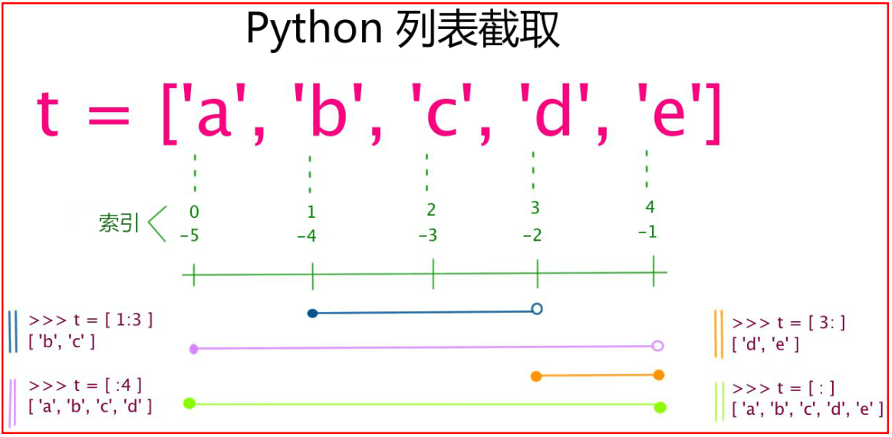
</left>

Python 列表截取可以接收第三个参数，作用是截取的步长。

<left>
    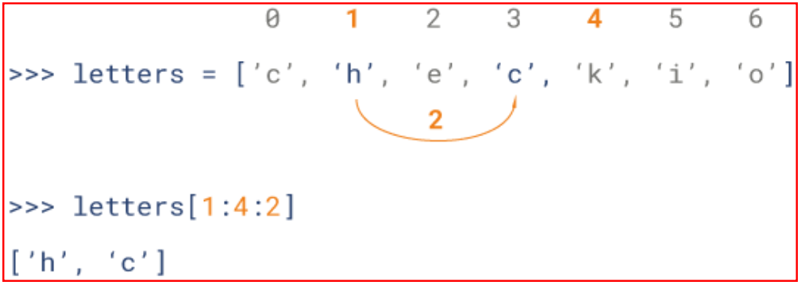
</left>

若步长参数为负数则表示逆向读取，以下实例用于翻转字符串：

```python
#！/usr/bin/env python3
def reverseWords(input):
    # 通过空格将字符串分隔符，把各个单词分隔为列表
    inputWords = input.split(" ")
    # 翻转字符串
    # 假设列表 list = [1,2,3,4],
    # list[0]=1, list[1]=2, 而-1表示最后一个元素 list[-1]=4 (与list[3]一样)
    # inputWords[-1::-1] 有三个参数
    # 第一个参数 -1 表示最后一个元素
    # 第二个参数为空，表示移动到列表末尾
    # 第三个参数为步长，-1 表示逆向
    inputWords=inputWords[-1::-1]
    # 重新组合字符串
    output = ' '.join(inputWords)
    return output

if __name__ == "__main__":
	input = 'I like runoob'
	rw = reverseWords(input)
	print(rw)
```

### 4.6.2 列表的操作

| Python Expression                       | Output                                            | Description          |
| :-------------------------------------- | :------------------------------------------------ | :------------------- |
| `len([1, 2, 3])`                        | 3                                                 | 长度                 |
| `[1, 2, 3] + [4, 5, 6]`                 | [1, 2, 3, 4, 5, 6]                                | 组合                 |
| `['Hi!'] * 7`                           | ['Hi!', 'Hi!', 'Hi!', 'Hi!', 'Hi!', 'Hi!', 'Hi!'] | 重复                 |
| `3 in [1, 2, 3]`                        | True                                              | 元素是否存在于列表中 |
| `for x in [1, 2, 3]: print(x, end=" ")` | 1 2 3                                             | 迭代                 |

加号 \+ 是列表连接符；星号 \* 表示重复操作，紧跟的数字为重复的次数。

```python
#!/usr/bin/env python3
list = [ 'abcd', 786 , 2.23, 'runoob', 70.2 ]
tinylist = [123, 'runoob']
print (list) # 输出完整列表
print (list[0]) # 输出列表第一个元素
print (list[1:3]) # 从第二个开始输出到第三个元素
print (list[2:]) # 输出从第三个元素开始的所有元素
print (tinylist * 2) # 输出两次列表
print (list + tinylist) # 连接列表
```

以上程序的输出结果为：

```bash
['abcd', 786, 2.23, 'runoob', 70.2]
abcd
[786, 2.23]
[2.23, 'runoob', 70.2]
[123, 'runoob', 123, 'runoob']
['abcd', 786, 2.23, 'runoob', 70.2, 123, 'runoob']
```

与 Python 中字符串类型不一样的是，列表中的元素是可以改变的：

```python
>>>a = [1, 2, 3, 4, 5, 6]
>>> a[0] = 9
>>> a[2:5] = [13, 14, 15]
>>> a
[9, 2, 13, 14, 15, 6]
>>> a[2:5] = [] # 将元素的值设为空[]即可删除相应元素
>>> a
[9, 2, 6]
```

**注意**：

```python
>>> list = [ 'abcd', 786 , 2.23, 'runoob', 70.2 ]
>>> print (list[2])
2.23
>>> print (list[2:3])
[2.23]
```

这两句话打印的内容其实是相似的，但输出的结果属于不同的类型：

```python
>>> a = list[2]
>>> b = list[2:3]
>>> type(a)
<class 'float'>
>>> type(b)
<class 'list'>
```

### 4.6.3 列表的内置函数与方法

Python 包含以下内置函数:

| No.  | Function & Description                                       | No.  | Function & Description                                       |
| :--: | :----------------------------------------------------------- | :--: | ------------------------------------------------------------ |
|  1   | [len(list)](https://www.runoob.com/python3/python3-att-list-len.html) 计算列表元素个数 |  3   | [min(list)](https://www.runoob.com/python3/python3-att-list-min.html) 返回列表元素的最小值 |
|  2   | [max(list)](https://www.runoob.com/python3/python3-att-list-max.html) 返回列表元素的最大值 |  4   | [list(seq)](https://www.runoob.com/python3/python3-att-list-list.html) 将序列转换为列表 |

Python 包含以下方法:

| No.  | Method & Description                                         |
| :--: | :----------------------------------------------------------- |
|  1   | [list.append(obj)](https://www.runoob.com/python3/python3-att-list-append.html) 在列表末尾添加新的对象 |
|  2   | [list.extend(seq)](https://www.runoob.com/python3/python3-att-list-extend.html) 在列表末尾一次性追加另一个序列中的多个值（用新列表扩展原来的列表） |
|  3   | [list.count(obj)](https://www.runoob.com/python3/python3-att-list-count.html) 统计某个元素在列表中出现的次数 |
|  4   | [list.index(obj)](https://www.runoob.com/python3/python3-att-list-index.html) 从列表中找出某个值第一个匹配项的索引位置 |
|  5   | [list.insert(index, obj)](https://www.runoob.com/python3/python3-att-list-insert.html) 将对象插入列表 |
|  6   | [list.pop([index=-1])](https://www.runoob.com/python3/python3-att-list-pop.html) 移除列表中的一个元素 (默认最后一个元素), 并且返回该元素的值 |
|  7   | [list.remove(obj)](https://www.runoob.com/python3/python3-att-list-remove.html) 移除列表中某个值的第一个匹配项 |
|  8   | [list.reverse()](https://www.runoob.com/python3/python3-att-list-reverse.html) 反向列表中元素 |
|  9   | [list.sort( key=None, reverse=False)](https://www.runoob.com/python3/python3-att-list-sort.html) 对原列表进行排序 |
|  10  | [list.clear()](https://www.runoob.com/python3/python3-att-list-clear.html) 清空列表 |
|  11  | [list2 = list1.copy()](https://www.runoob.com/python3/python3-att-list-copy.html) 复制列表 |

**注1**：**列表发生改变后**的说明：

1. 通过`list.clear()`, `list.remove()`, `list.pop()`, `list.append()`等方法改变列表之后，相应的已经**赋值给其他变量的列表也会发生改变**。

   ```python
   >>> d = {} # 空字典
   >>> s = s = ['一','二','一','三','四']
   >>> d["大写数字"] = s
   >>> d
   {'大写数字': ['一','二','一','三','四']}
   >>> s.remove('一')
   >>> d
   {'大写数字': ['二','一','三','四']}
   >>> s.pop()
   >>> d
   {'大写数字': ['二','一','三']}
   >>> s.append('五')
   >>> d
   {'大写数字': ['二','一','三','五']}
   >>> s.clear()
   >>> d
   {'大写数字': []}
   ```

**注2**：列表排序`list.sort()`方法的说明：

1. **数值型排序**：

   ```python
   #原始列表
   a=[[1,3],[3,2],[2,4],[1,2],[1,5],[2,5]]
   print(a)
   #先按第一个元素升序排序，第一个元素相同按第二个元素升序排序
   a.sort()
   print(a)
   #先按第一个元素升序排序，第一个元素相同则保持原来的顺序
   a=[[1,3],[3,2],[2,4],[1,2],[1,5],[2,5]]
   a.sort(key=lambda x:x[0])
   print(a)
   #先按第二个元素升序排序，第二个元素相同则保持原来的顺序
   a=[[1,3],[3,2],[2,4],[1,2],[1,5],[2,5]]
   a.sort(key=lambda x:x[1])
   print(a)
   #先按第二个元素升序排序，第二个元素相同按第一个元素升序排序
   a.sort(key=lambda x:(x[1],x[0]))
   print(a)
   #先按第二个元素升序排序，第二个元素相同按第一个元素降序排序
   a.sort(key=lambda x:(x[1],-x[0]))
   print(a)
   ```

2. **字符串排序**：

   ```python
   #原始列表
   a=['delphi', 'Delphi', 'python', 'Python', 'golang', 'Golang', 'c++', 'C++', 'c', 'C']
   print(a)
   #按字典序升序排序
   a.sort() 
   print(a)
   #按字典序降序排序  
   a.sort(reverse=True) 
   print(a)
   #按字符串长度升序排列 
   a.sort(key=lambda ele:len(ele))  
   print(a)  
   #按字符串长度降序排列 
   a.sort(key=lambda ele:len(ele),reverse=True)  
   print(a)  
   #先按字符串长度升序排序，长度相同按字典序升序排序
   a.sort(key=lambda x:(len(x),x)) 
   print(a)
   #先按字符串长度升序排序，长度相同按字典序降序排序
   a.sort(key=lambda x:(len(x),list(map(lambda c:-ord(c),x)))) 
   print(a)
   #先按字符串长度降序排序，长度相同按字典序升序排序
   a.sort(key=lambda x:(-len(x),x))
   print(a)
   #先按字符串长度降序排序，长度相同按字典序降序排序
   a.sort(key=lambda x:(-len(x),list(map(lambda c:-ord(c),x)))) 
   print(a)
   ```

3. 根据列表中**类对象的属性排序**:

   ```python
   #!/usr/bin/env python3
   class element(object):  
       def __init__(self,id="",name=""):  
           self.id=id  
           self.name=name
           
       def __lt__(self, other):  # override < 操作符  
           if self.id<other.id:  
               return True  
           return False  
     
       def __str__(self): # override __str__  
           return "id={0},name={1}".format(self.id,self.name)  
     
   def sort_by_attribute():  
       list=[element(id="130",name="json"),  
             element(id="01",name="jack"),
             element(id="120",name="tom")]  
       list.sort()  
       for item in list:  
           print(item)
   
   if __name__ == "__main__" :
       sort_by_attribute()
   ```

   由于 **list.sort()** 函数在排序时，使用的是小于号对比，所以自定义的数据类型需要 **override __lt__ (小于)** 函数才能实现排序。以上代码根据`element`的`id`属性升序排列。

4. 动态的根据用户指定的索引进行排序:

   ```python
   #!/usr/bin/env python3
   def two_d_list_sort2(sort_index="0,1,2"): # 动态的根据传入的元素索引进行排序  
       list=[ ["1","c++","demo"],  
              ["1","c","test"],  
              ["2","java","sli"],  
              ["8","golang","google"],  
              ["4","python","gil"],  
              ["5","swift","apple"]  
              ]  
       key_set=""  
       for item in sort_index.split(","):  
           key_set+="ele["+item+"]+"  
       key_set=key_set.rstrip("+")  
       list.sort(key=lambda ele:eval(key_set))  
       print("排序索引:",sort_index,list)  
     
   if __name__=="__main__":  
       two_d_list_sort2("0")  
       two_d_list_sort2("1")  
       two_d_list_sort2("2")  
       two_d_list_sort2("0,1")
   ```

   有时候，在写代码之前并不知道根据二维表的哪几列排序，而是在程序运行的时候根据输入或配置决定的，为了解决这个动态根据多个列或属性排序的问题，可借助 **eval()** 函数把字符串编译成 Python 代码并运行，从而达到动态根据多个列或属性排序的目的。排序结果：

   ```python
   排序索引: 0 [['1', 'c++', 'demo'], ['1', 'c', 'test'], ['2', 'java', 'sli'], ['4', 'python', 'gil'], ['5', 'swift', 'apple'], ['8', 'golang', 'google']]
   排序索引: 1 [['1', 'c', 'test'], ['1', 'c++', 'demo'], ['8', 'golang', 'google'], ['2', 'java', 'sli'], ['4', 'python', 'gil'], ['5', 'swift', 'apple']]
   排序索引: 2 [['5', 'swift', 'apple'], ['1', 'c++', 'demo'], ['4', 'python', 'gil'], ['8', 'golang', 'google'], ['2', 'java', 'sli'], ['1', 'c', 'test']]
   排序索引: 0,1 [['1', 'c', 'test'], ['1', 'c++', 'demo'], ['2', 'java', 'sli'], ['4', 'python', 'gil'], ['5', 'swift', 'apple'], ['8', 'golang', 'google']]
   ```

## 4.7 元组 (Tuple)

Tuple (元组) 与列表类似，不同之处在于**元组的元素不能修改**。<br>元组写在小括号 \(\) 里，元素之间用逗号隔开。元组中的元素类型也可以不同。

构造**包含 0 个**或 **1 个元素**的元组比较特殊，所以有一些额外的语法规则：

```python
tup1 = ()    # 空元组
tup2 = (20,) # 一个元素，需要在元素后添加逗号
```

关于元组是不可变的：所谓元组的不可变指的是元组所指向的内存中的内同不可变。

```python
>>> tup = ('r', 'u', 'n', 'o', 'o', 'b')
>>> tup[0] = 'g'  # 元组不支持修改元素
Traceback (most recent call last):
  File "<stdin>", line 1, in <module>
TypeError: 'tuple' object does not support item assignment
>>> id(tup)       # 查看内存地址
4440687904
>>> tup = (1,2,3)
>>> id(tup)
4441088800    # 内存地址不一样了
```

从以上实例可以看出，重新赋值的元组`tup`绑定到新的对象，而不是修改了原来的对象。

### 4.7.1 元组的截取

元组与字符串类似，可以被索引且下标索引从0开始，-1为从末尾开始的位置。<br>元组也可以进行截取。其实可以把字符串看作一种特殊的元组。

```python
#!/usr/bin/env python3
tuple = ('abcd', 786 , 2.23, 'runoob', 70.2)
tinytuple = (123, 'runoob')
print (tuple) # 输出完整元组
print (tuple[0]) # 输出元组的第一个元素
print (tuple[1:3]) # 输出从第二个元素开始到第三个元素
print (tuple[2:]) # 输出从第三个元素开始的所有元素
print (tinytuple * 2) # 输出两次元组
print (tuple + tinytuple) # 连接元组
```

以上程序输出结果：

```python
('abcd', 786, 2.23, 'runoob', 70.2)
abcd
(786, 2.23)
(2.23, 'runoob', 70.2)
(123, 'runoob', 123, 'runoob')
('abcd', 786, 2.23, 'runoob', 70.2, 123, 'runoob')
```

### 4.7.2 元组的操作

虽然**元组的元素不可改变**，但**它可以包含可变的对象**，比如 list 列表。

```python
>>> t = ('a', 'b', ['A', 'B'])
>>> t[2][0] = 'X'
>>> t[2][1] = 'Y'
>>> t
('a', 'b', ['X', 'Y'])
```

元组中的元素值是不允许修改的，但可以对元组进行连接组合：

```python
#!/usr/bin/env python3
tup1 = (12, 34.56);
tup2 = ('abc', 'xyz')
# 以下修改元组元素操作是非法的。
# tup1[0] = 100
 
# 创建一个新的元组
tup3 = tup1 + tup2;
print (tup3)
```

元组中的元素值是不允许删除的，但我们可以使用`del`语句来删除整个元组：

```python
#!/usr/bin/env python3
tup = ('Google', 'Runoob', 1997, 2000) 
print (tup)
del tup;
```

元组运算符表：

| Python Expression                       | Output                                                   | Description  |
| --------------------------------------- | -------------------------------------------------------- | ------------ |
| `len((1, 2, 3))`                        | 3                                                        | 计算元素个数 |
| `(1, 2, 3) + (4, 5, 6)`                 | (1, 2, 3, 4, 5, 6)                                       | 连接组合     |
| `('Hi!',) * 8`                          | ('Hi!', 'Hi!', 'Hi!', 'Hi!', 'Hi!', 'Hi!', 'Hi!', 'Hi!') | 复制         |
| `3 in (1, 2, 3)`                        | True                                                     | 元素是否存在 |
| `for x in (1, 2, 3): print(x, end=" ")` | 1 2 3                                                    | 迭代         |

### 4.7.3 元组的内置函数

Python 中元组包含了以下内置函数：

| No.  | Function & Description                                       | No.  | Function & Description                                       |
| :--: | :----------------------------------------------------------- | :--: | ------------------------------------------------------------ |
|  1   | [len(tuple)](https://www.runoob.com/python3/python3-att-list-len.html) 计算元组元素个数 |  3   | [min(tuple)](https://www.runoob.com/python3/python3-att-list-min.html) 返回元组中元素最小值 |
|  2   | [max(tuple)](https://www.runoob.com/python3/python3-att-list-max.html) 返回元组中元素最大值 |  4   | [tuple(seq)](https://www.runoob.com/python3/python3-att-list-list.html) 将序列转换为元组 |

## 4.8 字典 (Dictionary)

字典 (Dictionary) 是一种映射类型，用 **\{\}** 标识，它是一个无序的`键(key):值(value)`的集合。相比于列表 (有序的对象集合)，字典当中的元素是通过键来存取的，而不是通过偏移存取。

### 4.8.1 字典的创建

**注: 键 (key) 必须使用不可变类型 (数字,字符串或元组)；在同一个字典中键 (key) 必须唯一。**

```python
#!/usr/bin/env python3
dict = {}  # 创建空字典
dict['one'] = "1 - 菜鸟教程"  # 修改字典 (添加新键值对)
dict[2] = "2 - 菜鸟工具"      # 修改字典 (添加新键值对)
tinydict = {'name': 'runoob','code':1, 'site': 'www.runoob.com'} # 直接创建字典
print (dict['one']) # 输出键为 'one' 的值
print (dict[2]) # 输出键为 2 的值
print (tinydict) # 输出完整的字典
print (tinydict.keys()) # 输出所有键
print (tinydict.values()) # 输出所有值
```

构造函数`dict()`可以直接从**键值对序列**中构建字典，例如：

```python
>>>dict([('Runoob', 1), ('Google', 2), ('Taobao', 3)])
{'Taobao': 3, 'Runoob': 1, 'Google': 2}
>>> {x: x**2 for x in (2, 4, 6)}
{2: 4, 4: 16, 6: 36}
>>> dict(Runoob=1, Google=2, Taobao=3)
{'Runoob': 1, 'Google': 2, 'Taobao': 3}
>>>
>>> dict_1 = dict([('a',1),('b',2),('c',3)]) #元素为元组的列表
{'a': 1, 'b': 2, 'c': 3}
>>> dict_2 = dict({('a',1),('b',2),('c',3)}) #元素为元组的集合
{'b': 2, 'c': 3, 'a': 1}
>>> dict_3 = dict([['a',1],['b',2],['c',3]]) #元素为列表的列表
{'a': 1, 'b': 2, 'c': 3}
>>> dict_4 = dict((('a',1),('b',2),('c',3))) #元素为元组的元组
{'a': 1, 'b': 2, 'c': 3}
```

### 4.8.2 字典的操作

* 访问字典里的值：把相应的键放入到方括号中即可；若用字典里没有的键访问数据，则会报错。

* 修改字典：添加新键值对、更新旧键值对、删除某一键、清空一个字典、删除整个字典。

  ```python
  #!/usr/bin/env python3 
  dict = {'Name': 'Runoob', 'Age': 7, 'Class': 'First'}  # 创建一个字典
  dict['School'] = "菜鸟教程"  # 添加信息
  dict['Age'] = 8             # 更新键 'Age'
  del dict['Name']            # 删除键 'Name'
  dict.clear()                # 清空字典
  del dict                    # 删除字典
  ```

* 字典键的特性：字典值可以是任何的 Python 对象 (既可以是标准的, 也可以是用户定义的)，但键不行。
  * 不允许同一个键出现两次。创建时如果同一个键被赋值两次，后一个值会被记住。
  * 键必须不可变，所以可以用数字,字符串或元组充当，而不可用列表。

**注意**: Python 中的字典是使用了一个称为**散列表 (hashtable) 的算法**，不管字典中有多少项使用`in`操作符花费的时间都差不多。如果把一个字典对象作为`for`的迭代对象，那么这个操作将会**遍历该字典的键而不是其值**：

```python
def example(dict):
	# dict 是一个字典对象
	for c in dict:
		print(c)
#如果调用函数，会发现函数会将dict的所有键(key)打印出来;
#也就是遍历的是dict的键，而不是其值(value).
```

做测试的时候，想要输出 (key:value) 的组合可以这样：

```python
for c in dict:
	print(c,':',dict[c])
或
for c in dict:
	print(c,end=':'); print(dict[c])
```

### 4.8.3 字典的内置函数与方法

Python 中字典包含了以下**内置函数**：

| No.  | Function & Description                                       |
| :--: | ------------------------------------------------------------ |
|  1   | `len(dict)`: 计算字典元素个数 (键的总数)                     |
|  2   | `str(dict)`: 输出字典，以可打印的字符串表示。                |
|  3   | `type(variable)`: 返回输入的变量类型，若变量是字典则返回字典类型。 |

Python 中字典包含了以下**内置方法**：

|  No.   | Method                                                       | Description                                                  |
| :----: | ------------------------------------------------------------ | ------------------------------------------------------------ |
| **1**  | [dict.clear()](https://www.runoob.com/python3/python3-att-dictionary-clear.html) | 删除字典内所有元素                                           |
| **2**  | [dict2 = dict1.copy()](https://www.runoob.com/python3/python3-att-dictionary-copy.html) | 返回一个字典的浅复制                                         |
| **3**  | [x = dict.fromkeys(seq [, value])](https://www.runoob.com/python3/python3-att-dictionary-fromkeys.html) &emsp;&emsp;&emsp;&emsp;&emsp;&emsp;&emsp;&emsp;&emsp;&emsp;&emsp;&emsp;&emsp;&emsp;&emsp;&emsp; | 创建一个新字典`x`，以序列`seq`中的元素为键，可选参数`value`为键对应的初始值，若无可选参数则初始值为`None` |
| **4**  | [dict.get(key, default=None)](https://www.runoob.com/python3/python3-att-dictionary-get.html) | 返回指定键的值，如果值不在字典中返回`default`值              |
| **5**  | [key in dict](https://www.runoob.com/python3/python3-att-dictionary-in.html) | 如果键在字典`dict`里返回`True`，否则返回`False`              |
| **6**  | [dict.items()](https://www.runoob.com/python3/python3-att-dictionary-items.html) | 以列表返回可遍历的 (键, 值) 元组数组                         |
| **7**  | [dict.keys()](https://www.runoob.com/python3/python3-att-dictionary-keys.html) | 返回一个迭代器，可以使用`list()`来转换为列表                 |
| **8**  | [dict.setdefault(key, default=None)](https://www.runoob.com/python3/python3-att-dictionary-setdefault.html) | 和`get()`类似, 但若键不存在则会添加键并将值设为`default`     |
| **9**  | [dict1.update(dict2)](https://www.runoob.com/python3/python3-att-dictionary-update.html) | 把`dict2`的键值对更新到`dict1`里 (若键已存在则替换掉)        |
| **10** | [dict.values()](https://www.runoob.com/python3/python3-att-dictionary-values.html) | 返回一个迭代器，可以使用`list()`来转换为列表                 |
| **11** | [pop([key] [,default])](https://www.runoob.com/python3/python3-att-dictionary-pop.html) | 删除字典中给定键所对应的值，并返回该值。若给定键不存在于字典中，则返回`default`值。若未给定键，则从字典中随机删除一个键并返回其对应的值。 |
|   12   | [popitem()](https://www.runoob.com/python3/python3-att-dictionary-popitem.html) | 随机返回并删除最后一对键值对。若字典已经为空则报错。         |

**补充**:

1. Python 3 中**`dict.keys()`和`dict.values`返回的是迭代对象**，需**要使用`list()`将其转换为列表**：

   ```python
   >>> sites_link = {'runoob':'runoob.com', 'google':'google.com'}
   >>> sides = sites_link.keys()
   >>> list(sides)
   ['runoob', 'google']
   >>> links = sites_link.values()
   >>> list(links)
   ['runoob.com', 'google.com']
   ```

2. 通过`values`取到`key`的方法:

   ```python
   >>> dic={"a":1,"b":2,"c":3}
   >>> list(dic.keys())[list(dic.values()).index(1)]
   'a'
   ```

3. 字典推导式: `{key:value for variable in iterable [if expression]}`

## 4.9 集合 (Set)

集合 (set) 是由一个或数个形态各异的大小整体组成的，构成集合的事物或对象称作元素或是成员。<br>集合的基本功能是**进行成员关系测试**和**删除重复元素**。可以使用大括号 **\{\}** 或者 `set()` 函数创建集合。<br>**注意**: 创建一个空集合必须用 `set()` 而不是大括号 **\{\}**，因为 \{\} 是用来创建一个空字典的。

创建格式：

```python
parame = {value01, value02, ...}
或者
set(value01, value02, ...)
```

实例：

```python
#!/usr/bin/env python3
student = {'Tom', 'Jim', 'Mary', 'Tom', 'Jack', 'Rose'}
print(student) # 输出集合，重复的元素被自动去掉

# 成员测试
if 'Rose' in student :
	print('Rose 在集合中')
else :
	print('Rose 不在集合中')
    
# set可以进行集合运算
a = set('abracadabra')
b = set('alacazam')
print(a)
print(a - b) # a 和 b 的差集
print(a | b) # a 和 b 的并集
print(a & b) # a 和 b 的交集
print(a ^ b) # a 和 b 中不同时存在的元素
```

Python 中**集合的内置方法**有：

| Method                                                       | Description                                               |
| ------------------------------------------------------------ | --------------------------------------------------------- |
| [set.add(elmnt)](https://www.runoob.com/python3/ref-set-add.html) | 为集合添加元素 (若已存在则舍弃)                           |
| [set.update(x)](https://www.runoob.com/python3/ref-set-update.html) | 为集合添加元素，入参`x`可为列表, 元组, 字典等             |
| [set.discard(elmnt)](https://www.runoob.com/python3/ref-set-discard.html) | 删除集合中指定的元素 (若元素不存在不报错)                 |
| [set.remove(elmnt)](https://www.runoob.com/python3/ref-set-remove.html) | 删除集合中指定的元素 (若元素不存在则报错)                 |
| [set.pop()](https://www.runoob.com/python3/ref-set-pop.html) | 随机地移除一个元素                                        |
| [set.copy()](https://www.runoob.com/python3/ref-set-copy.html) | 拷贝一个集合                                              |
| [set.clear()](https://www.runoob.com/python3/ref-set-clear.html) | 移除集合中的所有元素                                      |
| [set = set1.difference(set2)](https://www.runoob.com/python3/ref-set-difference.html) | 返回一集合中不存在于另一指定集合的元素                    |
| [set1.difference_update(set2)](https://www.runoob.com/python3/ref-set-difference_update.html) | 移除一集合中存在于另一指定集合的元素                      |
| [set = set1.intersection(set2)](https://www.runoob.com/python3/ref-set-intersection.html) | 返回一集合中存在于另一指定集合的元素                      |
| [set1.intersection_update(set2)](https://www.runoob.com/python3/ref-set-intersection_update.html) | 移除一集合中不存在于另一指定集合的元素                    |
| [set = set1.symmetric_difference(set2)](https://www.runoob.com/python3/ref-set-symmetric_difference.html) | 返回两个集合中不重复的元素组成的新集合                    |
| [set1.symmetric_difference_update(set2)](https://www.runoob.com/python3/ref-set-symmetric_difference_update.html) | 返回两个集合中不重复的元素组成的新集合                    |
| [set = set1.union(set2)](https://www.runoob.com/python3/ref-set-union.html) | 返回两个集合的并集                                        |
| [set1.isdisjoint(set2)](https://www.runoob.com/python3/ref-set-isdisjoint.html) | 判断两个集合是否包含相同元素，若无返回`True`，否则`False` |
| [set1.issubset(set2)](https://www.runoob.com/python3/ref-set-issubset.html) | 判断指定集合是否为该方法参数集合的子集。                  |
| [set1.issuperset(set2)](https://www.runoob.com/python3/ref-set-issuperset.html) | 判断该方法的参数集合是否为指定集合的子集                  |

实例：

```python
>>> thisset = set(("Google", "Runoob", "Taobao"))
>>> thisset.add("Facebook")
>>> print(thisset)
{'Taobao', 'Facebook', 'Google', 'Runoob'}

>>> thisset = set(("Google", "Runoob", "Taobao"))
>>> thisset.update({1,3})
>>> print(thisset)
{1, 3, 'Google', 'Taobao', 'Runoob'}
>>> thisset.update([1,4],[5,6])  
>>> print(thisset)
{1, 3, 4, 5, 6, 'Google', 'Taobao', 'Runoob'}

>>> thisset = set(("Google", "Runoob", "Taobao"))
>>> thisset.remove("Taobao")
>>> print(thisset)
{'Google', 'Runoob'}
>>> thisset.remove("Facebook")   # 不存在会发生错误
Traceback (most recent call last):
  File "<stdin>", line 1, in <module>
KeyError: 'Facebook'
>>>
```

**注意**：

1. `set.update("字符串")`与`set.update({"字符串"})`或`set.update(("字符串"))`含义不同：

   * `set.update({"字符串"})` 将字符串添加到集合中，有重复的会忽略。

   * `set.update("字符串")` 将字符串拆分为单个字符后，再一个个添加到集合中，有重复的会忽略。

   ```python
   >>> thisset = set(("Google", "Runoob", "Taobao"))
   >>> print(thisset)
   {'Google', 'Runoob', 'Taobao'}
   >>> thisset.update({"Facebook"})
   >>> print(thisset) 
   {'Google', 'Runoob', 'Taobao', 'Facebook'}
   >>> thisset.update("Yahoo")
   >>> print(thisset)
   {'h', 'o', 'Facebook', 'Google', 'Y', 'Runoob', 'Taobao', 'a'}
   ```

2. 集合用`set.pop()`方法删除元素的不一样的感想如下:

   对于 list, tuple 类型中的元素，转换集合时会去掉重复的元素，且具有升序排列的功能:

   ```python
   >>> list = [1,1,2,3,4,5,3,1,4,6,5]
   >>> set(list)
   {1, 2, 3, 4, 5, 6}
   >>> tuple = (2,3,5,6,3,5,2,5)
   >>> set(tuple)
   {2, 3, 5, 6}
   ```

   有人认为`set.pop()`是随机删除集合中的一个元素，其实不然！对于是字典和字符串转换的集合，确实是随机删除元素的。但当集合是由列表和元组构成时，`set.pop()`是从左边删除元素的。如下:

   ```python
   >>> set1 = set([9,4,5,2,6,7,1,8])
   >>> print(set1)
   {1, 2, 4, 5, 6, 7, 8, 9}
   >>> print(set1.pop())
   1
   >>> print(set1)
   {2, 4, 5, 6, 7, 8, 9}
   ```

## 4.10 Python 数据类型转换

Python 中数据类型的转换，只需要**将数据类型作为函数名**即可。

| Function Name          | Description                                                  |
| ---------------------- | ------------------------------------------------------------ |
| `int(x[,base])`        | 将 *x* 转换为一个整数                                        |
| `float(x)`             | 将 *x* 转换为一个浮点数                                      |
| `complex(real[,imag])` | 创建一个复数                                                 |
| `str(x)`               | 将对象 *x* 转换为字符串                                      |
| `repr(x)`              | 将对象 *x* 转换为表达式字符串                                |
| `eval(str)`            | 用来计算在字符串中的有效Python表达式，并返回一个对象         |
| `tuple(s)`             | 将序列 *s* 转换为一个元组                                    |
| `list(s)`              | 将序列 *s* 转换为一个列表                                    |
| `set(s)`               | 将序列 *s* 转换为一个可变集合                                |
| `frozenset(s)`         | 将序列 *s* 转换为一个不可变集合                              |
| `dict(d)`              | 创建一个字典。*d* 必须是一个包含 (key, value) 关系的序列 (sequence)。 |
| `chr(x)`               | 将一个整数转换为一个字符                                     |
| `ord(x)`               | 将一个字符转换为它的整数值                                   |
| `hex(x)`               | 将一个整数转换为一个十六进制字符串                           |
| `oct(x)`               | 将一个整数转换为一个八进制字符串                             |

`repr()` 函数将其对象 (Object) 转化为供解释器读取的形式:

```python
>>>s = 'RUNOOB'
>>> repr(s)
"'RUNOOB'"
>>> dict = {'runoob': 'runoob.com', 'google': 'google.com'};
>>> repr(dict)
"{'google': 'google.com', 'runoob': 'runoob.com'}"
```

## 4.11 数组,列表,矩阵间的转换

Python 中提供的基本组合数据类型有集合、序列和字典，列表属于序列类型。数组`array`和矩阵`mat`的使用需要用到`numpy`库，它们之间可相互便捷的转化。

```python
from numpy import array, mat

#1.列表定义
a1 = [[1,2,3], [4,5,6]]
print('\n1.列表a1 :\n',a1)

#2.列表 -----> 数组
a2 = array(a1)
print('\n2.列表a1---->数组a2 :\n',a2)

#3.列表 ----> 矩阵
a3 = mat(a1)
print('\n3.列表a1---->矩阵a3 :\n',a3)

#4.数组 ---> 列表
a4 = a2.tolist()
print('\n4.数组a2---->列表a4:\n',a4)

#5.数组 ---> 矩阵
a5 = mat(a2)
print('\n5.数组a2--->矩阵a5:\n',a5)

#6.矩阵 ---> 列表
a6 = a3.tolist()
print('\n6.矩阵a3--->列表a6:\n',a6)

#7.矩阵 ---> 数组
a7 = array(a3)
print('\n7.矩阵a3--->数组a7:\n',a7)
```

# 5 Python 3 数据结构

## 5.1 列表作堆栈

列表方法使得列表可以很方便的作为一个堆栈来使用，堆栈作为特定的数据结构，最先进入的元素最后一个被释放(后进先出)。用`append()`方法可以把一个元素添加到堆栈顶；用不指定索引的`pop()`方法可以把一个元素从堆栈顶释放出来。例如：

```python
>>> stack = [3, 4, 5]
>>> stack.append(6)
>>> stack.append(7)
>>> stack
[3, 4, 5, 6, 7]
>>> stack.pop()
7
>>> stack
[3, 4, 5, 6]
>>> stack.pop()
6
>>> stack.pop()
5
>>> stack
[3, 4]
```

## 5.2 列表推导式

列表推导式提供了从序列创建列表的简单途径。通常应用程序将一些操作应用于某个序列的每个元素，用其获得的结果作为生成新列表的元素，或者根据确定的判定条件创建子序列。**每个列表推导式都在`for`之后跟一个表达式**，然后**有零到多个`for`或`if`子句**。返回结果是一个根据表达从其后的`for`和`if`上下文环境中生成出来的列表。

```python
>>> [[x, x**2] for x in vec]                     # 获得一个新的列表
[[2, 4], [4, 16], [6, 36]]
>>> freshfruit = ['  banana', '  loganberry ', 'passion fruit  ']
>>> [weapon.strip() for weapon in freshfruit]    # 对序列里每一个元素逐个调用某方法
['banana', 'loganberry', 'passion fruit']
>>> vec1 = [2, 4, 6]; vec2 = [4, 3, -9]
>>> [x*y for x in vec1 for y in vec2]            # 利用for语句从不同列表取值
[8, 6, -18, 16, 12, -36, 24, 18, -54]
>>> [3*x for x in vec if x > 3]                  # 利用if语句添加限定条件
[12, 18]
>>> [vec1[i]*vec2[i] for i in range(len(vec1))]
[8, 12, -54]
>>> [str(round(355/113,i)) for i in range(1,6)]  # 使用复杂表达式或嵌套函数
['3.1', '3.14', '3.142', '3.1416', '3.14159']

[x*y for x in range(1,5) if x > 2 for y in range(1,4) if y < 3]
相当于：
for x in range(1,5):
    if x > 2:
        for y in range(1,4):
            if y < 3:
                x*y
```

## 5.3 遍历技巧

在**字典 (List) 中遍历**时，关键字和对应的值可以使用**`items()`方法**同时解读出来：

```python
>>> knights = {'gallahad': 'the pure', 'robin': 'the brave'}
>>> for k, v in knights.items():
...     print(k, v)
...
gallahad the pure
robin the brave
```

在**序列 (seq) 中遍历**时，**索引位置**和**对应值**可以使用**`enumerate()`函数**同时得到：

```python
>>> for i, v in enumerate(['tic', 'tac', 'toe']):
...     print(i, v)
...
0 tic
1 tac
2 toe
```

**同时遍历两个或更多的序列**，可以使用`zip()`组合：

```python
>>> questions = ['name', 'quest', 'favorite color']
>>> answers = ['lancelot', 'the holy grail', 'blue']
>>> for q, a in zip(questions, answers):
...     print('What is your {0}?  It is {1}.'.format(q, a))
...
What is your name?  It is lancelot.
What is your quest?  It is the holy grail.
What is your favorite color?  It is blue.
```

要**反向遍历一个序列**，首先指定这个序列，然后调用`reversed()`函数：

```python
>>> for i in reversed(range(1, 10, 2)):
...     print(i)
...
9
7
5
3
1
```

要**按顺序遍历一个序列**，使用`sorted()`函数返回一个已排序的序列，并不修改原值：

```python
>>> basket = ['apple', 'orange', 'apple', 'pear', 'orange', 'banana']
>>> for f in sorted(set(basket)):
...     print(f)
...
apple
banana
orange
pear
```

# 6 Python 中的浅拷贝与深拷贝

## 6.1 赋值语句

```python
a = 'abc'
b = a
print id(a)
print id(b)

# id(a):29283464
# id(b):29283464
```

通过简单的赋值语句，我们可以看到`a`、`b`其实是一个对象。对象赋值实际上是简单的对象引用，也就是说，当你创建了一个对象，然后把它赋值给另一个变量时，Python 并没有拷贝这个对象，而是拷贝了这个对象的引用。

## 6.2 浅拷贝

序列 (Sequence) 类型的对象**默认**拷贝类型是**浅拷贝**，通过以下几种方式实施：

1. **完全切片**操作，即 [:]；
2. 利用**工厂函数**，如 `list()`、`dict()`等；
3. 使用`copy`模块中的**`copy()`函数**。

创建一个列表，然后分别用切片操作和工厂方法拷贝对象，然后使用`id()`内建函数来显示每个对象的标识符。

```python
s = ['abc', ['def',1]]
a = s[:]
b = list(s)
print([id(x) for x in (s,a,b)])
# [139780055330112, 139780053990464, 139780054532160]
```

可以看到创建了三个不同的列表对象。再对对象的每一个元素进行操作：

```python
a[0] = 'a'
b[0] = 'b'
print(a,b)
# ['a', ['def', 1]] ['b', ['def', 1]]

a[1][1] = 0
print(a,b)
# ['a', ['def', 0]] ['b', ['def', 0]]
```

我们可以看到，当执行`a[1][1] = 0`时，`b[1][1]`也跟着变为0。这是因为我们仅仅做了一个浅拷贝，对一个对象进行浅拷贝其实是新创建了一个类型跟原对象一样，它的内容元素是原来对象元素的引用。换句话说，这个**拷贝的对象是新的，但他的内容还是原来的，这就是浅拷贝**。

```python
#改变前
print([id(x) for x in a])
# [139780055253360, 139780055330304]
print([id(x) for x in b])
# [139780055253360, 139780055330304]

#改变后
print([id(x) for x in a])
# [139780054899056, 139780055330304]
print([id(x) for x in b])
# [139780055136176, 139780055330304]
```

但是我们看到`a`的第一个元素，即字符串被赋值后，并没有影响`b`的。这是因为在这个对象中，第一个字符串类型对象是不可变的，而第二个列表对象是可变的。正因为如此，当进行浅拷贝时，字符串被显式的拷贝，并创建了一个新的字符串对象，而列表元素只是把它的引用复制了，并不是他的成员。

## 6.3 深拷贝

根据上面的例子，如果我们想要在改变`a`时不影响到`b`，要得到一个完全拷贝或者说深拷贝 (即一个新的容器对象包含原有对象元素全新拷贝的引用)，就需要`copy.deepcopy()`函数。

```python
from copy import deepcopy
s = ['abc', ['def',1]]
a = deepcopy(s)
b = deepcopy(s)
print([id(x) for x in (s,a,b)])
# [139741157573888, 139741157596928, 139741157650240]
a[0] = 'a'
b[0] = 'b'
a[1][1] = 0
print(a,b)
# ['a', ['def', 0]] ['b', ['def', 1]]
```

# 7 Python 3 运算符

Python 支持以下类型的运算符：

* 算术运算符
* 比较(关系)运算符
* 赋值运算符
* 逻辑运算符
* 位运算符
* 成员运算符
* 身份运算符

## 7.1 算术运算符

| Operator | Description                                           |
| -------- | ----------------------------------------------------- |
| +        | 两个对象相加                                          |
| -        | 两个对象相减                                          |
| *        | 两个数相乘，或返回一个被重复若干次的字符串,列表或元组 |
| /        | 两个数相除，返回一个浮点数                            |
| //       | 两个数相除，返回商的整数部分（向下取整）              |
| %        | 两个数相除，返回除法的余数                            |
| **       | 幂运算                                                |

## 7.2 比较(关系)运算符

| Operator | Description                                |
| -------- | ------------------------------------------ |
| \=\=     | 比较两个对象是否相等                       |
| \!\=     | 比较两个对象是否不等                       |
| \>       | 比较前面一个对象是否大于后面一个对象       |
| \<       | 比较前面一个对象是否小于后面一个对象       |
| \>\=     | 比较前面一个对象是否大于或等于后面一个对象 |
| \<\=     | 比较前面一个对象是否小于或等于后面一个对象 |

## 7.3 赋值运算符

| Operator | Description                                                  |
| -------- | ------------------------------------------------------------ |
| \=       | 简单的赋值运算符                                             |
| \+\=     | 加法赋值运算符，例：`c += a`等效 于`c = c + a`               |
| \-\=     | 减法赋值运算符，例：`c -= a`等效于`c = c - a`                |
| \*\=     | 乘法赋值运算符，例：`c *= a`等效于`c = c * a`                |
| /\=      | 除法赋值运算符，例：`c /= a`等效于`c = c / a`                |
| //\=     | 取整除赋值运算符，例：`c //= a`等效于`c = c // a`            |
| %\=      | 取模赋值运算符，例：`c %= a`等效于`c = c % a`                |
| \*\*\=   | 幂赋值运算符，例：`c **= a`等效于`c = c ** a`                |
| :\=      | **海象运算符**，**可在表达式内部为变量赋值**。(**Python 3.8 新增**运算符) |

没有`:=`之前：

```python
n = len(a)
if n > 10:
    print(f"List is to long({n} elements, expected <= 10)")
```

有了`:=`之后：

```python
if (n := len(a)) > 10:
    print(f"List is too long ({n} elements, expected <= 10)")
```

第一行同时完成了: `len(a)`的求值，将该值赋值给`n`，再判断`n`是否大于10。这样就避免了多一次赋值给中间变量的步骤，或者避免调用`len()`两次。

另一个`while`循环控制的例子 (读取一个文件，当不为空则执行操作)，没有`:=`之前：

```python
while 1:
    block = f.read(256)
    if block != '':
        process(block)
```

有了`：=`之后：

```python
while ( (block := f.read(256)) != '' ):
    process(block)
```

## 7.4 逻辑运算符

| Operator | Logic Expression | Description                                                  |
| -------- | ---------------- | ------------------------------------------------------------ |
| `and`    | `x and y`        | 布尔 "与"：若`x`为`False`，则返回`False`；否则返回`y`的计算值。 |
| `or`     | `x or y`         | 布尔 "或"：若`x`是`True`，则返回`x`的值；否则返回`y`的计算值。 |
| `not`    | `not x`          | 布尔 "非"：若`x`为`True`，则返回`False` ；否则返回`True`。   |

## 7.5 位运算符

按位运算符是把数字看作二进制来进行计算的。Python 中的按位运算法则如下：

```
a = 0011 1100
b = 0000 1101
-----------------
a & b = 0000 1100
a | b = 0011 1101
a ^ b = 0011 0001
~a = 1100 0011
```

| Operator | Description                                                  |
| -------- | ------------------------------------------------------------ |
| \&       | 按位与运算符：参与运算的两个值, 如果两个相应位都为1, 则该位的结果为1；否则为0。 |
| \|       | 按位或运算符：只要对应的两个值中的两个二进位有一个为1时，结果位就为1。 |
| \^       | 按位异或运算符：当两对应的二进位相异时，结果为1。            |
| \~       | 按位取反运算符：对数据的每个二进制位取反，即把1变为0，把0变为1。 |
| \<\<     | 左移动运算符：运算数的各二进位全部左移若干位，由 "<<" 右边的数指定移动的位数，高位丢弃，低位补0。 |
| \>\>     | 右移动运算符：运算数的各二进位全部右移若干位，由 ">>" 右边的数指定移动的位数，低位丢弃，高位补0. |

实例：

```python
#!/usr/bin/env python3
a = 60            # 60 = 0011 1100 
b = 13            # 13 = 0000 1101 
c = a & b;        # 12 = 0000 1100
print ("1 - c 的值为：", c)
c = a | b;        # 61 = 0011 1101 
print ("2 - c 的值为：", c)
c = a ^ b;        # 49 = 0011 0001
print ("3 - c 的值为：", c)
c = ~a;           # -61 = 1100 0011
print ("4 - c 的值为：", c)
c = a << 2;       # 240 = 1111 0000
print ("5 - c 的值为：", c)
c = a >> 2;       # 15 = 0000 1111
print ("6 - c 的值为：", c)

a = 0b00111100  # 二进制赋值
bin(a)          # 输出二进制
oct(a)          # 输出八进制
hex(a)          # 输出十六进制
```

## 7.6 成员运算符

| Operator | Description                                                  |
| -------- | ------------------------------------------------------------ |
| `in`     | 如果在指定的序列 (Sequence) 中找到值则返回`True`，否则返回`False`。 |
| `not in` | 如果在指定的序列 (Sequence) 中没有找到值则返回`True`，否则返回`False`。 |

## 7.7 身份运算符

| Operator | Description                                                  |
| -------- | ------------------------------------------------------------ |
| `is`     | 判断两个标识符是不是引用自一个对象，`x is y`类似于`id(x) == id(y)` |
| `is not` | 判断两个标识符是不是引用自不同对象，`x is not y`类似于`id(x) != id(y)` |

**注**：`is`与`==`的区别在于，`is`用于判断两个变量引用对象是否为同一个，而`==`用于判断引用变量的值是否相等。

## 7.8 运算符优先级

下表列出了从最高到最低优先级的所有运算符：

| Operator                                       | Description                                  |
| ---------------------------------------------- | -------------------------------------------- |
| `**`                                           | 幂运算 (最高优先级)                          |
| `~`, `+`, `-`                                  | 按位取反，一元加号，一元减号                 |
| `*`, `/`, `%`, `//`                            | 乘法，除法，取余，取整                       |
| `+`, `-`                                       | 加法，减法                                   |
| `>>`, `<<`                                     | 右移动运算符，坐移动运算符                   |
| `&`                                            | 按位与运算符                                 |
| `^`, `|`                                       | 按位异或运算符，按位或运算符                 |
| `<=`, `<`, `>`, `>=`                           | 比较运算符（小于等于，小于，大于，大于等于） |
| `==`, `!=`                                     | 比较运算符（等于，不等于）                   |
| `=`, `%=`, `/=`, `//=`, `-=`, `+=`, `*=, `**=` | 赋值运算符                                   |
| `is`, `is not`                                 | 身份运算符                                   |
| `in`, `not in`                                 | 成员运算符                                   |
| `not`, `and`, `or`                             | 逻辑运算符                                   |

## 7.9 Python 无自增/自减运算

```python
>>> b = 5  
>>> a = 5  
>>> id(a)  
162334512  
>>> id(b)  
162334512  
>>> a is b  
True 
```

Python 中变量是以内容为基准而不是像C语言中以变量名为基准，所以只要你的数字内容是相同的，不管起什么名字，这个变量的ID都是相同的，这同时也说明了 Python 中一个变量可以以多个名称访问。这样的设计逻辑决定了 Python 中数字类型的值是不可变的，因为如果`a`和`b`都是 5，当你改变了`a`时，`b`也会跟着变。因此，正确的自增操作应该`a = a + 1`或者`a += 1`，当此`a`自增后，通过`id() `观察可知 ID 值变化了，即`a`已经是新值的名称。

```python
>>> a=1000
>>> b=1000
>>> id(a);id(b)
2236612366224
2236617350384
```

以上所说在脚本式编程环境中没有问题。但是在交互式环境中，编译器会有一个**小整数池**的概念，会把 (-5, 256) 间的数预先创建好，而当`a`和`b`超过这个范围的时候，两个变量就会指向不同的对象，因此地址也会不一样。

# 8 Python 3 控制语句

## 8.1 条件控制

Python 条件语句是通过一条或多条语句的执行结果 (`True`或`False`) 来决定执行的代码块。执行过程：

<left>
    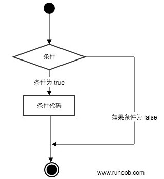
</left>

代码执行过程：

<left>
    
</left>

### 8.1.1 `if`语句

Python 中`if`语句的一般形式如下所示：

```python
if condition_1:
    statement_block_1
elif condition_2:
    statement_block_2
else:
    statement_block_3
```

**注意：**

- 1、每个条件后面要**使用冒号(" : ")**表示接下来是满足条件后要执行的语句块。
- 2、使用缩**进来划分语句块**，相同缩进数的语句在一起组成一个语句块。
- 3、Python 中没有`switch – case`语句。

### 8.1.2 `if`嵌套

在嵌套`if`语句中，可以把`if...elif...else`结构放在另外一个`if...elif...else`结构中。

```python
if 表达式1:
    语句
    if 表达式2:
        语句
    elif 表达式3:
        语句
    else:
        语句
elif 表达式4:
    语句
else:
    语句
```

## 8.2 循环控制

Python 中的循环语句有`for`和`while`，其控制结构图如下所示：

<left>
    
</left>

### 8.2.1 `while`循环

Python 中`while`循环语句的一般形式：

```python
while <condition>：
    <statement(s)>
或
while <expr>:
    <statement(s)>
else:
    <additional_statement(s)>    
或
while <condition> : <statement(s)>  # single-line style
```

执行流程图如下：

<left>
    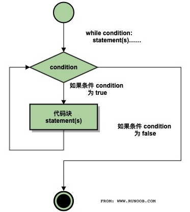
</left>

同样需要注意冒号和缩进。另外，在 Python 中**没有`do...while`循环**。

### 8.2.2 `for`循环

Python 中`for`循环可以遍历任何序列的项目，如一个列表或者一个字符串。`for`循环的一般格式如下：

```python
for <variable> in <sequence>:
    <statements>
else:
    <statements>
```

执行流程图如下：

<left>
    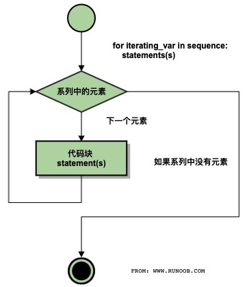
</left>

如果需要遍历数字序列，可以使用内置`range()`函数生成数列；也可以使用`range()`指定区间的值并指定不同的步长 (可以为负数)；也可以结合`range()`和`len()`函数以遍历一个序列的索引：

```python
>>> for i in range(5):
...     print(i)
>>> 
>>> for i in range(5,9):
...		print(i)
>>>
>>> for i in range(0,10,3):
...		print(i)
>>>
>>> for i in range(-10,-100,-30):
...		print(i)
>>>
>>> a = ['Google', 'Baidu', 'Runoob', 'Taobao', 'QQ']
>>> for i in range(len(a)):
...     print(i, a[i])
```

还可使用内置`enumerate()`函数进行遍历：

```python
for index, item in enumerate(sequence):
	process(index, item)
```

**使用`else`的区别** (`while`循环语句和`for`循环语句)：

- 若`else`语句和`while`循环语句一起使用，则当条件变为`False`时，则执行`else`语句。
- 若`else`语句和`for`循环语句一起使用，则`else`语句块只在`for`循环正常终止时执行！

### 8.2.3 `pass`,`break`和`continue`语句

1. **pass**语句是空语句，不做任何事情，是为了保持程序结构的完整性，一般用做占位语句。

2. **break**语句可以跳出`for`和`while`的循环体，若跳出循环体终止，任何对应的`else`循环块将不被执行。

   **`break`执行流程图：**

   <left>
       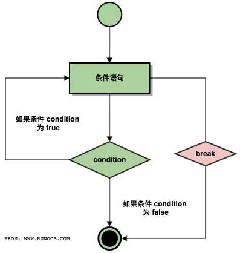
   </left>

3. **continue**语句被用来跳过当前循环块中的剩余语句，然后继续进行下一轮循环。

   **`continue`执行流程图：**

   <left>
       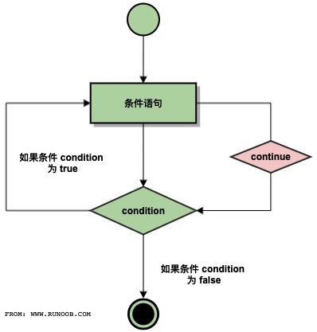
   </left>

4. **代码执行过程**：

   <left>
       
   </left>

# 9 Python 3 迭代器与生成器

## 9.1 迭代器

迭代是Python最强大的功能之一，是访问集合元素的一种方式。迭代器是一个可以记住遍历的位置的对象。<br>Python 中的任意对象，只要它定义了`__iter__`方法 (返回一个迭代器)，或者定义了`__getitem__`方法 (支持下标索引)，它就是一个可迭代对象。Python 中的任意对象，只要它定义了`__next__`方法，它就是一个迭代器。<br>迭代器对象从第一个元素开始访问，直到所有的元素被访问完结束 (迭代器只能往前不能后退)。<br>迭代器有两个基本的方法：**iter()** 和 **next()**。

### 9.1.1 迭代器的创建

字符串、列表或元组对象都可用于创建迭代器：

```python
>>> list = [1,2,3,4]
>>> it = iter(list)   # 创建迭代器对象
>>> print(next(it))   # 输出迭代器的下一个元素
1
>>> print(next(it))
2
```

迭代器对象可以使用常规`for`语句进行遍历：

```python
#!/usr/bin/python3
list=[1,2,3,4]
it = iter(list)  # 创建迭代器对象
for x in it:
    print (x, end=" ")
```

也可以使用`next()`函数：

```python
#!/usr/bin/python3
import sys       # 引入 sys 模块
list=[1,2,3,4]
it = iter(list)  # 创建迭代器对象
while True:
    try:
        print(next(it))
    except StopIteration:
        sys.exit()
```

### 9.1.2 类作为迭代器

把一个类作为一个迭代器使用需要在类中实现两个方法**`__iter__()`**与**`__next__()`**。`__iter__()`方法返回一个特殊的迭代器对象， 这个迭代器对象实现了`__next__()`方法并**通过`StopIteration`异常**标识迭代的完成。`__next__()`方法会返回下一个迭代器对象，在 `__next__()`方法中我们可以设置在完成指定循环次数后触发`StopIteration`异常来结束迭代，防止出现无限循环的情况。

```python
#!/usr/bin/env python3
class Fibonacci:
    def __init__(self, count=10):
        self._count = count

    def __iter__(self):
        self._a, self._b, self._i = 0, 1, 0
        return self

    def __next__(self):
        if self._i < self._count:
            self._i += 1
            a = self._a
            self._a, self._b = self._b, self._a + self._b
            return a
        else:
            raise StopIteration

for i in Fibonacci(10):
    print(i, end=" ")
```

## 9.2 生成器

在 Python 中，使用了**`yield`**的函数被称为生成器 (generator)，跟普通函数不同的是，生成器是一个返回迭代器的函数，只能用于迭代操作，更简单点理解生成器就是一个迭代器。在调用生成器运行的过程中，每次遇到`yield`时函数会暂停并保存当前所有的运行信息，返回`yield`的值, 并在下一次执行`next()`方法时从当前位置继续运行。

调用一个生成器函数，返回的是一个迭代器对象

```python
#!/usr/bin/python3
import sys
def fibonacci(n): # 生成器函数 - 斐波那契
    a, b, counter = 0, 1, 0
    while True:
        if (counter > n): 
            return
        yield a
        a, b = b, a + b
        counter += 1

f = fibonacci(10) # f 是一个迭代器，由生成器返回生成
while True:
    try:
        print(next(f), end=" ")
    except StopIteration:
        sys.exit()
```

另一个例子：(文件读取。若直接对文件对象调用`read()`方法，会导致不可预测的内存占用。好的方法是利用固定长度的缓冲区来不断读取文件内容。而通过`yield`我们不再需要编写读文件的迭代类，即可轻松实现文件读取)

```python
def read_file(fpath): 
    BLOCK_SIZE = 1024 
    with open(fpath, 'rb') as f: 
        while True: 
            block = f.read(BLOCK_SIZE) 
            if block: 
                yield block 
            else: 
                return
```

# 10 Python 3 函数

函数是组织好的，可重复使用的，用来实现单一，或相关联功能的代码段。函数能提高应用的模块性和代码的重复利用率。Python提供了许多**内建函数**，比如`print()`，同时也可以自己创建函数，即**用户自定义函数**。

## 10.1 定义函数

可以定义一个有自己想要功能的函数，以下是简单的规则：

- 函数代码块以 **def** 关键词开头，后接**函数标识符名称**和圆括号 **()**。
- 任何传入参数和自变量必须放在圆括号中间，圆括号之间可以用于定义参数。
- 函数的第一行语句可以选择性地使用文档字符串，用于存放函数说明。
- 函数内容以冒号起始，并且需要缩进。
- 结束函数 **return [表达式]** ，选择性地返回一个值给调用方。不带表达式的相当于返回`None`。

**定义语法**：Python 定义函数使用 **def** 关键字，一般格式如下：

```python
def 函数名(参数列表):
    函数体
```

默认情况下，参数值和参数名称是按函数声明中定义的顺序匹配起来的。

## 10.2 函数调用

函数定义：给了函数一个名称，指定了函数里包含的参数和代码块结构。这个函数的基本结构完成以后，可通过另一个函数调用执行，也可以直接从 Python 命令提示符执行。

函数返回值的注意事项: 不同于 C 语言，Python 函数可以返回多个值，多个值以元组的方式返回：

```python
#!/usr/bin/env python3
def fun(a,b):    
    "返回多个值，结果以元组形式表示"
    return a,b,a+b

print(fun(1,2))
```

## 10.3 参数传递

Python 中一切都是对象，严格意义上不能说值传递还是引用传递，应该说传不可变对象和传可变对象：

- **不可变类型：**类似 C++ 的值传递，如整数, 字符串及元组。例如: `fun(a)`传递的只是`a`的值，没有影响`a`对象本身，若在`fun(a)`内部修改`a`的值，则只是修改另一个复制的对象，而不会影响`a`本身。
- **可变类型：**类似 C++ 的引用传递，如列表, 字典及集合。例如: `fun(la)`则是将`la`真正的传过去，修改后`fun(la)`外部的`la`也会受影响。

实例1 (传不可变对象)：

```python
#!/usr/bin/python3 
def ChangeInt(a):
    a = 10

b = 2
ChangeInt(b)
print(b) # 结果仍是 2
```

实例2 (传可变对象):

```python
#!/usr/bin/python3
# 可写函数说明
def changeme(mylist):
   "修改传入的列表"
   mylist.append([1,2,3,4])
   print ("函数内取值: ", mylist)
   return
 
# 调用changeme函数
mylist = [10,20,30]
changeme(mylist)
print ("函数外取值: ", mylist)
```

传入函数的和在末尾添加新内容的对象用的是同一个引用。故输出结果如下：

```python
函数内取值:  [10, 20, 30, [1, 2, 3, 4]]
函数外取值:  [10, 20, 30, [1, 2, 3, 4]]
```

**注意**：函数也可以以一个函数为其参数：

```python
#!/usr/bin/env python3
def hello () :
  print ("Hello, world!")

def execute(f):
  "执行一个没有参数的函数"
  f()

execute(hello)
```

## 10.4 参数类型

以下是调用函数时可使用的正式参数类型：

- **必需参数**：须以正确的顺序传入函数，调用时的数量必须和声明时的一样。
- **关键字参数**：函数调用使用关键字参数来确定传入的参数值，允许调用时参数的顺序与声明时不一致。
- **默认参数**：调用函数时，若没有传递参数，则会使用默认参数。默认参数必须放在最后面。
- **不定长参数**：可能需要一个函数能处理比当初声明时更多的参数，和上述参数不同，声明时不会命名。

实例1 (必须参数)：

```python
#!/usr/bin/env python3
def printme(str):
   "打印任何传入的字符串"
   print(str)
   return

# 调用printme()函数，不加参数会报错
printme()
```

实例2 (关键字参数)：

```python
#!/usr/bin/env python3
def printinfo(name,age):
   "打印任何传入的字符串"
   print("名字: ", name)
   print("年龄: ", age)
   return

#调用printinfo()函数，不需要使用指定顺序
printinfo(age=50, name="runoob")
```

实例3 (默认参数)：

```python
#!/usr/bin/env python3
def printinfo(name, age=35):
   "打印任何传入的字符串"
   print("名字: ", name)
   print("年龄: ", age)
   return

#调用printinfo()函数，若没有给定传递参数则使用默认参数
printinfo(age=50, name="runoob")
print ("------------------------")
printinfo(name="runoob")
```

**不定长参数**：

```python
def functionname([formal_args,] *var_args_tuple, **var_args_dictionary):
   "函数_文档字符串"
   function_suite
   return [expression]
```

加了一个星号 `*` 的参数会以元组 (tuple) 的形式导入，存放所有未命名的变量参数。

```python
#!/usr/bin/env python3
def printinfo( arg1, *vartuple ):
   "打印任何传入的参数"
   print("输出: ")
   print(arg1)
   for var in vartuple:
      print(var)
   return

# 调用printinfo()函数
printinfo(70,60,50)
```

加了两个星号`**`的参数会以字典 (dict) 的形式导入，存放所有未命名的变量参数。

```python
#!/usr/bin/env python3
def printinfo(arg1, **vardict):
   "打印任何传入的参数"
   print("输出: ")
   print(arg1)
   for key,value in vardict.items():
      print(key,value)
   return

# 调用printinfo 函数
printinfo(1, a=2,b=3)
```

声明函数时，参数中星号`*`可以单独出现，若单独出现星号`*`，其后的参数必须用关键字传入。

```python
>>> def f(a,b,*,c):
...     return a+b+c
... 
>>> f(1,2,3)   # 报错
Traceback (most recent call last):
  File "<stdin>", line 1, in <module>
TypeError: f() takes 2 positional arguments but 3 were given
>>> f(1,2,c=3) # 正常
6
```

## 10.5 匿名函数 (`lambda`)

Python 使用`lambda`来创建匿名函数。所谓匿名，即不再使用`def`语句这样标准的形式定义一个函数。

- `lambda`只是一个表达式，函数体比`def`简单很多。
- `lambda`的主体是一个表达式，而不是一个代码块，仅仅能在`lambda`表达式中封装有限的逻辑进去。
- `lambda`函数拥有自己的命名空间，且不能访问自己参数列表之外或全局命名空间里的参数。
- `lambda`函数不等同于 C 或 C++ 的内联函数，后者的目的是调用小函数时不占用栈内存从而增加运行效率。

**语法**：`lambda`函数的语法只包含一个语句：

```python
lambda [arg1 [,arg2,.....argn]]:expression  # lambda函数也可以设定默认值
```

如下实例：

```python
#!/usr/bin/python3
# 可写函数说明
sum = lambda arg1, arg2: arg1 + arg2
# 调用sum函数
print("相加后的值为 : ", sum(10,20))
print("相加后的值为 : ", sum(20,20))
```

匿名函数`lambda`常与`map()`,`filter()`和`reduce()`函数一起使用。<br>函数**`map()`可根据提供的函数对指定的序列做一个映射并返回一个由指定函数所有输出构成的迭代器**：

```python
map(function, iterables)
```

参数`function`以序列中的每一个元素调用该函数，**`map()`返回一个迭代器，需用`list()`转换为列表**。

```python
>>> def square(x):  # 计算平方数
...     return x ** 2
... 
>>> list(map(square, [1,2,3,4,5]))  # 计算列表各个元素的平方
[1, 4, 9, 16, 25]
>>> list(map(lambda x: x ** 2, [1, 2, 3, 4, 5]))  # 使用 lambda 匿名函数
[1, 4, 9, 16, 25]
>>> list(map(lambda x, y: x + y, [1, 3, 5, 7, 9], [2, 4, 6, 8, 10]))
[3, 7, 11, 15, 19]   # 提供了两个列表，对相同位置的列表数据进行相加
```

函数**`filter()`可根据提供的函数对指定的序列做一个过滤并返回一个由所有符合要求的元素所构成的迭代器**， “符合要求“ 即指函数映射到该元素时返回值为`True`。

```python
filter(function, iterables)
```

参数`function`以序列中的每一个元素调用该函数，**`filter()`返回一个迭代器，需用`list()`转换为列表**。

 ```python
>>> number_list = range(-5, 5)
>>> less_than_zero = filter(lambda x: x < 0, number_list)
>>> print(list(less_than_zero)) 
[-5, -4, -3, -2, -1]
 ```

函数**`reduce()`将一个序列中的所有数据进行下列操作**：用传给`reduce`中的函数`function(有两个参数)`先对集合中的第1, 2 个元素进行操作，得到的结果再与第3个元素操作，最终得到一个结果。

```python
from functools import reduce
reduce(function, iterables[, initializer])
```

参数`function`必须有两个参数，**`reduce()`返回一个迭代器，需用`list()`转换为列表**。

```python
>>> reduce(lambda x, y: x+y, [1,2,3,4,5])  # 使用 lambda 匿名函数
15
>>>def add(x, y) :  # 定义一个两数相加的函数
...     return x + y
... 
>>> reduce(add, [1,2,3,4,5])  # 计算列表和：1+2+3+4+5
15
>>> # 统计一字符串中某字符串的重复次数
>>> from functools import reduce
>>> sentences = ['The Deep Learning textbook is a resource intended to help students and practitioners enter the field of machine learning.'] 
>>> word_count =reduce(lambda a,x:a+x.count("learning"),sentences,0)
>>> print(word_count)
```

## 10.6 强制位置参数

Python 3.8 中新增了一个函数形参语法`/`用来指明函数形参必须使用指定位置参数，不能使用关键字参数的形式。在以下的例子中，形参`a`和`b`必须使用指定位置参数，`c`或`d`可以是位置形参或关键字形参，而`e`或`f`要求为关键字形参：

```python
def f(a, b, /, c, d, *, e, f):  # /号前面的必须为位置参数，*号后面的必须为关键字参数
    print(a, b, c, d, e, f)
```

以下使用方法是正确的：

```python
f(10, 20, 30, d=40, e=50, f=60)
```

以下使用方法会发生错误：

```python
f(10, b=20, c=30, d=40, e=50, f=60)   # b 不能使用关键字参数的形式
f(10, 20, 30, 40, 50, f=60)           # e 必须使用关键字参数的形式
```

# 11 Python 3 变量前加 \* 或 \*\* 号

## 11.1 变量前加 \* 号可进行拆分

在列表、元组、字典变量前加 **"\*"** 号，会将其拆分成一个一个的独立元素。<br>不光是列表、元组、字典，由`numpy`生成的向量也可进行拆分。

```python
>>> _list = [1, 3, 5, 2]
>>> _tuple = (1, 2, 4, 5)
>>> _dict = {'1':'a', '2':'b', '3':'c'}
>>> print(_list, '=', *_list)
[1, 3, 5, 2] = 1 3 5 2
>>> print(_tuple, '=', *_tuple)
(1, 2, 4, 5) = 1 2 4 5
>>> print(_dict, '=', *_dict)
{'1': 'a', '2': 'b', '3': 'c'} = 1 2 3
```

此外，**"\*"** 号也可以作用于高维的列表。例如拆分一个二维列表，其结果是两个一维列表：

```python
>>> _list2 = [[1, 2, 3], [4, 5, 6]]
>>> print(*_list2)
[1, 2, 3] [4, 5, 6]
```

## 11.2 函数传参中使用 \* 或 \*\*

函数的参数传递中使用`*args`和`**kwargs`，这两个形参都接收若干个参数，通常我们将其称为参数组；

* `*args`：接收若干个位置参数，转换并存储于一个元组 (tuple) 变量`args`中；

* `**kwargs`：接收若干个关键字参数，转换并存储于一个字典 (dict) 变量`kwargs`中；

* 注意：位置参数`*args`一定要在关键字参数`**kwargs`前。

实例：

```python
>>> def test(*args):
...  print(args)
...  return args
...
>>> print(type(test(1,2,3,4))) 
(1, 2, 3, 4)      # print(args)的结果, 其中 args = (1,2,3,4)
<class 'tuple'>   # print(type(args))的结果, test(1,2,3,4)返回的args是一个元组
```

## 11.3 综合以上两点的实例

```python
def add(*args) :
    print(type(args))
    for iterm in args :
        print(iterm)

_list = [1, 2, 4, 5]
add(_list)  # 入参为1个列表 [1, 2, 4, 5]; 经*args后变为1个元组 args = ([1,2,4,5],) 仅包含1个元素
add(*_list) # 入参为4个元素 1, 2, 4, 5;   经*args后变为1个元组 args = (1,2,4,5) 包含4个元素
```

输出结果为：

```bash
<class 'tuple'> 
[1, 2, 4, 5]
<class 'tuple'>
1
2
4
5
```

作用于二维列表的实例：

```python
def add_plus(*args) :
    for iterm in args :
        print(iterm)

_list2 = [[1, 2, 3], [4, 5, 6]]
add_plus(_list2)
add_plus(*_list2)
```

输出结果为：

```python
[[1, 2, 3], [4, 5, 6]]
[1, 2, 3]
[4, 5, 6]
```

## 11.4 使用`zip()`函数进行压缩

Python 中有一个**`zip()`**函数功能与**"\*"**号相反，该函数可将一个或多个可迭代对象进行包装压缩，返回是一个 'zip' 类的迭代器，需经过`list()`转换为列表。通俗的说：**`zip()`压缩可迭代对象**，而 **"\*" 号解压可迭代对象**。

```
用法： zip([iterable1, iterable2, ...])

说明： 创建一个聚合了来自每个可迭代对象中的元素的迭代器。返回一个元组的迭代器，其中的第 i 个元组包含来自每个参数序列或可迭代对象的第 i 个元素。当所输入可迭代对象中最短的一个被耗尽时，迭代器将停止迭代。当只有一个可迭代对象参数时，它将返回一个单元组的迭代器。若不带参数，它将返回一个空迭代器。

注意： zip()的结果为一个'zip'类，要经过 list() 之后才能显示出来。
```

实例1 (单迭代对象为参数)：

```python
>>> x = [1, 2, 3]
>>> x = list(zip(x))
>>> print(x)
[(1,), (2,), (3,)]
```

实例2 (把两个列表转化为一个列表，以元组为该新列表的元素)：

```python
>>> seq1 = ['one', 'two', 'three']
>>> seq2 = [1, 2, 3]
>>> list(zip(seq1,seq2))
[('one', 1), ('two', 2), ('three', 3)]
```

实例3 (把两个列表转化为一个列表，每个列表转换为一个元组)：

```python
>>> zz = zip(seq1,seq2)
>>> list(zip(*zz))
[('one', 'two', 'three'), (1, 2, 3)]
```

实例4 (可利用`zip()`函数的特性可用来构建字典)：

```python
>>> dict(zip(seq1,seq2))
{'one': 1, 'two': 2, 'three': 3}
```

实例5 (另一个构建字典的例子)：

```python
>>> lst1 = ['food', 'drinks', 'sports']
>>> lst2 = [['hamburger', 'beer', 'football'], ['cheeseburger', 'wine', 'tennis']]
>>> [dict(zip(lst1, l)) for l in lst2]
[{'food': 'hamburger', 'drinks': 'beer', 'sports': 'football'}, {'food': 'cheeseburger', 'drinks': 'wine', 'sports': 'tennis'}]
```

实例6 (应用于二维列表的例子)：

```python
m = [[1, 2, 3],  [4, 5, 6],  [7, 8, 9]]
n = [[2, 2, 2],  [3, 3, 3],  [4, 4, 4]]
 
print('list(zip(m,n)):\n',list(zip(m,n)))
print("*zip(m, n):\n", *zip(m, n))
print("*zip(*zip(m, n)):\n", *zip(*zip(m, n)))
 
m2,n2 = zip(*zip(m, n))
print(m == list(m2) and n == list(n2))
```

输出结果：

```python
list(zip(m,n)):
 [([1, 2, 3], [2, 2, 2]), ([4, 5, 6], [3, 3, 3]), ([7, 8, 9], [4, 4, 4])]
*zip(m, n):
 ([1, 2, 3], [2, 2, 2]) ([4, 5, 6], [3, 3, 3]) ([7, 8, 9], [4, 4, 4])
*zip(*zip(m, n)):
 ([1, 2, 3], [4, 5, 6], [7, 8, 9]) ([2, 2, 2], [3, 3, 3], [4, 4, 4])
True
```

**注意**：

1. **可迭代对象**才可以使用 "\*" 号来拆分或`zip()`函数来压缩；
2. 带 "\*" 号变量并不是一个变量，而更**应该称为参数**，它是**不能赋值给其他变量**的，但可作为参数传递。

# 12 Python 3 命名空间和作用域

## 12.1 命名空间

先看看官方文档的一段话：

> A namespace is a mapping from names to objects. Most namespaces are currently implemented as Python dictionaries.  命名空间 (Namespace) 是从名称到对象的映射，大部分的命名空间都是通过 Python 字典来实现的。

命名空间提供了在项目中避免名字冲突的一种方法。各个命名空间是独立的，没有任何关系的，所以一个命名空间中不能有重名，但不同的命名空间是可以重名而没有任何影响。一般有三种命名空间：

- **内置名称 (built-in names)**， Python 语言内置的名称，比如函数名`abs`, `char`和异常名称`BaseException`, `Exception`等等。
- **全局名称 (global names)**，模块中定义的名称，记录了模块的变量，包括函数、类、其它导入的模块、模块级的变量和常量。
- **局部名称 (local names)**，函数中定义的名称，记录了函数的变量，包括函数的参数和局部定义的变量。类中定义的也是局部名称。

<left>
    
</left>

**命名空间查找顺序**：**局部命名空间 -> 全局命名空间 -> 内置命名空间**。若所有空间都找不到，则将放弃查找并引发一个`NameError`异常。**命名空间的生命周期**：取决于对象的作用域，如果对象执行完成，则该命名空间的生命周期就结束。因此，我们无法从外部命名空间访问内部命名空间的对象。

实例1：

```python
var1 = 5  # var1 是全局名称
def some_func():
    var2 = 6  # var2 是局部外的闭包名称
    def some_inner_func():
        var3 = 7  # var3 是内嵌的局部名称
```

如下图所示，相同的对象名称可以存在于多个命名空间中。

<left>
    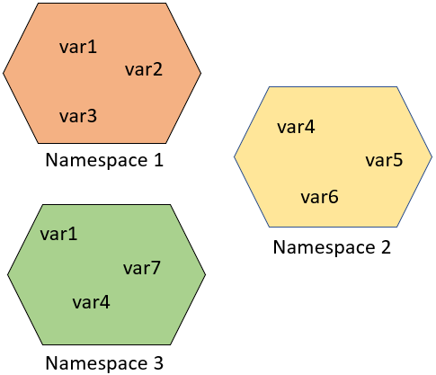
</left>

## 12.2 作用域

> A scope is a textual region of a Python program where a namespace is directly accessible. "Directly accessible" here means that an unqualified reference to a name attempts to find the name in the namespace.  作用域就是一个 Python 程序可以直接访问命名空间的正文区域。在一个 Python 程序中，直接访问一个变量，会从内到外依次访问所有的作用域直到找到，否则会报未定义的错误。

Python 中程序的变量并不是在哪个位置都可以访问的，访问权限决定于这个变量是在哪里赋值的。变量的作用域决定了在哪一部分程序可以访问哪个特定的变量名称。Python 中有四种作用域：

- **L (Local)**：最内层，包含局部变量，比如一个函数/方法内部。
- **E (Enclosing)**：包含了非局部 (non-local) 也非全局 (non-global) 的变量。比如两个嵌套函数，一个函数(或类)A里面又包含了一个函数B，那么对于B中的名称来说A中的作用域就为nonlocal。
- **G (Global)**：当前脚本的最外层，比如当前模块的全局变量。
- **B (Built-in)**： 包含了内建的变量/关键字等，最后被搜索

规则顺序： **L –> E –> G –> B**。在局部找不到，便会去局部外的局部找 (例如闭包)，再去全局找，再去内置中找。

<left>
    
</left>

```python
g_count = 0  # 全局作用域
def outer():
    o_count = 1  # 闭包函数外的函数中
    def inner():
        i_count = 2  # 局部作用域
```

内置作用域是通过一个名为`builtin`的标准模块来实现的，但是这个变量名自身并没有放入内置作用域内，所以必须导入这个文件才能够使用它。在 Python 3.0 中可以使用以下的代码来查看到底预定义了哪些变量:

```python
>>> import builtins
>>> dir(builtins)
```

Python 中只有模块 (module), 类 (class) 以及函数 (def或lambda) 才会引入新的作用域，其它代码块 (如 if…elif…else, try…except, for, while等) 是不会引入新作用域的，也就是说这些语句内定义的变量，外部也可以访问：

```python
>>> if True:
...  msg = 'I am from Runoob'
... 
>>> msg
'I am from Runoob'
```

如果将`msg`定义在函数中，则它就是局部变量，那么外部不能访问：

```python
>>> def test():
...     msg_inner = 'I am from Runoob'
... 
>>> msg_inner
Traceback (most recent call last):
  File "<stdin>", line 1, in <module>
NameError: name 'msg_inner' is not defined
```

### 12.2.1 全局变量和局部变量

定义在函数内部的变量有一个局部作用域，定义在函数外的有全局作用域。局部变量只能在其被声明的函数内部访问，而全局变量可以在整个程序范围内访问。调用函数时，所有在函数内声明的变量名称都将被加入到作用域中：

```python
#!/usr/bin/env python3
total = 0  # 这是一个全局变量
def sum( arg1, arg2 ):
    total = arg1 + arg2  # total在这里是局部变量
    print ("函数内是局部变量: ", total)
    return total
sum(10,20) # 调用sum函数
print("函数外是全局变量: ", total)
#输出为:
# 函数内是局部变量:  30
# 函数外是全局变量:  0
```

### 12.2.2 关键字`global`和`nonlocal`

内部作用域**可访问外部作用域**变量**但不可以修改**该变量。当内部作用域想修改外部作用域的变量时，需要使用关键字 **global** 和 **nonlocal** 。

```python
#!/usr/bin/env python3
num = 1
def fun1():
    global num  # 使用 global 关键字声明
    print(num) 
    num = 123
    print(num)
fun1()
print(num)
```

若要修改嵌套作用域 (**Enclosing**作用域,**外层非全局作用域**) 中的变量，则需要使用 **nonlocal** 关键字：

```python
#!/usr/bin/env python3
def outer():
    num = 10
    def inner():
        nonlocal num   # 使用 nonlocal 关键字声明
        print(num)
        num = 100
    inner()
    print(num)
outer()
```

# 13 Python 3 函数装饰器

装饰器 (Decorators) 是 Python 的一个重要部分。简单地说：它们是修改其他函数的功能的函数，有助于让代码更简洁也更 Python范儿。这可能是最难掌握的概念之一，我们会每次只讨论一个步骤，直至你能完全理解它。

## 13.1 函数也是对象

首先我们来理解下 Python 中的函数：

```python
#!/usr/bin/env python3
def hi(name="yasoob"):
    return "hi " + name

print(hi())
# output: 'hi yasoob'

# 我们甚至可以将一个函数赋值给一个变量，比如
greet = hi
# 我们这里没有在使用小括号，因为我们并不是在调用hi()函数
# 而是在将它放在greet变量里头。

# 我们尝试运行下这个
print(greet())
# output: 'hi yasoob'

# 如果我们删掉旧的hi函数，看看会发生什么！
del hi
print(hi())
#outputs: NameError
print(greet())
#outputs: 'hi yasoob'
```

## 13.2 在函数中定义函数

在 Python 中我们可以在一个函数中定义另一个函数：

```python
#!/usr/bin/env python3
def hi(name="yasoob"):
    print("now you are inside the hi() function")
 
    def greet():
        return "now you are in the greet() function"
 
    def welcome():
        return "now you are in the welcome() function"

    print(greet())
    print(welcome())
    print("now you are back in the hi() function")

hi()
#output:now you are inside the hi() function
#       now you are in the greet() function
#       now you are in the welcome() function
#       now you are back in the hi() function
 
# 上面展示了无论何时你调用hi(), 则greet()和welcome()将会同时被调用。
# 然后greet()和welcome()函数在hi()函数之外是不能访问的，比如：
greet()
#outputs: NameError: name 'greet' is not defined
```

## 13.3 从函数中返回函数

其实并不需要在一个函数里去执行另一个函数，我们也可以将其作为输出返回出来：

```python
#!/usr/bin/env python3
def hi(name="yasoob"):
    def greet():
        return "now you are in the greet() function"

    def welcome():
        return "now you are in the welcome() function"

    if name == "yasoob":
        return greet
    else:
        return welcome
 
a = hi()
print(a)
#outputs: <function greet at 0x7f2143c01500>
#上面清晰地展示了`a`现在指向到hi()函数中的greet()函数

#现在试试这个 
print(a())
#outputs: now you are in the greet() function
```

再次看看这个代码，在`if/else`语句中我们返回`greet`和`welcome`，而不是`greet()`和`welcome()`。这是因为如果把一对小括号放在函数名称后，这个函数就会执行；然而若不放括号在函数名称后，那它可以被到处传递，并且可以赋值给别的变量而不去执行它。当写下`a = hi()`时，`hi()`会被执行，而由于`name`参数默认是`yasoob`，所以函数名`greet`被返回了 (同样，若把语句改为`a = hi(name = "ali")`，那么函数名`welcome`将被返回)。当执行`a()`时，相当于执行`hi()()`即`greet()`，这时才会输出`now you are in the greet() function`。

## 13.4 将函数作为参数传给另一个函数

```python
#!/usr/bin/env python3
def hi():
    return "hi yasoob!"

def doSomethingBeforeHi(func):
    print("I am doing some boring work before executing hi()")
    print(func())

doSomethingBeforeHi(hi)
#outputs:I am doing some boring work before executing hi()
#        hi yasoob!
```

## 13.5 第一个装饰器

上一个例子里，其实已经创建了一个装饰器！现在修改下上一个装饰器，并编写一个稍微更有用点的程序：

```python
#!/usr/bin/env python3
def a_new_decorator(a_func):
    def wrapTheFunction():
        print("I am doing some boring work before executing a_func()")
        a_func()
        print("I am doing some boring work after executing a_func()")
    return wrapTheFunction

def a_function_requiring_decoration():
    print("I am the function which needs some decoration to remove my foul smell")

a_function_requiring_decoration()
#outputs: "I am the function which needs some decoration to remove my foul smell"

a_function_requiring_decoration = a_new_decorator(a_function_requiring_decoration)
#now a_function_requiring_decoration is wrapped by wrapTheFunction()

a_function_requiring_decoration()
#outputs:I am doing some boring work before executing a_func()
#        I am the function which needs some decoration to remove my foul smell
#        I am doing some boring work after executing a_func()
```

上述例子正是 Python 中装饰器做的事情！它们封装一个函数，并且用这样或者那样的方式来修改该函数的行为。现在你也许疑惑，我们在代码里并没有使用 **@** 符号，其实那只是一个简短的方式来生成一个被装饰的函数。

```python
#!/usr/bin/env python3
def a_new_decorator(a_func):
    def wrapTheFunction():
        print("I am doing some boring work before executing a_func()")
        a_func()
        print("I am doing some boring work after executing a_func()")
    return wrapTheFunction

@a_new_decorator
def a_function_requiring_decoration():
    """Hey you! Decorate me!"""
    print("I am the function which needs some decoration to remove my foul smell")

a_function_requiring_decoration()
#outputs: I am doing some boring work before executing a_func()
#         I am the function which needs some decoration to remove my foul smell
#         I am doing some boring work after executing a_func()

#the @a_new_decorator is just a short way of saying:
a_function_requiring_decoration = a_new_decorator(a_function_requiring_decoration)
```

希望你现在对 Python 装饰器的工作原理有一个基本的理解。但是如果运行如下代码会存在一个问题：

```python
print(a_function_requiring_decoration.__name__)
# Output: wrapTheFunction
```

这并不是我们想要的！希望的输出应该是 "a_function_requiring_decoration"。而这里的函数被`warpTheFunction`替代了，它重写了我们函数的名字和注释文档。幸运的是 Python 提供给我们一个简单的函数来解决这个问题，那就是`functools.wraps`：

```python
#!/usr/bin/env python3
from functools import wraps
def a_new_decorator(a_func):
    @wraps(a_func)
    def wrapTheFunction():
        print("I am doing some boring work before executing a_func()")
        a_func()
        print("I am doing some boring work after executing a_func()")
    return wrapTheFunction

@a_new_decorator
def a_function_requiring_decoration():
    """Hey yo! Decorate me!"""
    print("I am the function which needs some decoration to "
          "remove my foul smell")

print(a_function_requiring_decoration.__name__)
# Output: a_function_requiring_decoration
```

==**装饰器使用的蓝本规范**==：

```python
#!/usr/bin/env python3
from functools import wraps
def decorator_name(f):
    @wraps(f)
    def decorated(*args, **kwargs):
        if not can_run:
            return "Function will not run"
        return f(*args, **kwargs)
    return decorated

@decorator_name
def func():
    return("Function is running")

can_run = True
print(func())
# Output: Function is running

can_run = False
print(func())
# Output: Function will not run
```

**注意**：**@wraps()** 接受一个函数来进行装饰，并加入了**复制函数名称、注释文档、参数列表等等**的功能。这可以让我们**在装饰器里面访问在装饰之前的函数的属性**。

## 13.6 装饰器的使用场景

### 13.6.1 授权(Authorization)

装饰器能有助于检查某个人是否被授权去使用一个web应用的端点(endpoint)。它们被大量使用于Flask和Django web框架中。这里是一个例子来使用基于装饰器的授权：

```python
from functools import wraps
def requires_auth(f):
    @wraps(f)
    def decorated(*args, **kwargs):
        auth = request.authorization
        if not auth or not check_auth(auth.username, auth.password):
            authenticate()
        return f(*args, **kwargs)
    return decorated
```

### 13.6.2 日志(Logging)

日志是装饰器运用的另一个亮点。这是个例子：

```python
from functools import wraps
def logit(func):
    @wraps(func)
    def with_logging(*args, **kwargs):
        print(func.__name__ + " was called")
        return func(*args, **kwargs)
    return with_logging

@logit
def addition_func(x):
   """Do some math."""
   return x + x
 
result = addition_func(4)
# Output: addition_func was called
```

## 13.7 带参数的装饰器

实例1：(打日志)

```python
from functools import wraps
def logit(logfile='out.log'):
    def logging_decorator(func):
        @wraps(func)
        def wrapped_function(*args, **kwargs):
            log_string = func.__name__ + " was called"
            print(log_string)
            # 打开logfile，并写入内容
            with open(logfile, 'a') as opened_file:
                # 现在将日志打到指定的logfile
                opened_file.write(log_string + '\n')
            return func(*args, **kwargs)
        return wrapped_function
    return logging_decorator

@logit()
def myfunc1():
    pass

myfunc1()
# Output: myfunc1 was called
# 现在一个叫做 out.log 的文件出现了，里面的内容就是上面的字符串

@logit(logfile='func2.log')  # 带参数的装饰器
def myfunc2():
    pass

myfunc2()
# Output: myfunc2 was called
# 现在一个叫做 func2.log 的文件出现了，里面的内容就是上面的字符串
```

实例2：(输出任务执行时间)

```python
import time
def timer(parameter):
    def outer_wrapper(func):
		def wrapper(*args, **kwargs):
				start = time.time()
				func(*args, **kwargs)
				stop = time.time()
				print("{0} run time is {1:8.6f}.".format(parameter, stop-start))
		return wrapper
	return outer_wrapper

@timer(parameter='task1')
def task1():
    print("in the task1")
	time.sleep(2)

@timer(parameter='task2')
def task2():
    print("in the task2")
	time.sleep(2)

task1()
task2()
# Output:
# in the task1
# task1 run time is 2.002187.
# in the task2
# task2 run time is 2.002156.
```

## 13.8 装饰器类

现在我们有了能用于正式环境的`logit`装饰器，但当我们的应用的某些部分还比较脆弱时，异常也许是需要更紧急关注的事情。比方说有时你只想打日志到一个文件。而有时你想把引起你注意的问题发送到一个Email，同时也保留日志，留个记录。这是一个使用继承的场景，但目前为止我们只看到过用来构建装饰器的函数。幸运的是，类也可以用来构建装饰器。那我们现在以一个类而不是一个函数的方式，来重新构建`logit`。

```python
from functools import wraps
class logit(object):
    def __init__(self, logfile='out.log'):
        self.logfile = logfile
 
    def __call__(self, func):
        @wraps(func)
        def wrapped_function(*args, **kwargs):
            log_string = func.__name__ + " was called"
            print(log_string)
            # 打开logfile并写入
            with open(self.logfile, 'a') as opened_file:
                # 现在将日志打到指定的文件
                opened_file.write(log_string + '\n')
            # 现在，发送一个通知
            self.notify()
            return func(*args, **kwargs)
        return wrapped_function
 
    def notify(self):
        # logit只打日志，不做别的
        pass
```

这个实现有一个附加优势，比嵌套函数的方式更加整洁，而且包裹一个函数还是使用跟以前一样的语法：

```python
@logit()
def myfunc1():
    pass
```

现在，我们给`logit`创建子类，来添加 Email 的功能 (虽然 Email 这个话题不会在这里展开)。

```python
class email_logit(logit):
    '''
    一个logit的实现版本，可以在函数调用时发送Email给管理员
    '''
    def __init__(self, email='admin@myproject.com', *args, **kwargs):
        self.email = email
        super(email_logit, self).__init__(*args, **kwargs)

    def notify(self):
        # 发送一封email到self.email
        # 这里就不做实现了
        pass
```

从现在起，`@email_logit`将会和`@logit`产生同样的效果，但在打日志的基础上还会多发送一封邮件给管理员。

## 13.9 装饰器顺序

一个函数还可以同时定义多个装饰器，比如：

```python
@a
@b
@c
def f ():
    pass
```

它的执行顺序是从里到外，最先调用最里层的装饰器，最后调用最外层的装饰器，它等效于：

```python
f = a(b(c(f)))
```

# 14 Python 3 模块

Python 提供了一个办法，把定义的所有的方法和变量存放在文件中，为一些脚本或者交互式的解释器实例使用，这个文件被称为模块。模块是一个包含所有定义的函数和变量的文件，其后缀名是.py。模块可以被别的程序引入，以使用该模块中的函数等功能。这也是使用 Python 标准库的方法。

模块除了方法定义，还可以包括可执行的代码，这些代码一般用来初始化这个模块，只有在第一次被导入时才会被执行。每个模块有着各自独立的符号表，在模块内部为所有的函数当作全局符号表来使用。所以可放心大胆地在模块内部使用这些全局变量，而不用担心把其他用户的全局变量搞混。此外，也可通过`modname.itemname`这样的表示法来访问模块内的函数。 

## 14.1 `import`语句

想使用 Python 源文件，只需在另一个源文件里执行`import`语句，被导入的模块的名称将被放入当前操作的模块的符号表中。语法如下：

```python
import module1[, module2[,... moduleN]
```

当解释器遇到`import`语句，若所要导入的模块存在于当前的搜索路径中则会被导入。搜索路径是一个解释器会先进行搜索的所有目录的列表。**一个模块只会被导入一次**，不管你执行了多少次`import`。

当我们使用`import`语句的时，Python 解释器是怎样找到对应的文件的呢？这就涉及到 Python 的搜索路径，由一系列目录名组成，Python 解释器依次从这些目录中去寻找所需引入的模块。也可以通过定义环境变量的方式来确定搜索路径。搜索路径是在 Python 编译或安装的时候确定的，安装新的库时会添加相应库的路径到搜索路径中。搜索路径被存储在`sys`模块中的`path`变量：

```python
>>> import sys; sys.path
['', '/usr/lib/python38.zip', '/usr/lib/python3.8', '/usr/lib/python3.8/lib-dynload', '/usr/lib/python3.8/site-packages']
```

`sys.path`输出是一个列表，其中第一项是空串''，代表当前目录，即我们执行 Python 解释器的目录 (对于脚本的话则是运行脚本的所在目录)。因此若在当前目录下存在与所要引入模块同名的文件，则会屏蔽掉要引入的模块。

## 14.2 `from … import` 语句

Python 的`from`语句让你从模块中导入一个指定的部分到当前命名空间中，这种导入的方法不会把被导入的模块的名称放在当前的字符表中。语法如下：

```python
from modname import name1[, name2[, ... nameN]]
```

把一个模块的所有内容全都导入到当前的命名空间也是可行的，只需使用如下声明：

```python
from modname import *
```

这提供了一个简单的方法来导入一个模块中的所有项目，但是那些由单一下划线 (_) 开头的不会被导入。大多数情况下 Python 程序员不使用这种方法，因为引入的其它来源的命名很可能覆盖了已有的定义。 

## 14.3 `if __name__ == '__main__'：`的作用

一个 Python 文件通常有两种使用方法:<br>    第一是作为脚本直接执行；<br>    第二是`import `到其他的 python 脚本中被调用 (模块重用) 执行。

`if __name__ == '__main__': `的作用就是控制这两种情况执行代码的过程。在 `if __name__ == '__main__': `下的的代码只在第一种情况下 (即文件作为脚本直接执行时) 才会被执行, 而`import`到其他脚本中是不会被执行的。

## 14.4 使用`dir()`函数

内置的函数`dir()`可以找到模块内定义的所有名称，以一个字符串列表的形式返回：

```python
>>> import sys; dir(sys)
['__breakpointhook__', '__displayhook__', '__doc__', '__excepthook__', '__interactivehook__', '__loader__', '__name__', '__package__', '__spec__', '__stderr__', '__stdin__', '__stdout__', '__unraisablehook__', '_base_executable', '_clear_type_cache', '_current_frames', '_debugmallocstats', '_framework', '_getframe', '_git', '_home', '_xoptions', 'abiflags', 'addaudithook', 'api_version', 'argv', 'audit', 'base_exec_prefix', 'base_prefix', 'breakpointhook', 'builtin_module_names', 'byteorder', 'call_tracing', 'callstats', 'copyright', 'displayhook', 'dont_write_bytecode', 'exc_info', 'excepthook', 'exec_prefix', 'executable', 'exit', 'flags', 'float_info', 'float_repr_style', 'get_asyncgen_hooks', 'get_coroutine_origin_tracking_depth', 'getallocatedblocks', 'getcheckinterval', 'getdefaultencoding', 'getdlopenflags', 'getfilesystemencodeerrors', 'getfilesystemencoding', 'getprofile', 'getrecursionlimit', 'getrefcount', 'getsizeof', 'getswitchinterval', 'gettrace', 'hash_info', 'hexversion', 'implementation', 'int_info', 'intern', 'is_finalizing', 'last_traceback', 'last_type', 'last_value', 'maxsize', 'maxunicode', 'meta_path', 'modules', 'path', 'path_hooks', 'path_importer_cache', 'platform', 'prefix', 'ps1', 'ps2', 'pycache_prefix', 'set_asyncgen_hooks', 'set_coroutine_origin_tracking_depth', 'setcheckinterval', 'setdlopenflags', 'setprofile', 'setrecursionlimit', 'setswitchinterval', 'settrace', 'stderr', 'stdin', 'stdout', 'thread_info', 'unraisablehook', 'version', 'version_info', 'warnoptions']
```

若没有给定参数，那么`dir()`函数会罗列出当前定义的所有名称。

```python
>>> a = [1, 2, 3, 4, 5]
>>> import math
>>> dir()
['__annotations__', '__builtins__', '__doc__', '__loader__', '__name__', '__package__', '__spec__', 'a', 'math', 'sys']
>>> b = math.sqrt(a[3]); dir()
['__annotations__', '__builtins__', '__doc__', '__loader__', '__name__', '__package__', '__spec__', 'a', 'b', 'math', 'sys']
```

## 14.5 Python 包管理 (packages)

包 (packages) 是一种管理 Python 模块命名空间的形式，采用"点模块名称"。比如一个模块的名称是`A.B`， 那么它表示一个包`A`中的子模块`B`。就像使用模块的时候，不用担心不同模块之间的全局变量相互影响一样，采用点模块名称这种形式也不用担心不同库之间的模块有重名的情况。

不妨假设想设计一套统一处理声音文件和数据的模块 (或者称之为一个"包")，但是有很多种不同的音频文件格式通过后缀名区分，如: .wav, .aiff, .au等，所以需要有一组不断增加的模块，用来在不同的格式之间转换。并且针对这些音频数据，还有很多不同的操作，如: 混音, 添加回声, 增加均衡器, 创建人造立体声效果等。所以还需要一组怎么也写不完的模块来处理这些操作。

这里给出了一种可能的包结构 (在分层的文件系统中): 

```
sound/                          顶层包
      __init__.py               初始化 sound 包
      formats/                  文件格式转换子包
              __init__.py
              wavread.py
              wavwrite.py
              aiffread.py
              aiffwrite.py
              auread.py
              auwrite.py
              ...
      effects/                  声音效果子包
              __init__.py
              echo.py
              surround.py
              reverse.py
              ...
      filters/                  filters 子包
              __init__.py
              equalizer.py
              vocoder.py
              karaoke.py
              ...
```

在导入一个包的时候，Python 会根据`sys.path`中的目录来寻找这个包中包含的子目录。这些目录中只有包含一个叫做 `__init__.py`的文件才会被认作是一个包，主要是为了避免一些滥俗的名字 (比如叫做`string`) 不小心地影响了搜索路径中的有效模块。最简单的情况，可放一个空的`__init__.py`文件。这个文件中也可以包含一些初始化代码或者为`__all__`变量赋值。

用户可只导入一个包里的特定模块，如: **`import sound.effects.echo`**，这将会导入子模块`sound.effects.echo`，但必须使用全名去访问，如: `sound.effects.echo.echofilter(input, output, delay=0.7, atten=4)`。还有一种导入子模块的方法是: **`from sound.effects import echo`**，这同样会导入子模块`echo`并且不需要冗长的前缀，可以这样使用: `echo.echofilter(input, output, delay=0.7, atten=4)`。还有一种变化就是直接导入一个函数或者变量: **`from sound.effects.echo import echofilter`**，同样这也会导入子模块`echo`且可以直接使用`echofilter()`函数，如: `echofilter(input, output, delay=0.7, atten=4)`。

**注意事项**：

1. 若使用**`from package import item`**这种导入形式，对应的`item`既**可以是包里面的子包**，或者是**包里面定义的其他名称**，如：**函数、类或者变量名**。`import`语法会首先把`item`当作一个包定义的名称；若没找到，再试图按照一个模块去导入；若还没找到，则抛出一个`ImportError`异常。

2. 若使用**`import item.subitem.subsubitem`**这种导入形式，**最后一项之外的其他项都必须是包**，而**最后一项则可以是模块或者是包**，但**不可以是函数、类或者变量名**。 

3. 若包在结构中是一个子包而又想**导入其同级别的包**，则需**使用绝对路径来导入**。如:`sound.filters.vocoder`模块中要使用包`sound.effects`中的`echo`，则需写成`from sound.effects import echo`。

4. 若在包定义文件**`__init__.py`**中存在一个叫做**`__all__`**的列表变量，那么在使用**`from package import *`**的时候只会把这个列表中的所有名字作为包内容导入。

5. 在包定义文件**`__init__.py`**中可写入**初始化模块的代码**，也可**写入类的定义**，如：

   ```python
   # coding: utf-8
   # Copyright (c) Materials Virtual Lab
   # Distributed under the terms of the BSD License.
   
   """This package contains Potential classes representing Interatomic Potentials."""
   
   import abc
   import six
   from monty.json import MSONable
   
   class Potential(six.with_metaclass(abc.ABCMeta, MSONable)):
       """
       Abstract Base class for a Interatomic Potential.
       """
   
       @abc.abstractmethod
       def train(self, train_structures, energies, forces, stresses, **kwargs):
           """
           Train interatomic potentials with energies, forces and
           stresses corresponding to structures.
   
           Args:
               train_structures (list): List of Pymatgen Structure objects.
               energies (list): List of DFT-calculated total energies of each structure
                   in structures list.
               forces (list): List of DFT-calculated (m, 3) forces of each structure
                   with m atoms in structures list. m can be varied with each single
                   structure case.
               stresses (list): List of DFT-calculated (6, ) virial stresses of each
                   structure in structures list.
           """
           pass
   
       @abc.abstractmethod
       def evaluate(self, test_structures, ref_energies, ref_forces, ref_stresses):
           """
           Evaluate energies, forces and stresses of structures with trained
           interatomic potentials.
   
           Args:
               test_structures (list): List of Pymatgen Structure Objects.
               ref_energies (list): List of DFT-calculated total energies of each
                   structure in structures list.
               ref_forces (list): List of DFT-calculated (m, 3) forces of each
                   structure with m atoms in structures list. m can be varied with
                   each single structure case.
               ref_stresses (list): List of DFT-calculated (6, ) viriral stresses of
                   each structure in structures list.
   
           Returns:
               DataFrame of original data and DataFrame of predicted data.
           """
           pass
   
       @abc.abstractmethod
       def predict(self, structure):
           """
           Predict energy, forces and stresses of the structure.
   
           Args:
               structure (Structure): Pymatgen Structure object.
   
           Returns:
               energy, forces, stress
           """
           pass
   ```

# 15 Python 3 错误和异常

Python 有两种错误：**语法错误**和**异常**。

## 15.1 语法错误

Python 的语法错误称之为解析错。语法分析器可指出出错的一行，并在最先找到的错误处标记一个箭头。例：

```python
>>>while True print('Hello world')
  File "<stdin>", line 1, in ?
    while True print('Hello world')
                   ^
SyntaxError: invalid syntax
```

这个例子中，函数`print()`被检查到有错误，它前面缺少了一个**:**冒号 。

## 15.2 异常

即便 Python 程序的语法是正确的，在运行它的时候，也有可能发生错误。运行期检测到的错误被称为异常。大多数的异常都不会被程序处理，都以错误信息的形式展现在这里：

```python
>>>10 * (1/0)             # 0 不能作为除数，触发异常
Traceback (most recent call last):
  File "<stdin>", line 1, in ?
ZeroDivisionError: division by zero
>>> 4 + spam*3             # spam 未定义，触发异常
Traceback (most recent call last):
  File "<stdin>", line 1, in ?
NameError: name 'spam' is not defined
>>> '2' + 2               # int 不能与 str 相加，触发异常
Traceback (most recent call last):
  File "<stdin>", line 1, in ?
TypeError: Can't convert 'int' object to str implicitly
```

异常以不同的类型出现，这些类型都作为信息的一部分打印出来。上面例子中的异常类型有`ZeroDivisionError`, `NameError`和`TypeError`。错误信息的前面部分显示了异常发生的上下文，并以调用栈的形式显示具体信息。

## 15.3 捕获异常

### 15.3.1 使用`try...except`语句

异常捕捉可以使用 **try…except** 语句：

<left>
    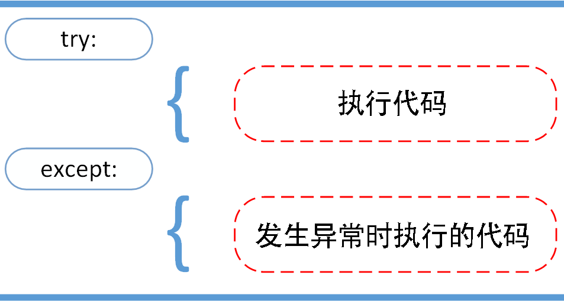
</left>

以下例子中，让用户输入一个合法的整数，且允许用户中断这个程序 (使用 Ctrl+C 或者操作系统提供的方法)。用户中断的信息会引发一个`KeyboardInterrupt`异常：

```python
while True:
    try:
        x = int(input("请输入一个数字: "))
        break
    except ValueError:
        print("您输入的不是数字，请再次尝试输入！")
```

**`try...except`**语句按照如下方式工作；

- 首先，执行在关键字`try`和关键字`except`之间的语句;
- 若没有异常发生，则忽略`except`子句，在`try`子句执行后结束;
- 若在执行`try`子句的过程中发生了异常，那么`try`子句中余下的部分将被忽略;
  - 若异常的类型和`except`之后的名称相符，那么对应的`except`子句将被执行;
  - 若异常没有与任何的`except`匹配，那么这个异常将会传递给上层的`try`中。

一个`try/except`语句可能包含多个`except`子句，分别来处理不同的特定的异常，但最多只有一个分支会被执行。处理程序将只针对对应的`try`子句中的异常进行处理，而不是其他的`try`的处理程序中的异常。一个`except`子句可以同时处理多个异常，这些异常将被放在一个括号里成为一个元组，如:

```python
except (RuntimeError, TypeError, NameError):
    pass
```

最后一个`except`子句可以忽略异常的名称，它将被当作通配符使用。可以使用这种方法打印一个错误信息，然后**再次把异常抛出**。

```python
import sys
try:
    f = open('myfile.txt')
    s = f.readline()
    i = int(s.strip())
except OSError as err:
    print("OS error: {0}".format(err))
except ValueError:
    print("Could not convert data to an integer.")
except:
    print("Unexpected error:", sys.exc_info()[0])
    raise
```

### 15.3.2 使用`try...except...else`语句

**`try...except`** 语句还有一个可选的**`else`** 子句，将在`try`子句没有发生任何异常的时候执行。若要使用**`else`**子句，必须将其放在所有的`except`子句之后。

<left>
    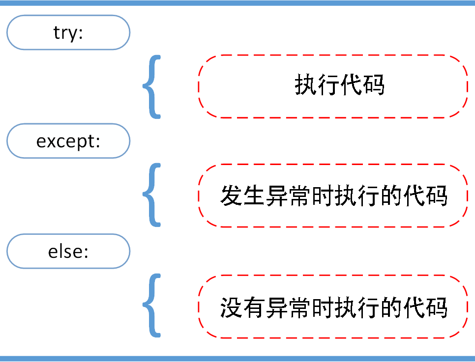
</left>

以下实例在`try`语句中判断文件是否可以打开，若打开文件时未发生异常则执行`else`子语句读取文件内容：

```python
for arg in sys.argv[1:]:
    try:
        f = open(arg, 'r')
    except IOError:
        print('cannot open', arg)
    else:
        print(arg, 'has', len(f.readlines()), 'lines')
        f.close()
```

使用`else`子句比把所有语句都放在`try`子句里面要好，可以避免一些意想不到而`except`又无法捕获的异常。

异常处理并不仅仅处理那些直接发生在`try`子句中的异常，还能处理子句中调用的函数 (甚至是间接调用的函数) 里抛出的异常。例如：

```python
>>> def this_fails():
...   x = 1/0
...
>>> try:
...   this_fails()
... except ZeroDivisionError as err:
...   print('Handling run-time error:', err)
...
Handling run-time error: int division or modulo by zero
```

### 15.3.3 使用`try...finally`语句

**`try...finally`**语句无论是否发生异常都将执行最后的代码。

<left>
    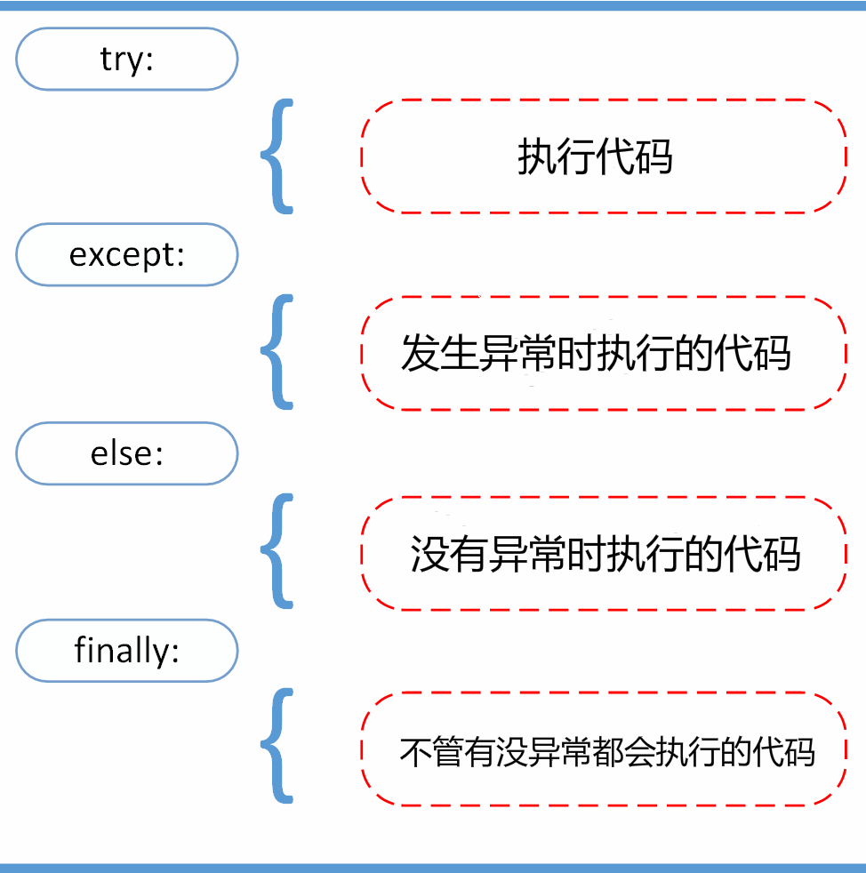
</left>

实例：

```python
try:
    runoob()
except AssertionError as error:
    print(error)
else:
    try:
        with open('file.log') as file:
            read_data = file.read()
    except FileNotFoundError as fnf_error:
        print(fnf_error)
finally:
    print('this line will be printed no matter there is error or not.')
```

在`finally`子句中可定义无论在任何情况下都会执行的清理行为，例如关闭打开的文件：

```python
try:
  file= open("test.txt","r")
  for line in file.readlines():
    print line
except:
  print "error"
finally:
  if file:
    file.close()
```

### 15.3.4 使用`with...as`语句

一些对象定义了标准的清理行为，无论系统是否成功的使用了它，一旦不需要它了，那么这个标准的清理行为就会执行。下面这个例子展示了尝试打开一个文件，然后把内容打印到屏幕上:

```python
file = open("myfile.txt")
for line in file.readlines():
    print(line, end="")
file.close()
```

以上这段代码的问题是，如果读取文件过程中出现错误，那么文件会保持打开状态一直占用内存资源。如前面所诉，可以使用`try..finally`语句来实现自动关闭文件。而关键词`with`语句则提供了更为简单的实现，可以保证诸如文件之类的对象在使用完之后一定会正确的执行他的清理方法。

实例1：(以下这段代码执行完毕后，就算在处理过程中出了问题，文件`file`也总会被关闭)

```python
with open("myfile.txt") as file:
    for line in file:
        print(line, end="")
```

实例2：(使用`with`语句来打开文件读写、用`pickle`包完成数据的存储及恢复的操作)

```python
import pickle
try:
  with open("phone.pickle", "wb") as outf:
    pickle.dump("13193388105", outf)
  except:
    print("file have error.")

try:
  with open("phone.pickle", "rb") as outf:
    data = pickle.load(outf)
    print(type(data))
    print(data)
  except:
    print("file have error.")
```

#### 15.3.4.1 `with`语句的执行原理

`with`语句的基本形式是：

```python
with expression1 as var1 [,expression2 as var2 [...]]：
  code_block
```

这样的一段代码可以称为一个上下文 (context)，在执行`with`语句时，解释器会先求出表达式的值，这个值 (对象) 就是一个上下文管理器，并且假设这个对象拥有如下类的构造方法：

```python
def __enter__():
  # 描述进入上下文的动作
  pass
 
 def __exit__():
  # 描述退出上下文的动作
  pass
```

`with`语句在求出这个上下文管理器对象之后，会自动执行`__enter__()`，并将这个对象的返回值赋值于`as`之后的变量，然后执行语句块。最终在退出上下文前，解释器会自动执行对象的`__exit__()`。Python 中的系统和标准库的一些类型定义了这对操作，可以直接用于`with`语句，比如文件对象的操作。

#### 15.3.4.2 自定义类的上下文管理

若自己有类似的计算过程需要抽取出来，那么可以自定义一个类，并且包含`__enter__()`和`__exit__()`方法。

```python
class File(object):
  def __init__(self, file_name, method):
    self.file_obj = open(file_name, method)
  def __enter__(self):
    return self.file_obj
  def __exit__(self, exception_type, exception_value, traceback): 
    self.file_obj.close() 
    # 异常处理的代码块 #

with File('demo.txt', 'r') as opened_file:
  for line in opened_file:
    print(line)

# with 语句执行的步骤：
# (1) 创建一个 File 类的实例, 先调用__init__方法来使用指定模式打开一个指定的文件
# (2) with 语句调用 File 类的__enter__方法返回打开的文件对象的句柄
# (3) 打开的文件句柄被传递给 opened_file, 再执行 with 语句内的代码块
# (4) 若执行过程中有异常或执行完毕无异常, with 语句调用 File 类的__exit__方法
# (5) File 类的__exit__方法关闭了文件

# with 语句处理异常的步骤：
# (1) 将异常的 type, value 和 traceback 传递给__exit__方法
# (2) 让__exit__方法来处理异常
# (3-1) 若__exit__返回的是True，那么这个异常被忽略;
# (3-2) 若__exit__返回的是True以外的东西，那么这个异常将被 with 语句抛出
```

此外，还可使用上下文管理包 (contextlib) 及装饰器和生成器来实现，则不需要用到类构造方法：

```python
from contextlib import contextmanager  # 引入上下文管理器

@contextmanager  # 给函数引入装饰器
def myopen(filename, mode):
  file = open(filename, mode, encoding='utf-8')
  try: # 上文
    yield file
  except Exception as err:
    print('Errpr: ', err)
  finally: # 下文
    file.close()

with myopen("demo.txt", 'r') as fobj:  # 把 try 中的 yield 中的 file 赋值给 fobj
  # with 会将后面的函数中的 yield 赋值给 fobj
  for line in fobj:
    print(line)
  # 等待上面的循环结束后,才最终执行 finally 的代码，所以这就是上下文管理
```

## 15.4 抛出异常

Python 中使用`raise`语句可抛出一个指定的异常。语法格式: `raise [Exception[, args[, traceback]]]`。

<left>
    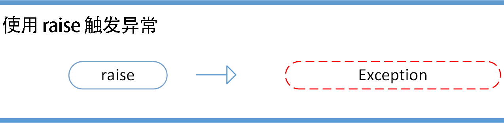
</left>

以下实例中如果`x > 5`就触发异常:

```python
x = 10
if x > 5:
    raise Exception('x 不能大于 5。x 的值为: {}'.format(x))
```

执行以上代码会触发异常：

```python
Traceback (most recent call last):
  File "test.py", line 3, in <module>
    raise Exception('x 不能大于 5。x 的值为: {}'.format(x))
Exception: x 不能大于 5。x 的值为: 10
```

`raise`唯一的一个参数指定了要被抛出的异常，它必须是一个异常的实例或异常的类 (即`Exception`的子类)。若只想知道是否抛出了一个异常但并不想去处理它，那么一个简单的`raise`语句就可以再次把它抛出。

```python
>>> try:
...   raise NameError('HiThere')
... except NameError:
...   print('An exception flew by!')
...   raise
...
An exception flew by!
Traceback (most recent call last):
  File "<stdin>", line 2, in ?
NameError: HiThere
```

## 15.5 自定义的异常

用户可以通过创建一个新的异常类来拥有自己的异常。异常类继承自`Exception`类，可以直接或者间接继承:

```python
>>> class MyError(Exception):
...   def __init__(self, value):
...     self.value = value
...   def __str__(self):
...     return repr(self.value)
...
>>> try:
...   raise MyError(2*2)
... except MyError as e:
...   print('My exception occurred, value:', e.value)
...
My exception occurred, value: 4
>>> raise MyError('oops!')
Traceback (most recent call last):
  File "<stdin>", line 1, in ?
__main__.MyError: 'oops!'
```

在这个例子中，类`Exception`默认的`__init__()`被覆盖。

当创建一个模块有可能抛出多种不同的异常时，一种通常的做法是为这个包建立一个基础异常类，然后基于这个基础类为不同的错误情况创建不同的子类：

```python
class Error(Exception):
    """Base class for exceptions in this module."""
    pass

class InputError(Error):
    """Exception raised for errors in the input.
 
    Attributes:
        expression -- input expression in which the error occurred
        message -- explanation of the error
    """
 
    def __init__(self, expression, message):
        self.expression = expression
        self.message = message
 
class TransitionError(Error):
    """Raised when an operation attempts a state transition that's not allowed.
 
    Attributes:
        previous -- state at beginning of transition
        next -- attempted new state
        message -- explanation of why the specific transition is not allowed
    """

    def __init__(self, previous, next, message):
        self.previous = previous
        self.next = next
        self.message = message
```

大多数的异常的名字都以"Error"结尾，就跟标准的异常命名一样。

## 15.6 使用`assert`断言

Python 中的`assert` (断言) 语句用于判断一个表达式，在表达式条件为`False`时触发异常。断言可以在条件不满足程序运行的情况下直接返回错误，而不必等待程序运行后出现崩溃的情况。例如若代码只能在Linux系统下运行，则可先判断当前系统是否符合条件。

语法格式：

```python
assert expression
assert expression [, arguments]
```

等价于：

```python
if not expression:
    raise AssertionError
    
if not expression:
    raise AssertionError(arguments)
```

实例：

```python
>>> assert True     # 条件为 true  正常执行
>>> assert False    # 条件为 false 触发异常
Traceback (most recent call last):
  File "<stdin>", line 1, in <module>
AssertionError
>>> assert 1==1    # 条件为 true  正常执行
>>> assert 1==2    # 条件为 false 触发异常
Traceback (most recent call last):
  File "<stdin>", line 1, in <module>
AssertionError
>>> assert 1==2, '1 不等于 2'
Traceback (most recent call last):
  File "<stdin>", line 1, in <module>
AssertionError: 1 不等于 2
```

以下实例判断当前系统是否为 Linux，若不满足条件则直接触发异常，不必执行接下来的代码：

```python
import sys
assert ('linux' in sys.platform), "This code only supports Linux OS!"
```

## 15.7 内置的异常类型

Python 3 内置异常类型的结构：

```python
BaseException
 +-- SystemExit
 +-- KeyboardInterrupt
 +-- GeneratorExit
 +-- Exception
      +-- StopIteration
      +-- StopAsyncIteration
      +-- ArithmeticError
      |    +-- FloatingPointError
      |    +-- OverflowError
      |    +-- ZeroDivisionError
      +-- AssertionError
      +-- AttributeError
      +-- BufferError
      +-- EOFError
      +-- ImportError
      |    +-- ModuleNotFoundError
      +-- LookupError
      |    +-- IndexError
      |    +-- KeyError
      +-- MemoryError
      +-- NameError
      |    +-- UnboundLocalError
      +-- OSError
      |    +-- BlockingIOError
      |    +-- ChildProcessError
      |    +-- ConnectionError
      |    |    +-- BrokenPipeError
      |    |    +-- ConnectionAbortedError
      |    |    +-- ConnectionRefusedError
      |    |    +-- ConnectionResetError
      |    +-- FileExistsError
      |    +-- FileNotFoundError
      |    +-- InterruptedError
      |    +-- IsADirectoryError
      |    +-- NotADirectoryError
      |    +-- PermissionError
      |    +-- ProcessLookupError
      |    +-- TimeoutError
      +-- ReferenceError
      +-- RuntimeError
      |    +-- NotImplementedError
      |    +-- RecursionError
      +-- SyntaxError
      |    +-- IndentationError
      |         +-- TabError
      +-- SystemError
      +-- TypeError
      +-- ValueError
      |    +-- UnicodeError
      |         +-- UnicodeDecodeError
      |         +-- UnicodeEncodeError
      |         +-- UnicodeTranslateError
      +-- Warning
           +-- DeprecationWarning
           +-- PendingDeprecationWarning
           +-- RuntimeWarning
           +-- SyntaxWarning
           +-- UserWarning
           +-- FutureWarning
           +-- ImportWarning
           +-- UnicodeWarning
           +-- BytesWarning
           +-- ResourceWarning
```

## 15.8 使用`warnings`模块

### 15.8.1 发出警告

若只想发出警告指出情况偏离了正轨，可使用`warnings`模块中的`warn()`函数。该警告只显示一次，若之后还有相同情况发生不会再次发出警告。函数`warn()`的**语法格式为：**

```python
warn(message, category=None, stacklevel=1, source=None)
```

> The *category* argument, if given, must be a [warning category class](https://docs.python.org/3.8/library/warnings.html#warning-categories); it defaults to [`UserWarning`](https://docs.python.org/3.8/library/exceptions.html#UserWarning). Alternatively, *message* can be a [`Warning`](https://docs.python.org/3.8/library/exceptions.html#Warning) instance, in which case *category* will be ignored and `message.__class__` will be used. In this case, the message text will be `str(message)`. This function raises an exception if the particular warning issued is changed into an error by the [warnings filter](https://docs.python.org/3.8/library/warnings.html#warning-filter). The *stacklevel* argument can be used by wrapper functions written in Python, like this:
>
> ```python
> def deprecation(message):
>     warnings.warn(message, DeprecationWarning, stacklevel=2)
> ```
>
> This makes the warning refer to `deprecation()`’s caller, rather than to the source of `deprecation()` itself (since the latter would defeat the purpose of the warning message).
>
> *source*, if supplied, is the destroyed object which emitted a [`ResourceWarning`](https://docs.python.org/3.8/library/exceptions.html#ResourceWarning).
>
> *Changed in version 3.6:* Added *source* parameter.

可选用的**警告类型** (warning categories) 有：

> | Class                                                        | Description                                                  |
> | :----------------------------------------------------------- | :----------------------------------------------------------- |
> | [`Warning`](https://docs.python.org/3.8/library/exceptions.html#Warning) | This is the base class of all warning category classes. It is a subclass of [`Exception`](https://docs.python.org/3.8/library/exceptions.html#Exception). |
> | [`UserWarning`](https://docs.python.org/3.8/library/exceptions.html#UserWarning) | The default category for [`warn()`](https://docs.python.org/3.8/library/warnings.html#warnings.warn). |
> | [`DeprecationWarning`](https://docs.python.org/3.8/library/exceptions.html#DeprecationWarning) | Base category for warnings about deprecated features when those warnings are intended for other Python developers (ignored by default, unless triggered by code in `__main__`). |
> | [`SyntaxWarning`](https://docs.python.org/3.8/library/exceptions.html#SyntaxWarning) | Base category for warnings about dubious syntactic features. |
> | [`RuntimeWarning`](https://docs.python.org/3.8/library/exceptions.html#RuntimeWarning) | Base category for warnings about dubious runtime features.   |
> | [`FutureWarning`](https://docs.python.org/3.8/library/exceptions.html#FutureWarning) | Base category for warnings about deprecated features when those warnings are intended for end users of applications that are written in Python. |
> | [`PendingDeprecationWarning`](https://docs.python.org/3.8/library/exceptions.html#PendingDeprecationWarning) | Base category for warnings about features that will be deprecated in the future (ignored by default). |
> | [`ImportWarning`](https://docs.python.org/3.8/library/exceptions.html#ImportWarning) | Base category for warnings triggered during the process of importing a module (ignored by default). |
> | [`UnicodeWarning`](https://docs.python.org/3.8/library/exceptions.html#UnicodeWarning) | Base category for warnings related to Unicode.               |
> | [`BytesWarning`](https://docs.python.org/3.8/library/exceptions.html#BytesWarning) | Base category for warnings related to [`bytes`](https://docs.python.org/3.8/library/stdtypes.html#bytes) and [`bytearray`](https://docs.python.org/3.8/library/stdtypes.html#bytearray). |
> | [`ResourceWarning`](https://docs.python.org/3.8/library/exceptions.html#ResourceWarning) | Base category for warnings related to resource usage.        |
>
> *Changed in version 3.7:* Previously [`DeprecationWarning`](https://docs.python.org/3.8/library/exceptions.html#DeprecationWarning) and [`FutureWarning`](https://docs.python.org/3.8/library/exceptions.html#FutureWarning) were distinguished based on whether a feature was being removed entirely or changing its behaviour. They are now distinguished based on their intended audience and the way they’re handled by the default warnings filters. 

```python
>>> from warnings import warn
>>> warn("I've got a bad feeling about this.")
__main__:1: UserWarning: I've got a bad feeling about this.
```

### 15.8.2 过滤警告

若其他代码在使用你的模块，可使用`warnings`模块中的`filterwarnings()`函数来过滤你发出的警告 (或特定类型的警告) 并指定要采取的措施，如 "error" 或 "ignore"。函数`filterwarnings()`的**语法格式为**：

```python
filterwarnings(action, message='', category=Warning, module='', lineno=0, append=False)
```

> Insert an entry into the list of [warnings filter specifications](https://docs.python.org/3.8/library/warnings.html#warning-filter). The entry is inserted at the front by default; if *append* is true, it is inserted at the end. This checks the types of the arguments, compiles the *message* and *module* regular expressions, and inserts them as a tuple in the list of warnings filters. Entries closer to the front of the list override entries later in the list, if both match a particular warning. Omitted arguments default to a value that matches everything.
>
> - *action* is one of the following strings:
>
>   | Value       | Disposition                                                  |
>   | :---------- | :----------------------------------------------------------- |
>   | `"default"` | print the first occurrence of matching warnings for each location (module + line number) where the warning is issued |
>   | `"error"`   | turn matching warnings into exceptions                       |
>   | `"ignore"`  | never print matching warnings                                |
>   | `"always"`  | always print matching warnings                               |
>   | `"module"`  | print the first occurrence of matching warnings for each module where the warning is issued (regardless of line number) |
>   | `"once"`    | print only the first occurrence of matching warnings, regardless of location |
>
> - *message* is a string containing a regular expression that the start of the warning message must match. The expression is compiled to always be case-insensitive.
>
> - *category* is a class (a subclass of [`Warning`](https://docs.python.org/3.8/library/exceptions.html#Warning)) of which the warning category must be a subclass in order to match.
>
> - *module* is a string containing a **regular expression** that the module name must match. The expression is compiled to be case-sensitive.
>
> - *lineno* is an integer that the line number where the warning occurred must match, or `0` to match all line numbers.

```python
>>> from warnings import filterwarnings
>>> filterwarnings("ignore")
>>> warn("Anyone out there?")
>>> filterwarnings("error")
>>> warn("Something is very wrong!")
Traceback (most recent call last):
File "<stdin>", line 1, in <module>
UserWarning: Something is very wrong!
```

以上实例引发的异常为`UserWarning`。发出警告时，可指定将引发的异常 (即警告类别)，但必须是`Warning`的子类。若将警告转换为错误 ("error")，则将使用你指定的异常。此外，还可根据异常来过滤掉特定类型的警告。

```python
>>> filterwarnings("error")
>>> warn("This function is really old...", DeprecationWarning)
Traceback (most recent call last):
File "<stdin>", line 1, in <module>
DeprecationWarning: This function is really old...
>>> filterwarnings("ignore", category=DeprecationWarning)
>>> warn("Another deprecation warning.", DeprecationWarning)
>>> warn("Something else.")
Traceback (most recent call last):
File "<stdin>", line 1, in <module>
UserWarning: Something else.
```


