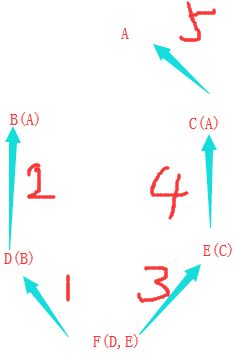

**Python 3 面向对象编程**

---

目录

[toc]

<div style="page-break-after: always;"></div>
&emsp;

# 1 Python 3 面向对象

Python 从设计之初就已经是一门面向对象的语言，因此在 Python 中创建一个类和对象非常容易。先让我们了解一些面向对象语言的基本特征，形成一个面向对象的基本概念，有助于更容易地学习 Python 的面向对象编程。

## 1.1 面向对象简介

先来简单地了解下面向对象的一些基本概念：

- **类 (Class):** 用来描述具有相同的属性 (Attribute) 和方法 (Method) 的对象的集合。它定义了该集合中每个对象所共有的属性和方法。对象是类的实例。
- **方法 (Method):** 类中定义的函数。可分为：实例方法，类方法，静态方法以及魔法方法。
- **类变量 (Class Variable):** 类变量在整个实例化的对象中是公用的。类变量定义在类中且在函数体之外。类变量通常不作为实例变量使用，应使用类方法进行操作。
- **局部变量 (Local Variable):** 定义在方法中的变量，只作用于当前实例的类。
- **实例变量 (Instance Variable):** 在类的声明中，属性是用变量来表示的，这种变量就称为实例变量，实例变量就是一个用`self`修饰的变量。
- **数据成员 (Data Member):** 类变量或者实例变量用于处理类及其实例对象的相关的数据。
- **方法重写 (Override):** 如果从父类继承的方法不能满足子类的需求，可以对其进行改写，这个过程叫方法的覆盖，也称为方法的重写。
- **继承 (Inheritance):** 即一个派生类 (derived class) 继承基类 (base class) 的字段和方法。继承也允许把一个派生类的对象作为一个基类对象对待。例如有这样一个设计：一个 Dog 类型的对象派生自 Animal 类，这是模拟 "是一个" 关系，即：Dog 是一个 Animal。
- **实例化 (Instantiation):** 创建一个类的实例，类的具体对象。
- **对象 (Object):** 通过类定义的数据结构实例。对象包括两个数据成员 (类变量和实例变量) 和方法。

和其它编程语言相比，Python 在尽可能不增加新的语法和语义的情况下加入了类机制。Python 中的类提供了面向对象编程的所有基本功能：**类的继承机制允许多个基类**, **派生类可以覆盖基类中的任何方法**, **方法中可以调用基类中的同名方法**, **对象可以包含任意数量和类型的数据**。

## 1.2 类的定义

语法格式如下：

```python
class ClassName(object):
    <statement-1>
    .
    .
    .
    <statement-N>
```

类实例化后，可以使用其属性，实际上创建一个类之后，可以通过类名访问其属性。

## 1.3 类对象

类对象支持两种操作：**属性引用**和**实例化**。<br>属性引用使用和 Python 中所有的**属性引用**一样的标准语法：**obj.name**。<br>类对象创建后，类命名空间中所有的命名都是有效属性名。

实例：(创建一个新的类实例并将该对象赋给局部变量`x`)

```python
#!/usr/bin/env python3
# 定义一个类
class MyClass(object):
    """一个简单的类实例"""
    i = 12345  # 定义一个类变量
    def f(self):
        return 'hello world'

# 实例化类
x = MyClass() 

# 访问类的属性和方法
print("MyClass 类的属性 i 为：", x.i)        # MyClass 类的属性 i 为： 12345
print("MyClass 类的方法 f 输出为：", x.f())  # MyClass 类的方法 f 输出为： hello world
```

类有一个名为**`__init__()`**的特殊方法 (**构造方法**)，该方法在类实例化时会自动调用。例如：

```python
def __init__(self):
    self.data = []
```

此外`__init__()`方法可以有参数，参数通过`__init__()`传递到类的实例化操作上。例如：

```python
#!/usr/bin/env python3
class Complex(object):
    def __init__(self, realpart, imagpart):
        self.r = realpart
        self.i = imagpart
x = Complex(3.0, -4.5)
print(x.r, x.i)   # 输出结果：3.0 -4.5
```

**注意：self 代表类的实例，而非类。**类的方法与普通函数只有一个特别的区别：类的方法必须有一个额外的**第一个参数**，按照惯例为 **self**。

```python
class Test(object):
    def prt(self):
        print(self)
        print(self.__class__)

t = Test()
t.prt()
# 输出结果为：
# <__main__.Test object at 0x7f9c92afddf0>
# <class '__main__.Test'>
```

从执行结果可以很明显的看出，**self** 代表的是类的实例 (即当前对象的地址)，而 **self.class** 则指向类。注意：**self** 不是 Python 关键字，换成其他也是可以正常执行的。

## 1.4 类的方法

在类的内部，使用 **def** 关键字来定义一个方法，与一般函数定义不同，类的方法**第一个参数**必须为 **self** 。

```python
#!/usr/bin/env python3
# 类的定义
class people(object):
    # 定义基本属性
    name = ''
    age = 0
    # 定义私有属性 (类外部无法直接进行访问)
    __weight = 0
    # 定义构造方法
    def __init__(self,n,a,w):
        self.name = n
        self.age = a
        self.__weight = w
    # 定义一个类的方法
    def speak(self):
        print("%s 说: 我 %d 岁。" %(self.name,self.age))

# 实例化类
p = people('runoob',10,30)
p.speak()

# 输出结果为：
# runoob 说: 我 10 岁。
```

## 1.5 类的继承

Python 同样支持类的继承，派生类 (derived class) 的定义如下所示：

```python
class DerivedClassName(BaseClassName):
    <statement-1>
    .
    .
    .
    <statement-N>
```

示例中的**基类名`BaseClassName1`必须与派生类定义在一个作用域**内。除了类，还可以用表达式，基类定义在另一个模块中时非常有用：

```python
class DerivedClassName(modname.BaseClassName):
```

实例：

```python
#!/usr/bin/env python3
# 类的定义
class people(object):
    # 定义基本属性
    name = ''
    age = 0
    # 定义私有属性 (在类外部无法直接进行访问)
    __weight = 0
    # 定义构造方法
    def __init__(self,n,a,w):
        self.name = n
        self.age = a
        self.__weight = w
    # 定义类的方法
    def speak(self):
        print("%s 说: 我 %d 岁。" %(self.name,self.age))

# 单继承示例
class student(people):
    # 定义新的属性
    grade = ''
    # 定义新的构造方法
    def __init__(self,n,a,w,g):
        # 在新构造方法中调用父类的构造函数
        people.__init__(self,n,a,w)  # 建议写成: super().__init__(n,a,w)
        self.grade = g
    # 覆盖父类的方法
    def speak(self):
        print("%s 说: 我 %d 岁了，我在读 %d 年级"%(self.name,self.age,self.grade))

# 实例化类
s = student('ken',10,60,3)
s.speak()

# 输出结果为：
# ken 说: 我 10 岁了，我在读 3 年级
```

## 1.6 类的多继承

Python 同样有限的支持多继承形式。多继承的类定义形式如下：

```python
class DerivedClassName(Base1, Base2, Base3, ...):
    <statement-1>
    .
    .
    .
    <statement-N>
```

需注意圆括号中基类的顺序，若是基类中有相同的方法名，而在子类使用时未指定，Python 将从左至右搜索，即: **若方法在子类中未找到时，从左到右查找基类中是否包含该方法**。==注意：多重继承情况下，**子类调用父类构造函数的顺序需与继承顺序相反**，用后调用的构函去覆盖先调用的构函的部分功能 (若有重复)。==

```python
#!/usr/bin/env python3
# 类的定义
class people(object):
    # 定义基本属性
    name = ''
    age = 0
    # 定义私有属性 (在类外部无法直接进行访问)
    __weight = 0
    # 定义构造方法
    def __init__(self,n,a,w):
        self.name = n
        self.age = a
        self.__weight = w
    # 定义类的方法
    def speak(self):
        print("%s 说: 我 %d 岁。" %(self.name,self.age))

# 单继承示例
class student(people):
    # 定义新的属性
    grade = ''
    # 定义新的构造方法
    def __init__(self,n,a,w,g):
        # 在新构造方法中调用父类的构造函数
        people.__init__(self,n,a,w)  # 建议写成: super().__init__(n,a,w)
        self.grade = g
    # 覆盖父类的方法
    def speak(self):
        print("%s 说: 我 %d 岁了，我在读 %d 年级"%(self.name,self.age,self.grade))

# 定义另一个类 (多重继承前的准备)
class speaker(object):
    # 定义基本属性
    topic = ''
    name = ''
    # 定义构造方法
    def __init__(self,n,t):
        self.name = n
        self.topic = t
    # 定义类的方法
    def speak(self):
        print("我叫 %s，我是一个演说家，我演讲的主题是 %s"%(self.name,self.topic))

# 多重继承
class sample(speaker,student):     # 注意: 继承顺序 -> 先speaker后student
    def __init__(self,n,a,w,g,t):  # 注意: 调用父类构函顺序 -> 先student后speaker
        student.__init__(self,n,a,w,g) 
        speaker.__init__(self,n,t) 
        # 建议使用super()函数来调用父类构造函数
        # super(speaker,self).__init__(n,a,w,g)  #                     -> 先student
        # super().__init__(n,t)  # 或 super(sample,self).__init__(n,t) -> 后speaker

# 实例化类
test = sample("Tim",25,80,4,"Python")
test.speak()   # 方法名同,默认调用的是在括号中排前的父类的方法

# 输出结果为：
# 我叫 Tim，我是一个演说家，我演讲的主题是 Python
```

### 1.6.1 子类继承父类的构造函数

若在子类中需要父类的构造方法**`__init__`**就需显式地调用父类的构造方法，或者不重写父类的构造方法。若子类不重写 **`__init__`**，实例化子类时则会自动调用父类定义的 **`__init__`**。

```python
class Father(object):
    def __init__(self, name):
        self.name=name
        print ( "name: %s" %( self.name) )
    def getName(self):
        return 'Father ' + self.name
 
class Son(Father):
    def getName(self):
        return 'Son '+self.name

if __name__=='__main__':
    son=Son('runoob')
    print (son.getName())

# Output is：
# name: runoob
# Son runoob
```

若子类重写了**`__init__`** 且未在其中调用父类的构造方法，则实例化子类时不会调用父类的 **`__init__`**，例如：

```python
class Father(object):
    def __init__(self, name):
        self.name=name
        print ( "name: %s" %( self.name) )
    def getName(self):
        return 'Father ' + self.name
 
class Son(Father):
    def __init__(self, name):
        print ( "hi" )
        self.name =  name
    def getName(self):
        return 'Son '+self.name

son=Son('runoob')
print ( son.getName() )

# Output is：
# hi
# Son runoob
```

若在子类重写了的**`__init__`** 中继**承父类的构造方法**，有**两种方式**：

* 直接**使用父类名**：**`父类名称.__init__(self, 参数1,参数2, ...)`**
* 使用 **super** 关键字：**`super([子类名称,self]).__init__(参数1,参数2, ...)`**

```python
class Father(object):
    def __init__(self, name):
        self.name=name
        print ( "name: %s" %( self.name))
    def getName(self):
        return 'Father ' + self.name
 
class Son(Father):
    def __init__(self, name):
        super(Son, self).__init__(name)
        print ("hi")
        self.name =  name
    def getName(self):
        return 'Son '+self.name
 
if __name__=='__main__':
    son=Son('runoob')
    print ( son.getName() )

# Output is：
# name: runoob
# hi
# Son runoob
```

### 1.6.2 使用`super()`函数

**super()** 函数是用于调用父类(超类)的一个方法，可用来解决多重继承的问题。调用`super()`时，**默认将当前类和当前实例作为参数**。在使用单继承时，直接用父类名称调用父类方法没有什么问题；但是如果在使用多继承时，会涉及到查找顺序 (MRO)、重复调用 (钻石继承) 等种种问题。MRO (Method Resolution Order) 就是类的方法解析顺序表，其实也就是继承父类方法时的顺序表。

`super()`方法的**语法格式**：

```python
super(type[, object-or-type])
# Python3中可直接使用 super().xxx 代替 super(当前类, self).xxx

# 参数:
# (1) type -- 类。
# (2) object-or-type -- 类，一般是 self
```

根据官方文档，`super()`函数返回一个委托类`type`的父类或者兄弟类的方法调用的代理对象，还能是兄弟类？

在下面的实例中由输出结果可知：

* 传入`super()`中的`object` (即`self`子类) 在整个过程当中都不发生变化 (0x7fba9a1e5f40) 
* C类的 MRO 表为 [C, A, B, object]

实际上多继承时，`super()`获取的是继承顺序中的下一个类，因此类A的中`super().x()`调用的其实是`B.x()`。

```python
#   Base
#   /  \
#  /    \
# A      B
#  \    /
#   \  /
#    C
class A(object): 
    def x(self):
        print('run A.x')
        super().x()  # 注意：此处的super()函数调用的是B类(即A类的兄弟)的方法
        print(self)
        print('leave A')

class B(object):
    def x(self):
        print('run B.x')
        print(self)
        print('leave B')

class C(A,B):
    def x(self):
        print('run C.x')
        super().x()
        print(self)
        print('leave C')

C().x()
print(C.mro())

# Output is:
# run C.x
# run A.x
# run B.x
# <__main__.C object at 0x7fba9a1e5f40>
# leave B
# <__main__.C object at 0x7fba9a1e5f40>
# leave A
# <__main__.C object at 0x7fba9a1e5f40>
# leave C
# [<class '__main__.C'>, <class '__main__.A'>, <class '__main__.B'>, <class 'object'>]
```

既然也可直接使用父类名称，那么`super()`函数的优点是什么呢？实际上使用`super()`可避免基类被多次调用。

```python
#   Base
#   /  \
#  /    \
# A      B
#  \    /
#   \  /
#    C

# 使用super()函数
class Base(object):
    def __init__(self):
        print("enter Base",end='; ')
        print("leave Base",end='; ')

class A(Base):
    def __init__(self):
        print("enter A",end='; ')
        super(A, self).__init__()
        print("leave A",end='; ')

class B(Base):
    def __init__(self):
        print("enter B",end='; ')
        super(B, self).__init__()
        print("leave B",end='; ')

class C(A, B):
    def __init__(self):
        print("enter C",end='; ')
        super(C, self).__init__()
        print("leave C",end='; ')

print(C.mro())
C()

# 测试结果
# [<class '__main__.C'>, <class '__main__.A'>, <class '__main__.B'>, <class '__main__.Base'>, <class 'object'>]
# enter C; enter A; enter B; enter Base; leave Base; leave B; leave A; leave C;
```

```python
# 不使用super()函数
class Base(object):
    def __init__(self):
        print("enter Base",end='; ')
        print("leave Base",end='; ')

class A(Base):
    def __init__(self):
        print("enter A",end='; ')
        Base().__init__()
        print("leave A",end='; ')

class B(Base):
    def __init__(self):
        print("enter B",end='; ')
        Base().__init__()
        print("leave B",end='; ')

class C(A, B):
    def __init__(self):
        print("enter C",end='; ')
        B().__init__()
        A().__init__()
        print("leave C",end='; ')

print(C.mro())
C()

# 测试结果
# [<class '__main__.C'>, <class '__main__.A'>, <class '__main__.B'>, <class '__main__.Base'>, <class 'object'>]
# enter C; enter B; enter Base; leave Base; enter Base; leave Base; leave B; enter B; enter Base; leave Base; enter Base; leave Base; leave B; enter A; enter Base; leave Base; enter Base; leave Base; leave A; enter A; enter Base; leave Base; enter Base; leave Base; leave A; leave C;
```

### 1.6.3 类方法解析顺序(MRO)

Python 3 中所有类都是新式类，类方法解析顺序 (MRO) 遵循**广度优先**，即米格节点有且只走一次。Python 2 中支持新式类(要加`(object)`)和经典类，经典类遵循**深度优先**，即一条路走到最后不行再换另一条路。

```python
class A(object):
    def func(self):
        print("in A")
        
class B(A):
    def func(self):
        print("in B")

class C(A):
    def func(self):
        print("in C")
        
class D(B):
    def func(self):
        print("in D")

class E(C):
    def func(self):
        print("in E")
        
class F(D,E):
    def func(self):
        print("in F")

print(F.mro())

# [<class '__main__.F'>, <class '__main__.D'>, <class '__main__.B'>, <class '__main__.E'>, <class '__main__.C'>, <class '__main__.A'>, <class 'object'>]
```

<table>
    <tr>
        <td><center>广度优先(MRO)</center></td>
    </tr>
</table>

## 1.7 方法重写

若父类方法的功能不能满足需求，Python 允许在子类重写父类的方法，实例如下：

```python
#!/usr/bin/env python3
# 定义父类
class Parent(object):        
   # 定义父类的方法
   def myMethod(self):
      print ('调用父类方法')

# 定义子类
class Child(Parent):
   # 重写父类的方法
   def myMethod(self):
      print ('调用子类方法')

# 子类实例        
c = Child()          
c.myMethod()  # 子类调用重写方法        
super(Child,c).myMethod()  # 用子类实例调用父类已被覆盖的方法
```

## 1.8 私有变量与方法

Python 中不存在只能从对像内部访问的''私有''实例变量。然而有另一个变通的方法可用于大多数 Python 代码：以一个下划线开头的命名 (例如 `_spam` ) 会被处理为 API 的非公开部分 (无论是函数, 方法或数据成员)，它会被视为一个实现细节无需公开。

因为有一个正当的类私有成员用途 (即避免子类里定义的命名与之冲突)，Python 提供了对这种结构的有限支持，称为 ***name mangling* (命名编码)**。任何形如`__spam`的标识 (前面至少两个下划线，后面至多一个)，会被替代为 `_classname__spam` ，`classname` 即去掉前导下划线的当前类名。此语法不关注标识的位置，只要求在类定义内。名称重整有助于子类重写方法，而不会打破组内的方法调用。例如：

```python
#!/usr/bin/env python3
class Mapping(object):
    def __init__(self, iterable):
        self.items_list = []
        self.__update(iterable)

    def update(self, iterable):
        print('enter Mapping')
        for item in iterable:
            self.items_list.append(item)

    __update = update   # private copy of original update() method

class MappingSubclass(Mapping):
    def update(self, keys, values):
        # provides new signature for update()
        # but does not break __init__()
        print('enter MappingSubclass')
        for item in zip(keys, values):
            self.items_list.append(item)

m_list=[0,0]
M = MappingSubclass(m_list);
M.update([1,2],[3,4])

for k,v in enumerate(M.items_list):
	print(k,v)

# (Output is:) 
# enter Mapping
# enter MappingSubclass
# 0 0
# 1 0
# 2 (1, 3)
# 3 (2, 4)
```

上述例子中，父类中的`update()`函数在子类中被重写。然而由于父类中备份了原`update()`函数至`__update()`中并在其构造函数中调用了`self.__update()`，因此父类的`update()`函数仍然可被执行。实际上即使在子类中也引入了`__update`标识符，程序运行时仍不会出错。因为父类中的`__update`标识符会被自动重整为`_Mapping__update`，而子类中引入的`__update()`会被自动重整为`_MappingSublcass__update`。

注意：该编码规则是为了尽可能地避免冲突，然而被认作为私有的变量仍有可能被访问或修改。在特定的场合也确实有用，比如调试的时候。此外，代码传入`exec()`和`eval()`时并不考虑所调用类的类名，而视其为当前类，类似于`global`语句的效应，已经按字节编译的部分也有同样的限制。对于`getattr()`,`setattr()`和`delattr()`以及直接引用`__dict__`也是同样。

## 1.9 属性和方法的操作

* **`getattr(obj,namestr[,default])`**：返回对象的一个属性值或者方法。若对象有该属性返回属性值，否则返回`default`值；若不提供`default`参数，在对象没有对应属性时将触发`AttributeError`异常。若返回的是对象的方法，则返回的是方法的内存地址；如果要运行这个方法，可以在后面添加一对括号。**注意：实例方法不可直接由类对象直接调用**。

  ```python
  class MyClass(object):
      name = 'jack'
      age = '22'
      def func1(self):
          return 'this is instance method'
      @classmethod
      def func2(cls):
          return 'this is class method'
  
  obj = MyClass()
  
  print(getattr(MyClass, 'name'))  
  print(getattr(obj, 'age')) 
  
  print(getattr(MyClass, 'func1'))  
  print(getattr(obj, 'func1'))  
  print(getattr(MyClass, 'func2'))  
  print(getattr(obj, 'func2'))  
  print(getattr(MyClass, 'func3', None)) 
  
  print(getattr(MyClass, 'func1')('self'))  # `func1`是实例方法,不可直接由类对象`MyClass`调用
  print(getattr(obj, 'func1')())            # `func1`是实例方法,可直接由`MyClass`的实例调用
  
  print(getattr(MyClass, 'func2')())        # `func2`是类方法,可直接由类对象`MyClass`调用
  print(getattr(obj, 'func2')())            # `func2`是类方法,可直接由`MyClass`的实例调用
  
  # jack
  # 22
  # <function MyClass.func1 at 0x7f5c910dfca0>
  # <bound method MyClass.func1 of <__main__.MyClass object at 0x7f5c91175f10>>
  # <bound method MyClass.func2 of <class '__main__.MyClass'>>
  # <bound method MyClass.func2 of <class '__main__.MyClass'>>
  # None
  # this is instance method
  # this is instance method
  # this is class method
  # this is class method
  ```

* **`hasattr(obj,namestr)`**：判断对象是否包含对应的属性或者方法，若对象有则返回`True`，否则返回`False`。

  ```python
  class MyClass(object):
      name = 'jack'
      age = '22'
      def if_gender():
          pass
  
  obj = MyClass()
  print(hasattr(obj, 'name'))            # True
  print(hasattr(MyClass, 'age'))         # True
  print(hasattr(obj, 'if_gender'))       # True
  print(hasattr(MyClass, 'if_gender'))   # True
  print(hasattr(obj, 'gender'))          # False
  ```

* **`setattr(obj,namestr,value)`**：设置对象的一个属性值，若该属性已存在则对其值进行修改，若该属性不存在则先创建一个新的对象属性再对其进行赋值。

  ```python
  class MyClass(object):
      name = 'jack'
      age = '22'
  
  obj = MyClass()
  
  setattr(MyClass, 'name', 'tom')
  print(getattr(MyClass, 'name'))    # tom
  
  setattr(obj, 'age', 28)
  print(getattr(obj, 'age'))         # 28
  
  setattr(MyClass, 'gender', 'male')
  print(getattr(MyClass, 'gender'))  # male
  print(getattr(obj, 'gender'))      # male
  
  setattr(obj, 'hobby', 'skating')
  print(obj, 'hobby')                # <__main__.MyClass object at 0x00000209F5070630> hobby
  print(MyClass, 'hobby')            # <class '__main__.MyClass'> hobby
  ```

* **`delattr(obj,namestr)`**：删除对象的一个属性，相当于`del obj.namestr`。

实例1：(判断是否有`gender`属性,有则打印,没有则添加)

```python
class MyClass(object):
    name = 'jack'
    age = '22'

    def if_gender(self, gender='male'):
        '''判断是否有gender属性,有则打印,没有则添加'''
        if hasattr(self, 'gender'):
            return getattr(self, 'gender')
        return setattr(self, 'gender', gender)

obj = MyClass()
obj.if_gender(gender='female')
print(getattr(obj, 'gender'))  # female
```

实例2：(收集平台信息判断当前平台，根据不同的平台执行不同的方法)

```python
import sys
import platform

class InfoCollection(object):

    def collect(self):
        '''收集平台信息,先判断当前平台，根据平台的不同，执行不同的方法'''
        try:
            func = getattr(self, platform.system().lower())
            info_data = func()
            formatted_data = self.build_report_data(info_data)
            return formatted_data
        except AttributeError:
            sys.exit("不支持当前操作系统： [%s]! " % platform.system())

    @staticmethod
    def linux():
        from plugins.collect_linux_info import collect
        return collect()

    @staticmethod
    def windows():
        from plugins.collect_windows_info import Win32Info
        return Win32Info().collect()

    @staticmethod
    def build_report_data(data):
        '''留下一个接口，方便以后增加功能或者过滤数据'''
        pass
        return data
```

## 1.10 抽象基类(ABC)

### 1.10.1 抽象基类

1. 抽象类的概念：抽象类是一个特殊的类，只能被继承，不能被实例化。

2. 抽象基类：假设有一个水果的基类且其中包含了一个`eat`方法，那么我们可构造香蕉, 苹果, 梨等类，并让它们继承自水果这个基类。然后我们可以将香蕉, 苹果, 梨等实例化，就可以去吃香蕉, 苹果, 梨等。然而，我们却不能将水果实例化，因为我们无法吃到叫水果的这个东西。抽象基类中定义了抽象的方法而没有实现其功能；**抽象基类不能被实例化，只能被继承**；且**子类必须实现定义在抽象基类中的抽象方法**，否则实例化子类时报错。

3. 抽象基类的作用：在不同的模块中通过抽象基类来调用，可以用最精简的方式展示出代码之间的逻辑关系，让模块之间的依赖清晰简单。抽象基类的编程，让每个人可以关注当前基类的方法和描述，而不需要考虑过多的实现细节，这对协同开发有很大意义，也让代码可读性更高。

### 1.10.2 使用`abc`模块

Python 中的`abc`模块 (abstract base class) 有以下**两个主要功能**：

- **判定某个对象的类型**或**判定某个类是否为子类**，如：`isinstance(a, Sized)`, `issubclass(A, Sized)`；
- **强制子类必须实现某些方法**，即**抽象基类(ABC类)**的派生类。

---

`abc`模块中的主要类或方法：

* **`abc.ABCMeta`**：用来生成抽象基础类的元类。由它生成的类可以被直接继承。

* **`abc.ABC`**：辅助类，让你可以不用关心元类概念，直接继承它就有了`ABCMeta`元类。(使用时需注意元类冲突)

* **`@abc.abstractmethod`**：定义抽象方法，除了这个装饰器，其余装饰器都被`deprecated`了。

* 在`abc`模块中实现了各种的抽象基类，可用于判断类型或是继承方法：

  ```python
  # /usr/lib/python3.8/_collections_abc.py
  __all__ = ["Awaitable", "Coroutine",
             "AsyncIterable", "AsyncIterator", "AsyncGenerator",
             "Hashable", "Iterable", "Iterator", "Generator", "Reversible",
             "Sized", "Container", "Callable", "Collection",
             "Set", "MutableSet",
             "Mapping", "MutableMapping",
             "MappingView", "KeysView", "ItemsView", "ValuesView",
             "Sequence", "MutableSequence",
             "ByteString",]
  ```

  | ABC                                                          | Inherits from                                                | Abstract Methods                                             | Mixin Methods                                                |
  | :----------------------------------------------------------- | :----------------------------------------------------------- | :----------------------------------------------------------- | :----------------------------------------------------------- |
  | [`Container`](https://docs.python.org/3/library/collections.abc.html#collections.abc.Container) |                                                              | `__contains__`                                               |                                                              |
  | [`Hashable`](https://docs.python.org/3/library/collections.abc.html#collections.abc.Hashable) |                                                              | `__hash__`                                                   |                                                              |
  | [`Iterable`](https://docs.python.org/3/library/collections.abc.html#collections.abc.Iterable) |                                                              | `__iter__`                                                   |                                                              |
  | [`Iterator`](https://docs.python.org/3/library/collections.abc.html#collections.abc.Iterator) | [`Iterable`](https://docs.python.org/3/library/collections.abc.html#collections.abc.Iterable) | `__next__`                                                   | `__iter__`                                                   |
  | [`Reversible`](https://docs.python.org/3/library/collections.abc.html#collections.abc.Reversible) | [`Iterable`](https://docs.python.org/3/library/collections.abc.html#collections.abc.Iterable) | `__reversed__`                                               |                                                              |
  | [`Generator`](https://docs.python.org/3/library/collections.abc.html#collections.abc.Generator) | [`Iterator`](https://docs.python.org/3/library/collections.abc.html#collections.abc.Iterator) | `send`, `throw`                                              | `close`, `__iter__`, `__next__`                              |
  | [`Sized`](https://docs.python.org/3/library/collections.abc.html#collections.abc.Sized) |                                                              | `__len__`                                                    |                                                              |
  | [`Callable`](https://docs.python.org/3/library/collections.abc.html#collections.abc.Callable) |                                                              | `__call__`                                                   |                                                              |
  | [`Collection`](https://docs.python.org/3/library/collections.abc.html#collections.abc.Collection) | [`Sized`](https://docs.python.org/3/library/collections.abc.html#collections.abc.Sized), [`Iterable`](https://docs.python.org/3/library/collections.abc.html#collections.abc.Iterable), [`Container`](https://docs.python.org/3/library/collections.abc.html#collections.abc.Container) | `__contains__`, `__iter__`, `__len__`                        |                                                              |
  | [`Sequence`](https://docs.python.org/3/library/collections.abc.html#collections.abc.Sequence) | [`Reversible`](https://docs.python.org/3/library/collections.abc.html#collections.abc.Reversible), [`Collection`](https://docs.python.org/3/library/collections.abc.html#collections.abc.Collection) | `__getitem__`, `__len__`                                     | `__contains__`, `__iter__`, `__reversed__`, `index`, and `count` |
  | [`MutableSequence`](https://docs.python.org/3/library/collections.abc.html#collections.abc.MutableSequence) | [`Sequence`](https://docs.python.org/3/library/collections.abc.html#collections.abc.Sequence) | `__getitem__`, `__setitem__`, `__delitem__`, `__len__`, `insert` | Inherited [`Sequence`](https://docs.python.org/3/library/collections.abc.html#collections.abc.Sequence) methods and `append`, `reverse`, `extend`, `pop`, `remove`, and `__iadd__` |
  | [`ByteString`](https://docs.python.org/3/library/collections.abc.html#collections.abc.ByteString) | [`Sequence`](https://docs.python.org/3/library/collections.abc.html#collections.abc.Sequence) | `__getitem__`, `__len__`                                     | Inherited [`Sequence`](https://docs.python.org/3/library/collections.abc.html#collections.abc.Sequence) methods |
  | [`Set`](https://docs.python.org/3/library/collections.abc.html#collections.abc.Set) | [`Collection`](https://docs.python.org/3/library/collections.abc.html#collections.abc.Collection) | `__contains__`, `__iter__`, `__len__`                        | `__le__`, `__lt__`, `__eq__`, `__ne__`, `__gt__`, `__ge__`, `__and__`, `__or__`, `__sub__`, `__xor__`, and `isdisjoint` |
  | [`MutableSet`](https://docs.python.org/3/library/collections.abc.html#collections.abc.MutableSet) | [`Set`](https://docs.python.org/3/library/collections.abc.html#collections.abc.Set) | `__contains__`, `__iter__`, `__len__`, `add`, `discard`      | Inherited [`Set`](https://docs.python.org/3/library/collections.abc.html#collections.abc.Set) methods and `clear`, `pop`, `remove`, `__ior__`, `__iand__`, `__ixor__`, and `__isub__` |
  | [`Mapping`](https://docs.python.org/3/library/collections.abc.html#collections.abc.Mapping) | [`Collection`](https://docs.python.org/3/library/collections.abc.html#collections.abc.Collection) | `__getitem__`, `__iter__`, `__len__`                         | `__contains__`, `keys`, `items`, `values`, `get`, `__eq__`, and `__ne__` |
  | [`MutableMapping`](https://docs.python.org/3/library/collections.abc.html#collections.abc.MutableMapping) | [`Mapping`](https://docs.python.org/3/library/collections.abc.html#collections.abc.Mapping) | `__getitem__`, `__setitem__`, `__delitem__`, `__iter__`, `__len__` | Inherited [`Mapping`](https://docs.python.org/3/library/collections.abc.html#collections.abc.Mapping) methods and `pop`, `popitem`, `clear`, `update`, and `setdefault` |
  | [`MappingView`](https://docs.python.org/3/library/collections.abc.html#collections.abc.MappingView) | [`Sized`](https://docs.python.org/3/library/collections.abc.html#collections.abc.Sized) |                                                              | `__len__`                                                    |
  | [`ItemsView`](https://docs.python.org/3/library/collections.abc.html#collections.abc.ItemsView) | [`MappingView`](https://docs.python.org/3/library/collections.abc.html#collections.abc.MappingView), [`Set`](https://docs.python.org/3/library/collections.abc.html#collections.abc.Set) |                                                              | `__contains__`, `__iter__`                                   |
  | [`KeysView`](https://docs.python.org/3/library/collections.abc.html#collections.abc.KeysView) | [`MappingView`](https://docs.python.org/3/library/collections.abc.html#collections.abc.MappingView), [`Set`](https://docs.python.org/3/library/collections.abc.html#collections.abc.Set) |                                                              | `__contains__`, `__iter__`                                   |
  | [`ValuesView`](https://docs.python.org/3/library/collections.abc.html#collections.abc.ValuesView) | [`MappingView`](https://docs.python.org/3/library/collections.abc.html#collections.abc.MappingView), [`Collection`](https://docs.python.org/3/library/collections.abc.html#collections.abc.Collection) |                                                              | `__contains__`, `__iter__`                                   |
  | [`Awaitable`](https://docs.python.org/3/library/collections.abc.html#collections.abc.Awaitable) |                                                              | `__await__`                                                  |                                                              |
  | [`Coroutine`](https://docs.python.org/3/library/collections.abc.html#collections.abc.Coroutine) | [`Awaitable`](https://docs.python.org/3/library/collections.abc.html#collections.abc.Awaitable) | `send`, `throw`                                              | `close`                                                      |
  | [`AsyncIterable`](https://docs.python.org/3/library/collections.abc.html#collections.abc.AsyncIterable) |                                                              | `__aiter__`                                                  |                                                              |
  | [`AsyncIterator`](https://docs.python.org/3/library/collections.abc.html#collections.abc.AsyncIterator) | [`AsyncIterable`](https://docs.python.org/3/library/collections.abc.html#collections.abc.AsyncIterable) | `__anext__`                                                  | `__aiter__`                                                  |
  | [`AsyncGenerator`](https://docs.python.org/3/library/collections.abc.html#collections.abc.AsyncGenerator) | [`AsyncIterator`](https://docs.python.org/3/library/collections.abc.html#collections.abc.AsyncIterator) | `asend`, `athrow`                                            | `aclose`, `__aiter__`, `__anext__`                           |

#### 1.10.3.1 判断对象类型

Python 遵循编程语言中**动态类型语言**的一种设计风格：**鸭子类型**，即：“**当看到一只鸟走起来像鸭子，游泳起来像鸭子，叫起来也想鸭子，那么这只鸟就可以被称为鸭子**”。换句话说也就是，**并不关心对象是什么类型 (到底是不是鸭子)，而只关心对象能够实现什么方法 (它有什么样的行为)**。

---

判断一个对象是否存在某个方法时，可使用内置函数**`hasattr()`**，还可使用**`isinstance()`**。例如：`abc`模块中定义了`Sized`类，利用`Sized`可判断一个对象里是否存在`__len__`方法，即可否对这个对象调用`len()`函数。

```python
from collections.abc import Sized

class A(object):
    def __len__(self):
        pass

a = A()
print("has __len__()" if isinstance(a, Sized) else "no __len__()")  # has __len__()
```

来看看`Sized`类的源码：

```python
def _check_methods(C, *methods):
    mro = C.__mro__
    for method in methods:
        for B in mro:
            if method in B.__dict__:
                if B.__dict__[method] is None:  # method in C.__mro__.__dict__
                    return NotImplemented
                break
        else:
            return NotImplemented
    return True

class Sized(metaclass=ABCMeta):
    __slots__ = ()
    @abstractmethod
    def __len__(self):
        return 0
    @classmethod
    def __subclasshook__(cls, C):
        if cls is Sized:
            return _check_methods(C, "__len__")
        return NotImplemented  
```

可见`Sized`类重写了`__subclasshook__`魔法方法 (必须定义为`classmethod`)，使其可通过`isinstance()`判断对象是否含有`__len__`方法 (也可通过`issubclass()`判断是否为子类)。同时，这个类必须基于元类**`abc.ABCMeta`**。

我们也可以依葫芦画瓢来实现一个判断对象是否含有`greet()`方法的类：

```python
from abc import ABCMeta, abstractmethod

class Greeted(metaclass=ABCMeta):
    @classmethod
    def __subclasshook__(cls, C):
        '''if greet() exists, return True; otherwise return False'''
        if cls is Greeted:
            if any("greet" in B.__dict__ for B in C.__mro__):  # replace `_check_methods()`
                return True
        return NotImplemented        

class A(object):
    def greet(self):  # has greet()
        pass

class B(object):  # no greet()
    pass

class C(A):  # inherited from A, has greet()
    pass

print(issubclass(A, Greeted))    # True
print(isinstance(A(), Greeted))  # True
print(issubclass(B, Greeted))    # False
print(isinstance(B(), Greeted))  # False 
print(issubclass(C, Greeted))    # True
print(isinstance(C(), Greeted))  # True
```

**注意，此时类A可以被实例化，因为它还不是抽象基类。**

#### 1.10.3.2 实现抽象基类

利用`abc`模块可实现抽象基类：

```python
from abc import ABCMeta, abstractmethod

class Greeted(metaclass=ABCMeta):
    '''abstractmethod to decorate greet()'''
    @abstractmethod
    def greet(self):
        print("hell world")

a = Greeted() # TypeError: Can't instantiate abstract class Greeted with abstract methods greet
```

此时类`Greeted`是一个抽象基类不可实例化，同时其子类必须实现`greet()`方法，否则实例化子类时也会报错：

```python
from abc import ABCMeta, abstractmethod

class Greeted(metaclass=ABCMeta):
    '''abstractmethod to decorate greet()'''
    @abstractmethod
    def greet(self):
        print("hell world")

class A(Greeted):  # A inherited from Greeted
    def greet(self):
        pass

class B(Greeted):  # B inherited from Greeted
    pass

print('Subclass:', issubclass(A, Greeted))    # Subclass: True
print('Subclass:', issubclass(B, Greeted))    # Subclass: True
print('Instance:', isinstance(A(), Greeted))  # Instance: True
print('Instance:', isinstance(B(), Greeted))  # TypeError: Can't instantiate abstract class B with abstract methods greet
```

注意：当`@abstractmethod`和其它方法的装饰器一起使用时，需将`@abstractmethod`放置在最内层：

```python
class C(ABC):
    @abstractmethod
    def my_abstract_method(self, ...):
        ...
    @classmethod
    @abstractmethod
    def my_abstract_classmethod(cls, ...):
        ...
    @staticmethod
    @abstractmethod
    def my_abstract_staticmethod(...):
        ...

    @property
    @abstractmethod
    def my_abstract_property(self):
        ...
    @my_abstract_property.setter
    @abstractmethod
    def my_abstract_property(self, val):
        ...

    @abstractmethod
    def _get_x(self):
        ...
    @abstractmethod
    def _set_x(self, val):
        ...
    x = property(_get_x, _set_x)
```

实际上具体化抽象类可以有两种方式，上面介绍的是继承方式，即**除非子类实现了抽象基类的抽象方法，否则子类不能实例化**。还有另外一种**通过注册 (register)**的 方式。

```python
from abc import ABCMeta

class MyABC(metaclass=ABCMeta):
    pass

MyABC.register(tuple)

print('Subclass:', issubclass(tuple, MyABC))  # Subclass: True
print('Instance:', isinstance((), MyABC))     # Instance: True
print('Subclass:', issubclass(list, MyABC))   # Subclass: False
```

上述例子中，首先生成了一个`MyABC`的抽象基础类，然后再将`tuple`注册为它的“虚拟子类“。通过`issubclass()`或者`isinstance()`可以判断出`tuple`是不是出于`MyABC`类。另外，也可通过重写`__subclasshook__()`魔法方法 (必须定义为`classmethod`) 来改变`issubclass()`或`isinstance()`的行为。

```python
from abc import ABCMeta, abstractmethod

class Greeted(metaclass=ABCMeta):
    @classmethod
    def __subclasshook__(cls, C):
        '''if greet() exists, return True; otherwise return False'''
        if cls is Greeted:
            if any("greet" in B.__dict__ for B in C.__mro__):  # replace `_check_methods()`
                return True
        return NotImplemented        

class A(object):      # A not inherited from Greeted
    def greet(self):  # has greet()
        print("hell world")

class B(object):  # B not inherited from Greeted
    pass          # no greet()

class C(A):  # C inherited from A
    pass     # has greet()

Greeted.register(A)  # Greeted registers class A
Greeted.register(B)  # Greeted registers class B

print(isinstance(A(), Greeted))  # True
print(isinstance(B(), Greeted))  # True
print(isinstance(C(), Greeted))  # True
A().greet()                      # hell world
C().greet()                      # hell world
B().greet()                      # AttributeError: 'B' object has no attribute 'greet'  
```

**注册方式的缺点**：**抽象方法不会出现在类的方法解析顺序 (MRO) 中**，故而也不能通过`super()`来调用抽象方法。若子类没有实现抽象基类中的抽象方法，实例化子类时并不会报错，**只有在子类实例调用抽象方法时才会报错**。

# 2 实例方法, 类方法, 静态方法

Python 类中有三种比较常见的方法类型，即：**实例方法**，**类方法**以及**静态方法**。

## 2.1 三种方法的比较

三种方法的比较如下：

* **装饰器**：
  * 实例方法：**无装饰器**
  * 类方法    ：使用**@classmethod**装饰
  * 静态方法：使用**@staticmethod**装饰
* **参数传递**：
  * 实例方法：**第一个参数必须是实例对象**  (通常使用 **self**)
  * 类方法    ：**第一个参数必须是类对象**  (通常使用 **cls**)
  * 静态方法：**无 self 或 cls 参数**
* **属性和方法的传递**：
  * 实例方法：可传递**实例以及类的属性和方法**，需使用**''self.xxx''**或**''类名.xxx''**的形式
  * 类方法    ：可传递**类的属性和方法**，需使用**''cls.xxx''**或**''类名.xxx''**的形式
  * 静态方法：**一般不使用实例或类的任何属性或方法**
    * 若非要**使用类的属性或方法**时，需使用**''类名.xxx''**的形式
* **什么对象可调用**：
  * 实例方法：**只能由实例对象调用**
  * 类方法    ：**实例对象**和**类对象**都可调用
  * 静态方法：**实例对象**和**类对象**都可调用
* **使用场景**：
  * 实例方法：**只有实例化以后才有意义的操作**  (如：一个学生的成绩只有在学生被实例化了后才有意义)
  * 类方法    ：**与实例无关**或**逻辑上采用类本身作为对象更合理**时  (如：用于**模拟定义多个构造函数**)
  * 静态方法：**和类本身以及实例都没有关系**时  (如：获取当前系统时间，不依赖于类本身或任何实例)

## 2.2 结合实例的说明

### 2.2.1 实例1 (三种方法的说明)

```python
#!/usr/bin/env python3
# define a class
class Apple(object):
    def fun1(self):
        return 'instance method'
    @classmethod
    def fun2(cls):
        return 'class method'    
    @staticmethod
    def fun3():
        return 'static method'

# define a subclass
class AppleSub(Apple): 
    pass

# all methods called by class Apple()
print(Apple.fun1)
print(Apple.fun2)
print(Apple.fun3)
print("-"*80)

# create an instance of class Apple()
apple1 = Apple()
print(apple1.fun1)
print(apple1.fun2)
print(apple1.fun3)
print("-"*80)

# create another instance of class Apple()
apple2 = Apple()
print(apple2.fun1)
print(apple2.fun2)
print(apple2.fun3)
print("-"*80)

# all methods called by the subclass AppleSub()
print(AppleSub.fun1)
print(AppleSub.fun2)
print(AppleSub.fun3)
print("-"*80)

# create an instance of the subclass AppleSub()
apple3 = AppleSub()
print(apple3.fun1)
print(apple3.fun2)
print(apple3.fun3)
```

运行结果为：

```python
<function Apple.fun1 at 0x7fc5a7c9cee0>
<bound method Apple.fun2 of <class '__main__.Apple'>>
<function Apple.fun3 at 0x7fc5a7ca8040>
--------------------------------------------------------------------------------
<bound method Apple.fun1 of <__main__.Apple object at 0x7fc5a7d32a00>>
<bound method Apple.fun2 of <class '__main__.Apple'>>
<function Apple.fun3 at 0x7fc5a7ca8040>
--------------------------------------------------------------------------------
<bound method Apple.fun1 of <__main__.Apple object at 0x7fc5a7ce5f70>>
<bound method Apple.fun2 of <class '__main__.Apple'>>
<function Apple.fun3 at 0x7fc5a7ca8040>
--------------------------------------------------------------------------------
<function Apple.fun1 at 0x7fc5a7c9cee0>
<bound method Apple.fun2 of <class '__main__.AppleSub'>>
<function Apple.fun3 at 0x7fc5a7ca8040>
--------------------------------------------------------------------------------
<bound method Apple.fun1 of <__main__.AppleSub object at 0x7fc5a7d3feb0>>
<bound method Apple.fun2 of <class '__main__.AppleSub'>>
<function Apple.fun3 at 0x7fc5a7ca8040>
```

**实例运行结果的分析**：

* **实例方法的说明**：
  * 对比第 1, 5, 9 行可知：实例方法`fun1()`由`Apple`类调用时是未绑定的方法，而由`Apple`类的实例`apple1`和`apple2`调用时已被绑定，且由于二者是不同的实例对象，`fun1()`被绑定到了不同的内存地址上
  * 对比第 1, 13 行可知：实例方法在父类中定义后即被分配内存地址；若子类继承了父类的实例方法，当子类访问该实例方法时使用的是同一内存地址，但由于未实例化，此时的实例方法仍属于未绑定的方法
  * 对比第 13, 17 行可知：子类`AppleSub`继承父类`Apple`的实例方法`fun1()`后，子类的实例调用父类的实例方法`fun1()`时`fun1()`会被绑定到子类的实例对象上

* **类方法的说明**：
  * 对比第 2, 6, 10 行可知：类方法`fun2()`通过`Apple`类调用或者通过`Apple`类的实例`apple1`和`apple2`调用时，都属于被绑定的方法且被绑定到了同一块内存地址，实际上是因为`fun2()`被绑定到了`Apple`类本身
  * 对比第 14, 18 行可知：若子类继承了父类的类方法，在子类或子类的实例调用该方法时，会将该方法绑定到子类本身上 (`AppleSub`类和其实例`apple3`调用`fun2()`时都被绑定到`AppleSub`类本身)

* **静态方法的说明**：
  * 对比第 3, 7, 11, 15, 19 行可知：静态方法一旦在类中定义就固定了内存地址，与是否由类本身、类的实例、子类或子类的实例调用无关，且始终是未绑定的方法

### 2.2.2 实例2 (属性和方法的调用)

**实例方法调用实例的属性和方法**时，需使用**''self.xxx''**的形式；由于类的属性和方法实例化后，可通过实例来访问，因此实例方法中若想**访问类的属性和方法**也可使用**''self.xxx''**的形式，若直接使用**''类名.xxx''**的形式也可。

```python
#!/usr/bin/env python3
# define a class
class Apple(object):
    prop = 1  # class variable
    # instance method 1
    def fun1(self): 
        print(self.fun2())  # calls another instance method
        print(self.fun3())  # calls another class method
        print(self.fun4())  # calls another static method
        print(self.prop)    # calls a instance variable
        print(Apple.prop)   # calls a class variable
    # instance method 2 
    def fun2(self):  
       return 'this is instance method fun2'    
    # class method
    @classmethod
    def fun3(cls):
        return 'this is class method fun3'
    # static method
    @staticmethod
    def fun4():
        return 'this is static method fun4'

# create a instancqe of Apple class
apple = Apple()
apple.fun1()

# change instance property will not change class property
apple.prop += 1  
apple.fun1()

# (Output is:)
# this is instance method fun2
# this is class method fun3
# this is static method fun4
# 1
# 1
# this is instance method fun2
# this is class method fun3
# this is static method fun4
# 2
# 1
```

**类方法调用其他类方法或静态方法**，需使用**''cls.xxx''**的形式；若子类继承了父类的一个类方法`cls_fun1()`，该方法又调用了另一个类方法`cls_fun2()`，且`cls_fun2()`在子类中被重写，则子类或其实例使用`cls_fun1()`时调用的是被重写的`cls_fun2()`类方法，而不是父类中的`cls_fun2()`类方法。

```python
#!/usr/bin/env python3
# define a class
class Apple(object):
    prop = 1  # class variable
    # class method 1, inherited by a subclass
    @classmethod
    def cls_fun1(cls):
        cls.cls_fun2()   # calls another class method 
        cls.stat_fun3()  # calls another static method
        print(cls.prop)  # calls a class variable 
    # class method 2, override by a subclass
    @classmethod
    def cls_fun2(cls):
        print('this is parent class, class method: cls_fun2')
    # static method
    @staticmethod
    def stat_fun3():
        print('this is parent class, static method: stat_fun3')

# define a subclass
class AppleSub(Apple):
    @classmethod
    def cls_fun2(cls):
        print('ths is subclass, class method: cls_fun2')

apple = AppleSub()
apple.cls_fun1()

# (Output is:)
# ths is subclass, class method: cls_fun2
# this is parent class, static method: stat_fun3
# 1
```

### 2.2.3 实例3 (类方法和静态方法的应用)

#### 2.2.3.1 类方法的应用场景

原则上，类方法是将类本身作为对象进行操作的方法。假设有个方法，且这个方法在逻辑上采用类本身作为对象来
调用更合理，那么这个方法就可定义为类方法。另外，如果子类也需对子类其本身作为对象进行操作，那么该方法可定义为类方法并让子类继承。

如下场景：

> 假设有一个学生类和一个班级类，想要实现的功能为：
>
> * 执行的操作包括：班级人数的增加、获得班级的总人数；
> * 学生类继承自班级类，每实例化一个学生，班级人数自动增加；
> * 最后，定义一些学生，并获得班级中的总人数。

思考：这个问题用类方法做比较合适，为什么？首先静态方法不合适，因为本例中的操作与类和实例密切相关。其次因为实例化的是学生，如果从一个实例化的学生中获得班级的总人数，在逻辑上显然是不合理的。

```python
#!/usr/bin/env python3
# encoding: utf-8
class ClassTest(object):
    __num = 0 
    def __init__(self):
        ClassTest.__addNum()
    @classmethod
    def __addNum(cls):
        cls.__num += 1
    @classmethod
    def getNum(cls):
        return cls.__num

class Student(ClassTest):
    def __init__(self,name):
        super().__init__()
        self.name = name

a = Student('Tommy')
b = Student('Jerry')
print(ClassTest.getNum())
```

此外，由于 Python 类中只能有一个初始化方法，不能按照不同的情况初始化类，因此类方法还可被**用于模拟像在`java`中定义多个构造函数**的情况。

```python
#!/usr/bin/env python3
class Book(object):
    def __init__(self, title):
        self.title = title
    @classmethod
    def create(cls, title):
        book = cls(title=title)
        return book

book1 = Book("This is Book1")
book2 = Book.create("This is Book2")
book3 = Book.create("This is Book3")

print(book1.title)  # This is Book1
print(book2.title)  # This is Book2
print(book3.title)  # This is Book3
```

#### 2.2.3.2 静态方法的应用场景

静态方法是类中的函数，不需要实例。静态方法主要是用来存放逻辑性的代码，**逻辑上属于类，但是和类本身没有**
**关系**，也就是说**在静态方法中，不会涉及到实例或类中的属性和方法**。可以理解为，静态方法是独立的、单纯的函数，**它仅仅托管于某个类的名称空间中，便于使用和维护**。

如下场景：

> 譬如，定义一个关于时间操作的类，其中有一个获取当前时间的函数。

```python
#!/usr/bin/env python3
import time
class TimeTest(object):
    def __init__(self, hour, minute, second):
        self.hour = hour
        self.minute = minute
        self.second = second
    @staticmethod
    def showTime():
        print(time.strftime("%H:%M:%S", time.localtime()))

TimeTest.showTime()                    # 14:53:21
t = TimeTest(2, 10, 10); t.showTime()  # 14:53:21
```

上述实例中使用了静态方法，然而方法体中并没使用类或实例的属性或方法。若要获得当前时间的字符串，并不一定需要实例化对象，此时对于静态方法而言，所在类更像是一种名称空间。

# 3 魔法方法

## 3.1 函数和方法的区别

Python 中一定要区分开**函数**和**方法**的含义：

1. **函数**：**在类的外部定义的函数**，**跟类没有直接的关系**，形如`def func(*args)`；

2. **方法**：**在类的内部定义的函数**，也称为**对象的方法**，可分为两种：

   ① **魔法方法**：一般形式为**`__func__()`**，Python 会在对应的**特定情况下自动调用**该方法；

   ② 人为**自定义的方法**：一般和普通函数没有区别，只是定义在了类中。

3. 方法与函数的区别：(**方法可认为是函数的特殊情况**)

   ① 方法**定义在类的内部**，而**函数定义在类的外部**；

   ② 方法的**第一个参数**应为 **cls(类方法)** 或者 **self(实例方法)** 。(注: **静态方法可看作是依赖于类命名空间的函数**)

## 3.2 何为魔法方法

在 Python 中，有些名称很特别，**开头和结尾都是两个下划线**。这样的拼写表示名称有特殊意义，因此绝对不要在程序中随意创建这样的名称。在这样的名称中，有很大一部分都是**魔法方法**的名称。如果你的对象实现了这些方法，那么它们将在特定情况下 (具体哪种情况取决于方法的名称) 被 Python 自动调用 (几乎不需要手动调用)。

所谓魔法方法 (Magic Methods) 是 Python 的一种高级语法，允许用户**在类中自定义函数并绑定到类的特殊方法中**。比如在类 A 中定义`__str__()`函数，则在调用`str(A())`时会自动调用`__str__()`函数并返回相应的结果。

举个简单的例子，定义一个类`People`，当中有属性: 姓名`name`及年龄`age`。若要利用`sorted()`函数对一个`People`的数组按照`name`和`age`同时排序，即`name`不同时比较`name`，若相同则比较`age`。由于`People`类本身并不具备比较的功能，而 Python 中又有`lt`运算符可实现此功能，因此可以这么定义`People`类：

```python
class People(object):
    def __init__(self, name, age):
        self.name = name
        self.age = age

    def __str__(self):
        return self.name + ":" + str(self.age)

    def __lt__(self, other):
        return self.name < other.name if self.name != other.name else self.age < other.age

print("\t".join([str(item) for item in sorted([People("abc", 18), People("abe", 19), People("abe", 12), People("abc", 17)])]))

# (Output is:)
# abc:17  abc:18  abe:12  abe:19
```

上述例子中的`__lt__`函数即`less than`函数，在当比较两个`People`实例时会被自动调用。

## 3.3 魔法方法汇总

**所有的魔法方法**可参阅**“The Python Language Reference”**中的**“Special Method Names”**一节。

### 3.3.1 自定义构造和初始化

最经常使用的`__init__()`方法也是魔法方法的一种。通过此方法可定义一个对象的初始操作。然而，当调用`x = SomeClass()`实例化时， `__init__()` 方法并不是第一个被调用的。实际上，另一个叫做`__new__()` 的魔法方法才是，这两个方法共同构成了”构造函数”。其中`__new__()`方法用来创建并返回一个类的实例， 而`__init__()`方法则利用传入的参数来初始化该实例。

* `__new__(cls, *args, **kwargs)`: 第一个参数是当前类 (**`cls`**)，其他的参数会被直接传递给`__init__()` 方法。`__new__()` 方法决定了是否要使用`__init__()` ，因为`__new__()`甚至可以调用其他类的构造方法或者直接返回别的实例对象来作为创建的实例。若`__new__()`没有返回实例对象，则`__init__()`不会被调用。

* **`__init__(self[, param1,  param2, …])`**: 在实例创建后，利用传入的参数来进行初始化的操作。

```python
class TestClass:
    def __new__(cls, *args, **kwargs):
        print("enter __new__")
        return super().__new__(cls)   # return an object of current class (i.e. cls)
        # return object.__new__(cls)  # alternative to return an object of current class   
    def __init__(self):
        print("enter __init__")

t = TestClass()

# (Output is:)
# enter __new__
# enter __init__
#---------------------------------------------------------------------------------------------
class A:
    pass

class B(A):
    def __new__(cls, *args, **kwargs):
        print("enter B.__new__")
        print(super())                 # current class is B (i.e. cls = B)
        return super().__new__(A)      # return an object of A, won't call B.__init__()  
        # return super().__new__(cls)  # return an object of B, will  call B.__init__()  
    def __init__(self):
        print("enter B.__init__")

t = B()

# (Output is:)
# enter B.__new__
# <super: <class 'B'>, <B object>>
#---------------------------------------------------------------------------------------------
class Sample(object):
    def __str__(self):
        return "SAMPLE"

class A(object):
    def __new__(cls, *args, **kwargs): 
        return super().__new__(Sample)   # return an object of Sample
        # return Sample() # alternative to return an object of Sample

print(A())

# (Output is:)
# SAMPLE
```

此外，Python 还提供了魔法方法**`__del__(self)`**，也称作“析构函数“ (destructor)。这个方法在对象被销毁 (作为垃圾被收集) 前被调用，但鉴于无法知道准确的调用时间，建议尽可能不要使用`__del__()`方法。

### 3.3.2 属性的控制与访问

Python 可以通过魔法方法来完成封装：

- **`__getattr__(self, name)`**: 定义当用户试图获取一个不存在的属性时的行为。只有当访问一个不存在的属性时会调用此方法，如果属性存在则不会调用。若不重写`__getattr__`方法，当访问一个不存在的属性时则会抛出`AtrributeError`的错误。

  ```python
  class TestClass:
      def __init__(self,name):
          self.name = name    
      def __getattr__(self, item):
          print("enter __getattr__")
          return item
  
  t = TestClass("Tom")
  print(t.name)
  print(t.age)  # 'age' attribute does not exist
  
  # (Output is:)
  # Tom
  # enter __getattr__
  # age
  ```

- **`__setattr__(self, name, value)`**: 所有的属性设置都会调用此方法，并且只有拥有这个魔法方法的对象才可以设置属性。实现`__setattr__`时要避免"无限递归"的错误。

  ```python
  class TestClass:
      def __init__(self,name):
          self.name = name    
      def __setattr__(self, name, value):
          print("enter __setattr__")
          self.__dict__[name] = value
          # super().__setattr__(name, value)       # Alternative Method to Set Attribute
          # object.__setattr__(self, name, value)  # Alternative Method to Set Attribute
          # self.name = value                      # Wrong! Recursively Call Itself!
  
  t = TestClass("Tom")
  print(t.name)
  
  # (Output is:)
  # enter __setattr__
  # Tom
  ```

- **`__getattribute__(self, name)`**: 和`__getattr__`方法类似，但是它更加强大，所有访问属性的行为都会调用该方法，而不仅仅是不存在的属性。实现`__getattribute__`时同样要避免"无限递归"的错误。需要提醒的是，最好不要尝试去实现`__getattribute__`，因为很少见到这种做法，而且很容易出Bug。

  ```python
  class TestClass:
     def __init__(self,name):
         self.name = name    
     def __getattribute__(self, item):
         print("enter __getattribute")
         return item
  
  t = TestClass("Tom")
  print(t.name)
  print(t.age)
  
  # (Output is:)
  # enter __getattribute
  # name
  # enter __getattribute
  # age
  ```

  即使`name`属性已存在，调用`__getattribute__`方法导致了已经被初始化的`name`值`Tom`又被改写成了`name`。

* **`__delattr__(self, name)`**: 定义当一个属性被删除时的行为。实现时要防止无限递归现象发生。
* **`__dir__(self)`**: 定义当`dir()`被调用时的行为，该方法返回的必须是一个序列，`dir()`函数会将返回的序列转换成一个列表并对之排序。

**实例对象属性控制的补充说明**：

1. **实例对象属性查找的顺序**如下： 

   ① 首先访问`__getattribute__()`魔法方法 (隐含默认调用，无论何种情况均会先调用此方法)；

   ② 去实例对象`obj`中查找是否有该属性，即`obj.__dict__` 中查找 (每个类和实例对象都有`__dict__` 属性)；

   ③ 若在`obj.__dict__`中找不到该属性， 则去该实例对象的类中寻找，即`obj.__class__.__dict__`中寻找；

   ④ 若在实例对象的类中也找不到该属性，则去父类中寻找，即`obj.__class__.__bases__.__dict__`中寻找；

   ⑤ 若以上均无法找到，若未重载`__getattr__`方法，则直接报错`AttributeError`；若重载了`__getattr__`方法，则会调用该方法执行其内部的命令。

2. 注意：若重载了`__getattribute__()`方法，在调用该方法找不到属性时，必须要手动加入第④步，否则无法进入到第⑤步，可使用: `object.__getattribute__(self, name)`或`super().__getattribute__(name)`。
3. 在`__init__()`中设置初始值时也会自动进入`__setattr__()`，此时由于初始化还未完成，默认属性还未成功创建，所以为了给默认属性成功赋初始值，在`__setattr__()`中应使用`self.__dict__[name] = value` (即先创建该属性再赋值), 使用`super().__setattr__(name, value)`或`object.__setattr__(self, name, value)`也可。

### 3.3.3 属性的描述器

**描述器**是一个对象，可以**描述一个属性的操作 (获取, 设置或删除)**；其**作用是对属性的操作做验证和过滤**。如：对一个人的年龄赋值时，不能赋值为负数，这是需要验证和过滤的。当然了，我们可以在赋值前先对年龄的值进行验证，但这就相当于把问题抛给了用户，用户在赋值前需进行大量的重复的验证操作。而利用描述器可将验证和过滤的操作隐藏在赋值的过程中，每次赋值时程序就会自动进入描述器中进行相关验证和过滤的操作。这样一来，用户在赋值时就不必关心所赋的年龄是否是负数了。

描述器并不是独立的，相反，**描述器通常被一个类所持有** (某个类为个描述器的所有者)。当创建面向对象的数据库或者类，且里面又含有相互依赖的属性时，描述器将会非常有用。描述器的一种典型的使用方法就是用不同的单位来表示同一个数值，或者表示某个数据的附加属性。

#### 3.3.3.1 描述器类

一个类拥有`__get__`，`__set__`，`__delete__`其中一种魔法方法就可称为一个描述器：

- **`__get__(self, instance, owner)`**: 定义了当描述器的值被取得时的行为，需返回恰当的值。`self`是该描述器对象本身，`instance`是拥有该描述器对象的一个实例，`owner`是拥有者(实例所在的类)本身。
- **`__set__(self, instance, value)`**: 定义了当描述器的值被改变时的行为，可无返回值。`self`是该描述器对象本身，`instance`是拥有该描述器类的一个实例，`value`是要设置的值。
- **`__delete__(self, instance)`**: 定义了当描述器的值被删除时的行为。`self`是该描述器对象本身，`instance`是拥有该描述器对象的一个实例。

为了弄清楚`self`, `instance`, `owner`, `value`的概念，可看如下的例子：

```python
#!/usr/bin/env python3
class Desc(object):  # descriptor class
    def __get__(self, instance, owner):
        print("enter...__get__...")
        print("self : \t\t", self)
        print("instance : \t", instance)
        print("owner : \t", owner)
        print('='*40)
    def __set__(self, instance, value):
        print('enter...__set__...')
        print("self : \t\t", self)
        print("instance : \t", instance)
        print("value : \t", value)
        print('='*40)

class TestDesc(object):
    print('='*40)
    x = Desc()  # 创建一个描述器类Desc的实例，来作为类TestDesc的属性 

t = TestDesc()
t.x      # call __get__
t.x = 1  # call __set__

# (Output is:)
# ======================================== 
# enter...__get__...
# self :           <__main__.Desc object at 0x7fe91a1dddf0>
# instance :       <__main__.TestDesc object at 0x7fe91a1ddf10>
# owner :          <class '__main__.TestDesc'>
# ======================================== 
# enter...__set__...
# self :           <__main__.Desc object at 0x7fe91a1dddf0>
# instance :       <__main__.TestDesc object at 0x7fe91a1ddf10>
# value :          1
# ======================================== 
```

描述器的应用实例：(单位转换)

```python
#!/usr/bin/env python3
# -*- coding: UTF-8 -*-
class Meter(object):
    """
    Descriptor of the Unit "Meter"
    """
    def __init__(self, value=0.0):
        self.value = float(value)
    def __get__(self, instance, owner):
        return self.value
    def __set__(self, instance, value):
        self.value = float(value)

class Foot(object):
    """
    Descriptor of the Unit "Foot"
    """
    def __get__(self, instance, owner):
        return instance.meter*3.2808           # 将值存储在主类(Distance类)的实例中,而非self
    def __set__(self, instance, value):
        instance.meter = float(value)/3.2808   # 将值存储在主类(Distance类)的实例中,而非self

class Distance(object):
    """
    Distance Class which Converts "Meter" and "Foot"
    """
    # 'meter'和'foor'是描述器类的实例; 它们更像是类Distance的属性
    meter = Meter()  # object of the descriptor class Meter
    foot = Foot()    # object of the descriptor class Foot
    def __init__(self,value=0.0):
        self.meter = value

d = Distance(10)
print(d.meter)   # 10.0
print(d.foot)    # 32.808
```

**描述器的补充说明**：

1. **描述器只有在新式类中才能被执行**，描述器类也须是新式类；

2. **描述器类在主类中创建的实例对象相当于主类的类属性** (例如：`Distance`类中创建的实例`meter = Meter()`相当于给`Distance`类增加了一个属性`Distance.meter`)，这时**对其操作可以有两种方式**，使用实例操作`d.meter`和使用类操作`Distance.meter`。需注意的是，**只有使用实例操作才有效**，使用类操作无效。

3. 被操作属性值的存储问题：**应将属性值存储在主类的实例中**！现在有描述器类和主类两个类两个概念，当操作的是由主类实例化的两个实例对象的同一个属性 (即同一个描述器类的实例) 时，进入的是同一个描述器类，若将属性值存储在由描述器类实例化的实例对象上，由于存储地址相同，后面的赋值会覆盖前面的赋值；而主类实例化的两个实例对象不同，分配了不同的内存地址，因此将属性值存储在主类的实例中时，两个实例对属性的操作可实现互不影响。

4. 在**有描述器时，属性的查询优先级会发生变化**：

   ① 首先访问`__getattribute__()`魔法方法 (隐含默认调用，无论何种情况均会先调用此方法)；

   ② **数据描述器**(定义了`__get__()`和`__set__()`或`__delete__()`的描述器)；(由①触发调用，如果重载了魔法方法`__getattribute__()`，则可能无法调用描述器)

   ③ 去实例对象`obj`中查找是否有该属性，即`obj.__dict__` 中查找；

   ④ 若在`obj.__dict__`中找不到该属性， 则去该实例对象的类中寻找，即`obj.__class__.__dict__`中寻找；

   ⑤ **非数据描述器**(只定义了`__get__()`的描述器)；

   ⑥ 若非数据描述器中也找不到该属性，则去父类中寻找，即`obj.__class__.__bases__.__dict__`中寻找；

   ⑦ 若以上均无法找到，若未重载`__getattr__`方法，则直接报错`AttributeError`；若重载了`__getattr__`方法，则会调用该方法执行其内部的命令。

#### 3.3.3.2 使用`property()`或`@property`

描述器的另一种定义方法：使用`property()`可将操作与属性关联，即在操作属性时自动执行相关的操作) <br>语法：`property(fget=None, fset=None, fdel=None, doc=None)`。

``` python
#!/usr/bin/env python3
class Person(object):
    def __init__(self, age=18):
        self.__age = age
    def setAge(self, value):
        self.__age = value
    def getAge(self):
        return self.__age
    def delAge(self):
        del self.__age
    age = property(getAge, setAge, delAge, "I'm the 'age' property.")

p=Person(); print(p.age)  # 18  
p.age = 20; print(p.age)  # 20
del p.age ; print(p.age)  # AttributeError: 'Person' object has no attribute '_Person__age'
```

此外，还可利用`@property`装饰器以及附加函数`@xxx.setter`和`@xxx.deleter`来完成相同的操作：

```python
#!/usr/bin/env python3
class Person(object):
    def __init__(self, age=18):
        self.__age = age
    @property
    def age(self):  # acts as 'age.getter(self)', like 'fget' in property(fget,fset,fdel,doc)
        """I'm the 'age' property."""   # like 'doc' in property(fget,fset,fdel,doc)
        return self.__age
    @age.setter
    def age(self, value):
        self.__age = value
    @age.deleter
    def age(self):
        del self.__age

p=Person(); print(p.age)  # 18  
p.age = 20; print(p.age)  # 20
del p.age ; print(p.age)  # AttributeError: 'Person' object has no attribute '_Person__age'
```

**补充说明**：

1. 使用[`property()`](http://www.apiref.com/python-zh/library/functions.html#property)函数或`@property`装饰器是作为**数据描述器**来实现的，因此**实例不能重载属性的行为**。
2. **使用`@property`装饰器**时，自动**将`xxx()`方法转化为一个具有相同名称的只读属性的`xxx.getter(self)`**。若另有需要的话，可添加**附加函数`@xxx.setter`和`@xxx.deleter`**作为`fset`以及`fdel`。
3. **使用`@property`装饰器**时，一定**要给附加函数与原始的特征属性相同的名称** (上述例子中为`age`)。
4. `property()`函数中的**`doc`将成为该属性的文档字符串**。若**未设置`doc`，则使用`fget` 中的文档字符串**来替代 (若`fget`中提供了文档字符此的话)。

### 3.3.4 自定义容器

有很多方法可以让你的 Python 类行为像内置容器类型一样，比如常用的`list`, `dict`, `tuple`, `string`等。在讲创建自定义容器之前，应该先了解下协议。在 Python 中协议通常指的是规范行为的规则，有点类似于其他语言中所谓的"接口"概念。协议指定应实现哪些方法以及这些方法应做什么。Python 中多态仅仅基于对象的行为 (而不基于祖先，如属于哪个类或其超类等)，因此这个概念很重要：其他的语言可能要求对象属于特定的类或实现了特定的接口，而 Python 通常只**要求对象遵循特定的协议**。因此，**要成为序列，只需遵循序列协议**即可。

#### 3.3.4.1 基本的序列和映射协议

序列 (Sequence) 和映射 (Mapping) 基本上是元素(item)的集合，要实现它们的基本行为 (协议)，对于不可变对象需实现 2 个方法 (前两个)，而可变对象需实现 4 个方法：

* **`__len__(self)`**：这个方法返回集合包含的项数。对序列来说项数为元素个数，对映射来说为键值对数。如果`__len__`返回零 (且没有实现覆盖这种行为的`__nonzero__`)，对象在布尔上下文中将被视为假 (就像空的列表、元组、字符串和字典一样)。
* **`__getitem__(self, key)`**：这个方法返回与指定键相关联的值。对序列来说，键应是 [0, n-1] 的整数 (也可以是负数)，其中`n`为序列的长度。对映射来说，键可以是任何类型。若键的类型出错将产生`TypeError`；若`key`没有合适的值则产生`KeyError`。
* **`__setitem__(self, key, value)`**：这个方法以与键相关联的方式存储值，以便以后能够使用`__getitem__`来获取。当然，仅当对象可变时才需要实现这个方法。
* **`__delitem__(self, key)`**：这个方法在对对象的组成部分使用`__del__`语句时被调用，删除与`key`相关联的值。同样，仅当对象可变(且允许其项被删除)时，才需要实现这个方法。

对于这些方法，还有一些额外的要求：

* 对于**序列**，若**键为负整数，应从末尾往前数**。换言之`x[-n]`应与`x[len(x)-n]`等效。
* 如果**键的类型不合适** (如对序列使用字符串键)，可能**引发`TypeError`异常**。
* 对于**序列**，如果**索引的类型正确**，但**不在允许的范围内**，应**引发`IndexError`异常**。

要了解更复杂的接口和使用的抽象基类(`Sequence`)，请参阅有关模块`collections`的文档。

下面来试一试，看看能否创建一个无穷序列。

```python
#/usr/bin/env python3
class ArithmeticSequence(object):
    def __init__(self, start=0, step=1):
        """
        初始化这个算术序列
        start - 序列中的第一个值
        step  - 两个相邻值的差
        changed - 一个字典，包含用户修改后的值
        """
        self.start = start  # 存储起始值
        self.step = step    # 存储步长值
        self.changed = {}   # 没有任何元素被修改

    def __getitem__(self, key):
        """
        从算术序列中获取一个元素
        """
        self.__check_index(key)
        try: 
            return self.changed[key]             # 修改过?
        except KeyError:                         # 若没修改过,
            return self.start + key * self.step  # 则计算元素的值

    def __setitem__(self, key, value):
        """
        修改算术序列中的元素
        """
        self.__check_index(key)  
        self.changed[key] = value  # 存储修改后的值

    @staticmethod            # 静态方法,保证`self.__check_index(key)`可正常运行 (不传递self) 
    def __check_index(key):  # 私有该方法,保证在类ArithmeticSequence中调用不出错 (即使被重载)
        """
        指定的键是否是可接受的索引?
        键必须是非负整数，才是可接受的。
        如果非整数，将引发 TypeError 异常；
        如果是负数，将引发 IndexError 异常 (因为这个序列的长度是无穷的)。
        """
        if not isinstance(key, int): raise TypeError
        if key < 0: raise IndexError        

class A(object):
    def __check_index(key):     # 类ArithmeticSequence中使用了私有方法,即使被重载也不会调用此处
        print('here is B.__check_index')

class B(A,ArithmeticSequence):  # 类ArithmeticSequence中使用了私有方法,即使被重载也不会调用此处
    def __check_index(key):
        print('here is B.__check_index')

s = B(1, 2)
print(s[4])          # 9
s[4]=2; print(s[4])  # 2
print(s[5])          # 11
```

这些代码实现的是一个算术序列，其中任何两个相邻数字的差都相同。第一个值是由构造函数的参数`start`(默认为0)指定的，而相邻值之间的差由参数`step`(默认为1)指定的。你允许用户修改某些元素，这是通过将不符合规则的值保存在字典`changed`中实现的。若元素未被修改，就使用公式`self.start + key*self.step`来计算它的值。请注意，由于要禁止删除元素，因此没有实现`__del__`。另外，这个类没有方法`__len__`，因为其长度是无穷的。

#### 3.3.4.2 其他相关的魔法方法

- **`__iter__(self)`**: 返回一个容器迭代器。很多情况下需要返回迭代器，尤其当`iter()`方法被调用时，以及当使用`for x in container:`方式循环的时候。

- **`__reversed__(self)`**: 实现当`reversed()`被调用时的行为。应返回序列反转后的版本。仅当序列可以是有序的时候实现它，例如对于列表或者元组。

- **`__contains__(self, item)`**: 定义了调用`in`和`not in`来测试成员是否存在的时候所产生的行为。你可能会问为什么这个不是序列协议的一部分？因为当`__contains__`没有被定义的时候，Python 会迭代容器中的元素来一个一个比较，从而决定返回`True`或`False`。

- **`__missing__(self, key)`**: `dict`字典类型会有该方法，它定义了`key`如果在容器中找不到时触发的行为。比如`d = {'a': 1}`, 当你执行`d[b]`时，`d.__missing__['b']`就会被调用。

下面是书中的例子，用魔术方法来实现Haskell语言中的一个数据结构。

```python
# -*- coding: utf-8 -*-
class FunctionalList:
    ''' 实现了内置类型list的功能,并丰富了一些其他方法: head, tail, init, last, drop, take'''

    def __init__(self, values=None):
        if values is None:
            self.values = []
        else:
            self.values = values

    def __len__(self):
        return len(self.values)

    def __getitem__(self, key):
        return self.values[key]

    def __setitem__(self, key, value):
        self.values[key] = value

    def __delitem__(self, key):
        del self.values[key]

    def __iter__(self):
        return iter(self.values)

    def __reversed__(self):
        return FunctionalList(reversed(self.values))

    def append(self, value):
        self.values.append(value)
    def head(self):
        # 获取第一个元素
        return self.values[0]
    def tail(self):
        # 获取第一个元素之后的所有元素
        return self.values[1:]
    def init(self):
        # 获取最后一个元素之前的所有元素
        return self.values[:-1]
    def last(self):
        # 获取最后一个元素
        return self.values[-1]
    def drop(self, n):
        # 获取所有元素，除了前N个
        return self.values[n:]
    def take(self, n):
        # 获取前N个元素
        return self.values[:n]
```

#### 3.3.4.3 从`list`, `dict`和`str`派生

在标准库中，模块`collections`提供了抽象和具体的基类。此外，还可继承内置的类型。例如，若要实现一种行为类似于内置列表的序列类型，则可直接继承`list`。

实例：(一个带访问计数器的列表)

```python
class CounterList(list):
    def __init__(self, *args):
        super().__init__(*args)
        self.counter = 0
    def __getitem__(self, index):
        self.counter += 1
        return super(CounterList, self).__getitem__(index)
```

上例中的`CounterList`类深深地依赖于其超类`list`，`CounterList`中没有重写的方法 (如`append`, `extend`, `index`等) 都可直接使用。而两个被重写的方法既使用了`super`来调用`list`的相应方法，又添加了新的行为: 在`__init__`中初始化属性`counter`；在`__getitem__`中更新属性`counter`。下面演示了`CounterList`类的可能用法：

```python
>>> cl = CounterList(range(10))
>>> cl
[0, 1, 2, 3, 4, 5, 6, 7, 8, 9]
>>> cl.reverse()
>>> cl
[9, 8, 7, 6, 5, 4, 3, 2, 1, 0]
>>> del cl[3:6]
>>> cl
[9, 8, 7, 3, 2, 1, 0]
>>> cl.counter
0
>>> cl[4] + cl[2]
9
>>> cl.counter
2
```

### 3.3.5 字符串处理

#### 3.3.5.1 `str()`和`repr()`

* **`str(object)`**：将指定的值转换为字符串。用于转换`bytes`时，可指定编码和错误处理方式。

* **`repr(object)`**：返回指定值的字符串表示

```python
print(repr("Hello, \nWorld!"))
# 'Hello, \nWorld!'

print(str("Hello, \nWorld!"))
# Hello, 
# World!
```

函数`str()`和`repr()`都可以将对象转换为字符串，它们的使用以及输出都非常相似。但也存在不一致的情况。

```python
import decimal
a = decimal.Decimal(1.25)
print(str(a))   # 1.25
print(repr(a))  # Decimal('1.25')
#---------------------------------------------------------------------------------------------
from datetime import date
b = date.today()
print(str(b))   # 2019-05-22 
print(repr(b))  # datetime.date(2019, 5, 22)
```

**函数`str()`和`repr()`间的区别**：

1. 两者之间的目标不同：**`str()`主要面向用户**，其目的是可读性，**返回形式为用户友好性和可读性都较强的字符串类型**；而**`repr()`面向的是 Python 解释器或者说开发人员**，其目的是准确性，其**返回值表示 Python 解释器内部的含义**，常作为编程人员调试用途。
2. 在解释器中**直接输入`a`时调用`repr()`函数**，而**`print(a)`则调用`str()`函数**。
3. 在**将字符串再转换为字符串时**，`str()`会返回原来的字符串，而**`repr()`会返回原字符串且多一层引号**。
4. **`repr()`的返回值一般可用`eval()`函数来还原对象**，通常来说有形如`obj == eval(repr(obj))`的等式。

```python
>>> s = 'abdcf'
>>> ','.join([repr(i) for i in s])
"'a','b','d','c','f'"
>>> ','.join([str(i) for i in s])
'a,b,d,c,f'
>>>
>>> eval('['+','.join([repr(i) for i in s])+']')
['a', 'b', 'd', 'c', 'f']
>>> eval('['+','.join([str(i) for i in s])+']') 
Traceback (most recent call last):
  File "<stdin>", line 1, in <module>
  File "<string>", line 1, in <module>
```

为什么会报错呢？当`','.join([str(i) for i in s])`拼接后的结果`'a,b,d,c,f'`只有一层引号, `eval`执行时会去掉这层引号，就成了`a,b,d,c,f`解释器就会当做变量对待，然后并没有定义这样的变量，所以报`NameError`错误。

#### 3.3.5.2 `__str__(self)`和`__repr__(self)`

`str()`和`repr()`两个函数分别调用内建的`__str__()`魔法方法和`__repr__()`魔法方法。一般来说在类中都应该定义`__repr__()`方法，而`__str__()`方法则为可选。当可读性比准确性更为重要的时候应考虑定义`__str__()`方法。若类中没有定义`__str__()`方法，则默认会使用`__repr__()`方法的结果来返回对象的字符串表示形式。用户在实现`__repr__()`方法的时候最好保证其返回值可以用`eval()`方法使对象重新还原。

1. **`__str__(self)`**：调用`str()`函数时会自动执行，其默认返回对象实现类的 “类名+object at+内存地址” 值。

```python
#!/usr/bin/env python3
class A:
    def __init__(self,name):
        self.name = name

class B:
    def __init__(self,name):
        self.name = name
    def __str__(self):
        return self.name

a = A("Tommy"); print(a)  # <__main__.A object at 0x7f8f1665ddf0>
b = B("Jerry"); print(b)  # Jerry
```

2. **`__repr__(self)`**：调用`repr()`函数时会自动执行，默认返回对象实现类的 “类名+object at+内存地址” 值。

```python
#!/usr/bin/env python3
class A:
    def __init__(self,name,age):
        self.name, self.age = name, age

class B:
    def __init__(self,name,age):
        self.name, self.age = name, age
    def __repr__(self):
        return "Class_Test[name="+self.name+",age="+str(self.age)+"]"

a = A("Tommy",30); print(a)  # <__main__.A object at 0x7f7971f98df0>
b = B("Jerry",30); print(b)  # Class_Test[name=Jerry,age=30]
```

### 3.3.6 可调用的对象

在 Python 中方法是最高级的对象。这意味着方法也可以被传递到方法中，就像其他对象一样。这是一个非常惊人的特性。此外，Python 中提供了一个特殊的魔术方法`__call__`可以让类的实例的行为表现的像函数一样，你可以直接调用它们，可以将一个函数当做一个参数传到另外一个函数中等等。

- **`__call__(self, [args...])`**: 允许一个类的实例像函数一样被调用。这意味着`x()`与`x.__call__()`是相同的。注意`__call__`的参数可变。这意味着你可以定义`__call__`为其他你想要的函数，无论有多少个参数。

在类的实例经常改变状态的时候`__call__`会非常有效。调用这个实例将成为改变对象状态的直接和优雅的做法：

```python
#/usr/bin/env python3
class Entity:
    """调用实体来改变实体的位置"""
    def __init__(self, size, x, y):
        self.x, self.y = x, y
        self.size = size

    def __call__(self, x, y):
        """改变实体的位置"""
        self.x, self.y = x, y

entity = Entity(10,1,2)  # 创建一个实例
entity(5,6)              # 直接将实例当作函数调用
print("x = {0:2g}, y = {1:2g}, size = {2:2g}".format(entity.x, entity.y, entity.size))

# (Output is:)
# x =  5, y =  6, size = 10
```

### 3.3.7 上下文管理

#### 3.3.7.1 `with`语句的执行原理

`with`语句的基本形式是：

```python
with expression1 as var1 [,expression2 as var2 [...]]：
  code_block
```

这样的一段代码可以称为一个上下文 (context)，在执行`with`语句时，解释器会先求出表达式的值，这个值 (对象) 就是一个上下文管理器，并且假设这个对象拥有如下类的魔法方法：

```python
def __enter__(self):
  # 描述进入上下文的动作
  pass
 
 def __exit__(self, exception_type, exception_value, traceback):
  # 描述退出上下文的动作
  pass
```

`with`语句在求出这个上下文管理器对象之后，会自动执行`__enter__()`，并将这个对象的返回值赋值于`as`之后的变量，然后执行语句块。最终在退出上下文前，解释器会自动执行对象的`__exit__()`。Python 中的系统和标准库的一些类型定义了这对操作，可以直接用于`with`语句，比如文件对象的操作。

#### 3.3.7.2 自定义类的上下文管理

若有类似的计算过程需要抽取出来，那么可以自定义一个类，并且包含**`__enter__()`**和**`__exit__()`**魔法方法。

```python
class File(object):
  def __init__(self, file_name, method):
    self.file_obj = open(file_name, method)
  def __enter__(self):
    return self.file_obj
  def __exit__(self, exception_type, exception_value, traceback): 
    self.file_obj.close() 
    # 异常处理的代码块 #

with File('demo.txt', 'r') as opened_file:
  for line in opened_file:
    print(line)

# with 语句执行的步骤：
# (1) 创建一个 File 类的实例, 先调用__init__方法来使用指定模式打开一个指定的文件
# (2) with 语句调用 File 类的__enter__方法返回打开的文件对象的句柄
# (3) 打开的文件句柄被传递给 opened_file, 再执行 with 语句内的代码块
# (4) 若执行过程中有异常或执行完毕无异常, with 语句调用 File 类的__exit__方法
# (5) File 类的__exit__方法关闭了文件

# with 语句处理异常的步骤：
# (1) 将异常的 type, value 和 traceback 传递给__exit__方法
# (2) 让__exit__方法来处理异常
# (3-1) 若__exit__返回的是True，那么这个异常被忽略;
# (3-2) 若__exit__返回的是True以外的东西，那么这个异常将被 with 语句抛出
```

此外，还可使用上下文管理包 (contextlib) 及装饰器和生成器来实现，则不需要用到类构造方法：

```python
from contextlib import contextmanager  # 引入上下文管理器

@contextmanager  # 给函数引入装饰器
def myopen(filename, mode):
    file = open(filename, mode, encoding='utf-8')
    try: # 上文
        yield file
    except Exception as err:
        print('Errpr: ', err)
    finally: # 下文
        file.close()

with myopen("demo.txt", 'r') as fobj:  # 把 try 中的 yield 中的 file 赋值给 fobj
    # with 会将后面的函数中的 yield 赋值给 fobj
    for line in fobj:
        print(line)
    # 等待上面的循环结束后,才最终执行 finally 的代码，所以这就是上下文管理
```

### 3.3.8 类作为迭代器

把一个类作为一个迭代器使用需要在类中实现两个方法**`__iter__()`**与**`__next__()`**。`__iter__()`方法返回一个特殊的迭代器对象， 这个迭代器对象实现了`__next__()`方法并**通过`StopIteration`异常**标识迭代的完成。`__next__()`方法会返回下一个迭代器对象，在 `__next__()`方法中我们可以设置在完成指定循环次数后触发`StopIteration`异常来结束迭代，防止出现无限循环的情况。

```python
#!/usr/bin/env python3
class Fibonacci:
    def __init__(self, count=10):
        self._count = count

    def __iter__(self):
        self._a, self._b, self._i = 0, 1, 0
        return self

    def __next__(self):
        if self._i < self._count:
            self._i += 1
            a = self._a
            self._a, self._b = self._b, self._a + self._b
            return a
        else:
            raise StopIteration

for i in Fibonacci(10):
    print(i, end=" ")

# 0 1 1 2 3 5 8 13 21 34
```

### 3.3.9 魔法方法汇总表

| Magic Method                                     | Description                                                  |
| ------------------------------------------------ | ------------------------------------------------------------ |
|                                                  | **基本的魔法方法**                                           |
| `__new__(cls[, ...])`                            | 一个对象实例化的时候所调用的第一个方法                       |
| `__init__(self[, ...])`                          | 构造器，当一个实例被创建的时候调用的初始化方法               |
| `__del__(self)`                                  | 析构器，当一个实例被销毁的时候调用的方法                     |
| `__call__(self[, args...])`                      | 允许一个类的实例像函数一样被调用：`x(a, b)`调用`x.__call__(a, b)` |
| `__repr__(self)`                                 | 定义当被`repr()`调用时的行为                                 |
| `__str__(self)`                                  | 定义当被`str()`调用时的行为                                  |
| `__bytes__(self)`                                | 定义当被`bytes()`调用时的行为                                |
| `__format__(self, format_spec)`                  | 定义当被`format()`调用时的行为                               |
| `__hash__(self)`                                 | 定义当被`hash()`调用时的行为                                 |
| `__bool__(self)`                                 | 定义当被`bool()`调用时的行为，应返回`True`或`False`          |
|                                                  | **有关属性**                                                 |
| `__getattr__(self, name)`                        | 定义当用户试图获取一个不存在的属性时的行为                   |
| `__getattribute__(self, name)`                   | 定义当该类的属性被访问时的行为                               |
| `__setattr__(self, name, value)`                 | 定义当一个属性被设置时的行为                                 |
| `__delattr__(self, name)`                        | 定义当一个属性被删除时的行为                                 |
| `__dir__(self)`                                  | 定义当`dir()`被调用时的行为                                  |
| `__get__(self, instance, owner)`                 | 定义当描述符的值被取得时的行为                               |
| `__set__(self, instance, value)`                 | 定义当描述符的值被改变时的行为                               |
| `__delete__(self, instance)`                     | 定义当描述符的值被删除时的行为                               |
|                                                  | **比较操作符**                                               |
| `__lt__(self, other)`                            | 定义小于号的行为：`x < y`调用`x.__lt__(y)`                   |
| `__le__(self, other)`                            | 定义小于等于号的行为：`x <= y`调用`x.__le__(y)`              |
| `__eq__(self, other)`                            | 定义等于号的行为：`x == y`调用`x.__eq__(y)`                  |
| `__ne__(self, other)`                            | 定义不等号的行为：`x != y`调用`x.__ne__(y)`                  |
| `__gt__(self, other)`                            | 定义大于号的行为：`x > y`调用`x.__gt__(y)`                   |
| `__ge__(self, other)`                            | 定义大于等于号的行为：`x >= y`调用`x.__ge__(y)`              |
|                                                  | **算数运算符**                                               |
| **`__matmul__(self,other)`**                     | 定义矩阵乘法的行为：@  (3.5版本后, `from numpy mat`)         |
| `__add__(self, other)`                           | 定义加法的行为：+                                            |
| `__sub__(self, other)`                           | 定义减法的行为：-                                            |
| `__mul__(self, other)`                           | 定义乘法的行为：*                                            |
| `__truediv__(self, other)`                       | 定义真除法的行为：/                                          |
| `__floordiv__(self, other)`                      | 定义整数除法的行为：//                                       |
| `__mod__(self, other)`                           | 定义取模算法的行为：%                                        |
| `__divmod__(self, other)`                        | 定义当被`divmod()`调用时的行为                               |
| `__pow__(self, other[, modulo])`                 | 定义当被`power()`调用或 ** 运算时的行为                      |
| `__lshift__(self, other)`                        | 定义按位左移位的行为：<<                                     |
| `__rshift__(self, other)`                        | 定义按位右移位的行为：>>                                     |
| `__and__(self, other)`                           | 定义按位与操作的行为：&                                      |
| `__xor__(self, other)`                           | 定义按位异或操作的行为：^                                    |
| `__or__(self, other)`                            | 定义按位或操作的行为：\|                                     |
|                                                  | **反运算** (e.g. `x-y`, 若`x`不支持`-`, 而`y`支持反运算, 则变为`y-x`) |
| **`__rmatmul__(self,other)`**                    | （与上方相同，当左操作数不支持相应的操作时被调用）           |
| `__radd__(self, other)`                          | （与上方相同，当左操作数不支持相应的操作时被调用）           |
| `__rsub__(self, other)`                          | （与上方相同，当左操作数不支持相应的操作时被调用）           |
| `__rmul__(self, other)`                          | （与上方相同，当左操作数不支持相应的操作时被调用）           |
| `__rtruediv__(self, other)`                      | （与上方相同，当左操作数不支持相应的操作时被调用）           |
| `__rfloordiv__(self, other)`                     | （与上方相同，当左操作数不支持相应的操作时被调用）           |
| `__rmod__(self, other)`                          | （与上方相同，当左操作数不支持相应的操作时被调用）           |
| `__rdivmod__(self, other)`                       | （与上方相同，当左操作数不支持相应的操作时被调用）           |
| `__rpow__(self, other)`                          | （与上方相同，当左操作数不支持相应的操作时被调用）           |
| `__rlshift__(self, other)`                       | （与上方相同，当左操作数不支持相应的操作时被调用）           |
| `__rrshift__(self, other)`                       | （与上方相同，当左操作数不支持相应的操作时被调用）           |
| `__rand__(self, other)`                          | （与上方相同，当左操作数不支持相应的操作时被调用）           |
| `__rxor__(self, other)`                          | （与上方相同，当左操作数不支持相应的操作时被调用）           |
| `__ror__(self, other)`                           | （与上方相同，当左操作数不支持相应的操作时被调用）           |
|                                                  | **增量赋值运算**                                             |
| **`__imatmul__(self,other)`**                    | 定义赋值矩阵乘法的行为：@=                                   |
| `__iadd__(self, other)`                          | 定义赋值加法的行为：+=                                       |
| `__isub__(self, other)`                          | 定义赋值减法的行为：-=                                       |
| `__imul__(self, other)`                          | 定义赋值乘法的行为：*=                                       |
| `__itruediv__(self, other)`                      | 定义赋值真除法的行为：/=                                     |
| `__ifloordiv__(self, other)`                     | 定义赋值整数除法的行为：//=                                  |
| `__imod__(self, other)`                          | 定义赋值取模算法的行为：%=                                   |
| `__ipow__(self, other[, modulo])`                | 定义赋值幂运算的行为：**=                                    |
| `__ilshift__(self, other)`                       | 定义赋值按位左移位的行为：<<=                                |
| `__irshift__(self, other)`                       | 定义赋值按位右移位的行为：>>=                                |
| `__iand__(self, other)`                          | 定义赋值按位与操作的行为：&=                                 |
| `__ixor__(self, other)`                          | 定义赋值按位异或操作的行为：^=                               |
| `__ior__(self, other)`                           | 定义赋值按位或操作的行为：\|=                                |
|                                                  | **一元操作符**                                               |
| `__pos__(self)`                                  | 定义正号的行为：+x                                           |
| `__neg__(self)`                                  | 定义负号的行为：-x                                           |
| `__abs__(self)`                                  | 定义当被`abs()`调用时的行为                                  |
| `__invert__(self)`                               | 定义按位求反的行为：~x                                       |
|                                                  | **类型转换**                                                 |
| `__complex__(self)`                              | 定义当被`complex()`调用时的行为（需返回恰当的值）            |
| `__int__(self)`                                  | 定义当被`int()`调用时的行为（需返回恰当的值）                |
| `__float__(self)`                                | 定义当被`float()`调用时的行为（需返回恰当的值）              |
| `__round__(self[, n])`                           | 定义当被`round()`调用时的行为（需返回恰当的值）              |
| `__trunc__(self)`                                | 定义当被`math.trunc()`调用时的行为（需返回恰当的值）         |
| `__floor__(self)`                                | 定义当被`math.floor()`调用时的行为（需返回恰当的值）         |
| `__ceil__(self)`                                 | 定义当被`math.ceil()`调用时的行为（需返回恰当的值）          |
| `__index__(self)`                                | 当对象是被应用在切片表达式中时，实现整形强制转换             |
|                                                  | **上下文管理（`with`语句）**                                 |
| `__enter__(self)`                                | 定义当使用`with`语句时的初始化行为                           |
| `__exit__(self, exc_type, exc_value, traceback)` | 定义当一个代码块被执行或终止后上下文管理器应该做什么         |
|                                                  | **容器类型**                                                 |
| `__len__(self)`                                  | 定义当被`len()`调用时的行为（返回容器中元素的个数）          |
| `__getitem__(self, key)`                         | 定义获取容器中指定元素的行为，相当于`self[key]`              |
| `__setitem__(self, key, value)`                  | 定义设置容器中指定元素的行为，相当于`self[key] = value`      |
| `__delitem__(self, key)`                         | 定义删除容器中指定元素的行为，相当于`del self[key]`          |
| `__iter__(self)`                                 | 定义当迭代容器中的元素的行为                                 |
| `__reversed__(self)`                             | 定义当被`reversed()`调用时的行为                             |
| `__contains__(self, item)`                       | 定义当使用成员测试运算符`in`或`not in`时的行为               |
| `__missing__(self, key)`                         | 它定义了`key`如果在容器中找不到时触发的行为                  |
|                                                  | **实例或子类检查**                                           |
| `__instancecheck__(self, instance)`              | 检查一个实例是不是定义的类的实例 (应定义在*元类*上而不是类本身) |
| `__subclasscheck__(self, subclass)`              | 检查一个类是不是定义的类的子类                               |

